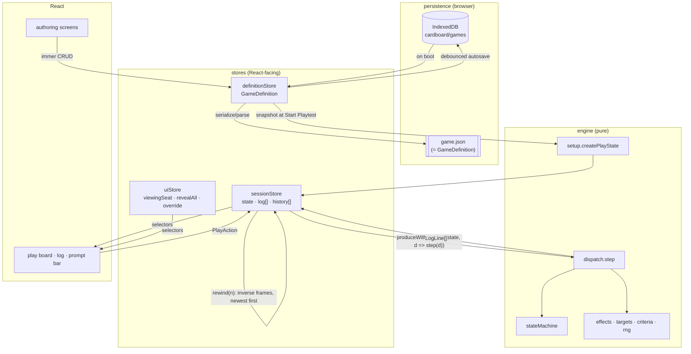

# Technical Design: Cardboard v1

Requirements: [`docs/REQUIREMENTS.md`](./REQUIREMENTS.md)

## 1. Overview

Cardboard is a client-only browser app in two halves. The **authoring** half edits a `GameDefinition`
— pools, zones, card templates, decks, rule sets, a state machine — persisted to IndexedDB and
exportable as a single JSON file. The **playtest** half instantiates that definition into a
`PlayState` and runs it hot-seat with rules enforced, backed by a pure rules engine.

The core architectural decision is that the rules engine is a **step machine, not a call tree**:
`step()` performs exactly one unit of work and returns exactly one result, with all remaining work
held in a serializable queue inside the state. Prompt suspension, the rule-loop guard, and
rewind all fall out of that one choice instead of each needing its own machinery.

The engine is pure TypeScript with no React, no store, and no DOM, so every acceptance criterion
about rules, state transitions, and history is provable headless before a component exists.

## 2. Context & constraints

Greenfield. The repository contains only `CLAUDE.md` and `docs/REQUIREMENTS.md` — no `src/`, no
commits. There is no existing code to reuse and no conventions to match; everything here is a
from-scratch decision.

### Dependencies

| Package | Why |
|---|---|
| `react`, `react-dom` | Per `CLAUDE.md`. |
| `vite`, `typescript` | Per `CLAUDE.md`. |
| `zustand` | Two small stores, no provider tree, no boilerplate. |
| `immer` | Not for ergonomics — for `produceWithPatches`. The inverse patches **are** the rewind mechanism. |
| `zod` | One schema definition serving import validation, authoring-time validation, and type inference. |
| `react-router-dom` | Authoring is a cross-reference graph; every reference chip is a link and back-navigation must work. `createHashRouter` — there is no backend, so there is no server to configure an SPA fallback on. |
| `@dnd-kit/core`, `@dnd-kit/utilities` | Card dragging. **Not** `@dnd-kit/sortable` — see §6.5. |

Dev only: `vitest`, `@testing-library/react`, `@testing-library/jest-dom`, `jsdom`,
`fake-indexeddb`.

No CSS-in-JS, no component library, no icon package, no `idb` wrapper. Each would be a dependency
earning less than the code it replaces.

### Out of scope (from the requirements)

Networked multiplayer, AI opponents, mobile/touch layouts, accounts or cloud sync, user-uploaded
artwork. Additionally, and decided here: **play sessions are not persisted** — a refresh ends the
playtest (§4.4).

---

## 3. Architecture

### 3.1 Module layout

```
src/
  main.tsx                      React root; enablePatches() once; boots persistence.
  App.tsx                       RouterProvider + <RoughFilters/> + <IconSprite/> + <ToastHost/>.
  routes.tsx                    Route table (§6.1).

  engine/                       PURE. No React, no zustand, no immer, no DOM. Plain functions over plain objects.
    types.ts                    Every type in §4. Types only, zero runtime code.
    schema.ts                   Zod mirrors of the definition types + referential refinements. One source of truth for validation.
    rng.ts                      Counter-based splitmix32 + Fisher-Yates. The only randomness in the app.
    valueRef.ts                 resolveValueRef / resolveSeat / zoneKey.
    criteria.ts                 evalCriteria(node, state, ctx) -> boolean. Recursive.
    setup.ts                    createPlayState(): zone instancing per seat, deck instantiation, seeded shuffle.
    effects.ts                  applyEffect(). Clamping and capacity live here.
    targets.ts                  resolveTargets(). Also produces the legal set for prompts.
    dispatch.ts                 The work queue: enqueue() + step(). §5.
    stateMachine.ts             Transition legality, quiescence scan, End handling.
    prose.ts                    Effect[] -> English. Feeds both the card Rules layer and the rule editor.
    visibility.ts               resolveVisibility(zone, instance, viewingSeat, revealAll).
    index.ts                    Public surface. The React layer imports only from here.

  stores/
    definitionStore.ts          Zustand + immer. The GameDefinition being authored. CRUD + validation on save.
    sessionStore.ts             Zustand. Owns PlayState, the log, the patch history, rewind, the step loop.
    uiStore.ts                  viewingSeat, revealAll, overrideEnabled, plain-mode toggle.
    persistence.ts              Raw IndexedDB (one store), debounced autosave, JSON export/import.

  screens/                      One per route (§6.1).
    GameListScreen.tsx  NotFoundScreen.tsx
    authoring/  AuthoringLayout.tsx  PoolsScreen.tsx  CatalogScreen.tsx  CardEditorScreen.tsx
                ZonesScreen.tsx  DecksScreen.tsx  EventsScreen.tsx
                RuleSetsScreen.tsx  RuleSetEditorScreen.tsx  StateMachineScreen.tsx
    play/       PlayScreen.tsx

  components/
    card/       Card.tsx  CardZoomModal.tsx
    icons/      Icon.tsx  IconSprite.tsx  IconPicker.tsx
    criteria/   CriteriaGroupEditor.tsx  CriteriaRow.tsx  ValueRefPicker.tsx
    dnd/        CardDraggable.tsx  ZoneDroppable.tsx  GapDroppable.tsx  CardDragOverlay.tsx
    ui/         Panel Button Chip Popover Modal TextField NumberField Select TagInput
                Badge EmptyState ConfirmButton EntityList
    authoring/  RuleSetEditor.tsx  EffectRow.tsx  EffectPicker.tsx  TargetSelectorChip.tsx
                RulesProsePreview.tsx  CardAppearanceForm.tsx  IndexEditor.tsx
                ZoneForm.tsx  DeckBuilder.tsx  StateGraph.tsx  StateNode.tsx
    play/       PlayToolbar.tsx  TransitionBar.tsx  PlayTable.tsx  SeatBand.tsx  ZoneView.tsx
                ZoneLayout{Stack,Fan,Row,Grid}.tsx  PoolReadout.tsx
                EventLogPanel.tsx  EventLogEntry.tsx  PromptBar.tsx  CustomEventBar.tsx

  assets/icons/ sprite.tsx  catalog.ts  ATTRIBUTION.md
  theme/        tokens.css  base.css  components.css  card.css  table.css
                RoughFilters.tsx  jitter.ts  layout.ts  fonts/
  test/         setup.engine.ts  setup.dom.ts  fixtures/
```

### 3.2 The engine boundary is lint-enforced, not conventional

```js
// eslint.config.js
{ files: ['src/engine/**'],
  rules: { 'no-restricted-imports': ['error', {
    patterns: ['react', 'react-*', 'zustand*', 'immer', '../stores/*', '../components/*'] }] } },

{ files: ['src/engine/**', 'src/stores/**'],
  rules: {
    'no-restricted-properties': ['error',
      { object: 'Math', property: 'random',
        message: 'Use the seeded PRNG (src/engine/rng.ts). Math.random breaks replay and rewind.' }],
    'no-restricted-globals': ['error',
      { name: 'crypto', message: 'crypto.randomUUID is nondeterministic — use the seeded id counter.' }],
    'no-restricted-syntax': ['error',
      { selector: "CallExpression[callee.object.name='Date'][callee.property.name='now']",
        message: 'Date.now breaks byte-identical export — inject a clock if you truly need time.' }] } }
```

Six lines of config beat a convention everyone forgets. This is also the *enforcement* mechanism for
the "`Math.random` is never reachable from game logic" constraint — the engine imports no source of
entropy at all.

### 3.3 The step machine

`step()` performs exactly **one** unit of work. Remaining work lives in `state.queue: WorkItem[]`,
which is part of `PlayState` and therefore serializable, patchable, and rewindable. The store drives
it:

```ts
// stores/sessionStore.ts — the whole engine integration
function runTransaction(input: EngineInput) {
  const forward: Patch[] = [], inverse: Patch[] = [], lines: LogLine[] = [];
  let next = get().state;
  for (;;) {
    const [after, f, i] = produceWithPatches(next, d => { done = step(d, input, lines); });
    forward.push(...f); inverse.push(...i);
    next = after;
    if (done) break;                    // queue empty, or paused on a prompt
    input = CONTINUE;
  }
  commit(next, { lines, forward, inverse });   // ONE log entry, ONE history frame
}
```

Three requirements fall out of this at once, at no extra cost:

- **Prompts pause for free.** A `prompt` selector sets `state.pendingPrompt`, leaves the effect at the
  head of the queue, and returns. "No later effect in that RuleSet has run yet" is guaranteed by
  construction, not by care.
- **The depth limit is a field, not a stack guard.** Each `WorkItem` carries `depth`; enqueueing from
  an effect gives `depth + 1`. There is no recursion to blow.
- **Rewind is one frame per transaction.** Per-effect `produceWithPatches` calls give per-effect
  atomicity; their patches accumulate into a single frame, so `history[i]` pairs with `log[i]` and
  rewind lands only on states the game legally occupied.

A headless test is `createPlayState(...)` then drive `step` — no immer, no React, no fake timers.

### 3.4 Data flow



### 3.5 What is inside the patched state, and what is deliberately outside

**Inside `PlayState`** (rewindable): zones, card instances, pool values, `currentStateId`, `queue`,
`pendingPrompt`, `rngCursor`, `nextSeq`, `finished`.

**Outside**:

- **`log[]` and `history[]`** — plain appends in the store. If the log lived inside the produce,
  every mutation would patch the log, and rewind would rewind the record of the rewind.
- **`viewingSeat`, `revealAll`, `overrideEnabled`** — `uiStore`. Rewinding must not yank the camera to
  another seat.
- **The `GameDefinition`** — `sessionStore` holds its own frozen snapshot taken at Start Playtest.
  Editing a card mid-session must not retroactively change a session you are rewinding through.

### 3.6 Determinism

`rng.ts` is **counter-based**, not stateful:

```ts
export function random(seedHash: number, cursor: number): number   // splitmix32(seedHash ^ cursor)
export function shuffle<T>(items: T[], seedHash: number, cursor: number): { items: T[]; cursor: number }
```

`seed` and `rngCursor` are both fields of `PlayState`. Every draw increments the cursor inside the
produce, so rewind restores the cursor along with everything else and the replay from that point is
bit-identical. A stateful `new Rng(seed)` object would sit outside the patch stream and desync on the
first rewind — that is the whole reason for the counter-based form.

**Instance ids are deterministic too.** `CardInstance.id` is `` `c${state.nextSeq++}` ``.
`crypto.randomUUID()` would silently break "same seed, same session" in a way that only shows up when
you diff two logs.

---

## 4. Data models & interfaces

`src/engine/types.ts`. Discriminated on `kind` throughout. Zod mirrors in `schema.ts` are
hand-written, and a type-level test asserts `z.infer` equals these types, so drift is a compile error.

### 4.1 Primitives and values

```ts
export type Id = string;
export type IconId = string;              // sprite symbol id, e.g. "gi-broadsword"

/** Discriminated on `type` so min/max are unrepresentable on booleans. */
export type GameValue =
  | { type: 'integer'; name: string; defaultValue: number; min: number | null; max: number | null }
  | { type: 'boolean'; name: string; defaultValue: boolean };

export type PoolScope = 'game' | 'player';

export interface PointPool { id: Id; scope: PoolScope; value: GameValue }

/** Reserved. The engine creates it if absent and NEVER writes it — only authored effects do.
 *  A designer-defined pool with this id is an author-time name collision. */
export const ACTIVE_PLAYER_POOL_ID = 'activePlayer' as const;
```

### 4.2 Seat and value references

```ts
/**
 * `all` in an *effect* applies to every seat. In a *criteria* it quantifies.
 * `triggeringSeat` is the seat that owns the card or zone that fired the event — required because
 * `next`/`previous` are only correct when the acting player is `activePlayer`, which any
 * out-of-turn play violates silently.
 */
export type SeatRef =
  | { kind: 'active' }
  | { kind: 'next' }
  | { kind: 'previous' }
  | { kind: 'triggeringSeat' }
  | { kind: 'seat'; index: number }
  | { kind: 'all'; quantifier?: 'every' | 'some' };   // default 'every' — §5.7

/** seat is null iff the referenced zone/pool is Game/Shared scoped. */
export interface ZoneRef { zoneId: Id; seat: SeatRef | null }

export type CardRef =
  | { kind: 'triggering' }
  | { kind: 'zoneTop'; zone: ZoneRef }
  | { kind: 'promptAnswer'; promptId: string; ordinal: number }
  | { kind: 'instance'; id: Id };

export type ValueRef =
  | { kind: 'literal';   value: number | boolean }
  | { kind: 'pool';      poolId: Id; seat: SeatRef | null }
  | { kind: 'cardIndex'; card: CardRef; indexId: Id }
  | { kind: 'zoneCount'; zone: ZoneRef };
```

Every numeric field in every effect is a `ValueRef`, never a bare `number` — "draw 2" and "draw X
where X is a pool" are then the same code path and the same editor widget.

**All references are by stable `Id`. Names are display-only.** Renaming a pool can never dangle a
rule; deleting one is blocked and lists its referrers.

### 4.3 Criteria

```ts
export type ComparisonOp = '=' | '!=' | '>' | '<' | '>=' | '<=';

export interface GameCriteria { kind: 'criteria'; left: ValueRef; op: ComparisonOp; right: ValueRef }
export interface CriteriaGroup { kind: 'group'; combinator: 'and' | 'or'; children: CriteriaNode[] }

/** Recursive union — arbitrary nesting for free, one recursive editor component. */
export type CriteriaNode = GameCriteria | CriteriaGroup;
```

### 4.4 Cards

```ts
export type IndexPosition = 'topLeft' | 'topRight' | 'bottomLeft' | 'bottomRight';

export interface CardIndex { id: Id; value: GameValue; icon: IconId; position: IndexPosition }

export interface CardTemplate {
  id: Id;
  name: string;
  marquee: string;                    // stored explicitly (defaults to name in the editor) so export is lossless
  faceIcon: IconId;
  borderColor: string;                // hex, picked from the theme palette
  tags: string[];
  indexes: CardIndex[];
  ruleSetIds: Id[];                   // reference into GameDefinition.ruleSets — §4.7
  rulesTextOverride: string | null;   // null => render prose.generate(); set => render verbatim, rules untouched
}

export interface CardInstance {
  id: Id;                             // `c${state.nextSeq++}` — deterministic, never a UUID
  templateId: Id;
  indexValues: Record<Id, number | boolean>;   // keyed by CardIndex.id; seeded from template defaults
  faceDown: boolean;
  rotated: boolean;
}
```

### 4.5 Zones and decks

```ts
export interface PlayZone {
  id: Id;
  name: string;                                          // unique across the definition (Zod superRefine)
  scope: 'shared' | 'player';
  visibility: 'faceUp' | 'faceDown' | 'ownerOnly';
  layout: 'stack' | 'fan' | 'row' | 'grid';
  ordered: boolean;
  maxCapacity: number | null;                            // >= 1 when set; 0 is rejected by the schema
}

/** Runtime instance. seat === null for shared zones. */
export interface ZoneInstance { zoneId: Id; seat: number | null; cardIds: Id[] }

/** zoneKey(z, null) === z; zoneKey(z, 1) === `${z}#1`. A flat Record beats a nested map for patch paths. */
export type ZoneKey = string;

/** A deck targeting a player-scoped zone is instantiated once per seat — derived from the zone's
 *  scope, so there is no perSeat flag to keep in sync. */
export interface Deck {
  id: Id;
  name: string;
  zoneId: Id;
  entries: { templateId: Id; quantity: number }[];
}
```

### 4.6 Events

```ts
export type BuiltinEvent =
  | 'onGameStart' | 'onGameEnd'
  | 'onCardPlayed' | 'onCardDrawn'
  | 'onZoneEnter' | 'onZoneExit'
  | 'onStateEnter' | 'onStateExit'
  | 'onPoolChanged';

/** `& {}` keeps autocomplete on the builtins while allowing any custom name. */
export type EventName = BuiltinEvent | (string & {});
```

`onTurnStart` / `onTurnEnd` are deliberately absent. Turns are authored in the state machine; a
built-in the engine never fires would be a lie in the picker. Designers express turn events as
custom events fired from `onStateEnter` / `onStateExit`.

Only `onCardPlayed`, `onCardDrawn`, `onZoneEnter`, `onZoneExit` bind a triggering card.

### 4.7 Effects, targeting, rules

```ts
export type InsertPosition = 'top' | 'bottom' | { kind: 'index'; index: number };
export type NumericOp = 'add' | 'subtract' | 'set';

/** `prompt` WRAPS another selector: the wrapped selector defines the legal set to highlight.
 *  No second targeting language for "what may I click". */
export type TargetSelector =
  | { kind: 'triggeringCard' }
  | { kind: 'topOfZone';    zone: ZoneRef; count: ValueRef }
  | { kind: 'bottomOfZone'; zone: ZoneRef; count: ValueRef }
  | { kind: 'allInZone';    zone: ZoneRef }
  | { kind: 'taggedInZone'; zone: ZoneRef; tag: string }
  | { kind: 'prompt';       from: TargetSelector; count: ValueRef; promptText: string };

export type Effect =
  | { kind: 'moveCards';       target: TargetSelector; to: ZoneRef; position: InsertPosition }
  | { kind: 'drawCards';       from: ZoneRef; to: ZoneRef; count: ValueRef }
  | { kind: 'shuffleZone';     zone: ZoneRef }
  | { kind: 'changePool';      poolId: Id; seat: SeatRef | null; op: NumericOp; amount: ValueRef }
  | { kind: 'setCardIndex';    target: TargetSelector; indexId: Id; op: NumericOp; amount: ValueRef }
  | { kind: 'flipCard';        target: TargetSelector; to: 'faceUp' | 'faceDown' | 'toggle' }
  | { kind: 'rotateCard';      target: TargetSelector; to: 'rotated' | 'upright' | 'toggle' }
  | { kind: 'createCard';      templateId: Id; zone: ZoneRef; position: InsertPosition; count: ValueRef }
  | { kind: 'destroyCards';    target: TargetSelector }
  | { kind: 'fireEvent';       name: string }
  | { kind: 'forceTransition'; toStateId: Id };

export interface RuleSet {
  id: Id;
  name: string;
  trigger: EventName;
  /** Narrows onStateEnter/onStateExit to one state. Ignored for every other trigger.
   *  This is what makes authored turn structure practical. */
  stateFilter: Id | null;
  condition: CriteriaNode | null;                 // null always passes
  effects: Effect[];                              // run in order
  priority: number;                               // default 0, descending — §5.2
  onRejection: 'continue' | 'abort';              // default 'continue' — §5.3
}
```

`drawCards` is kept distinct from `moveCards(topOfZone)` because it must fire `onCardDrawn`, which
`moveCards` must not.

**RuleSets are a library.** They are top-level entities in `GameDefinition.ruleSets`; card templates
attach them by id. A rule authored once ("deal 1 damage on play") can hang on twelve cards, and
editing it updates all twelve. Because a rule's meaning depends on the card it is attached to, the
rule editor previews in the context of a chosen attached card, and deleting a rule lists its
referrers.

### 4.8 State machine

```ts
export interface MachineState {
  id: Id;                              // 'start' and 'end' are reserved
  name: string;
  enterableFrom: Id[];
  exitableTo: Id[];
  entryCriteria: CriteriaNode | null;  // null => manual: renders as a labeled button
  transitionLabel: string | null;      // button text when entryCriteria === null
  priority: number;                    // default 0, descending — §5.6 tiebreak
  position: { x: number; y: number };  // node coords for the visual editor; part of the definition so layout survives export
}

/** A transition A→B is legal iff B.enterableFrom includes A AND A.exitableTo includes B.
 *  The editor writes both sides together; the engine checks both and names the failing one. */
export interface StateMachine { states: MachineState[]; startStateId: Id; endStateId: Id }
```

### 4.9 The export root

```ts
export const SCHEMA_VERSION = 1 as const;

/** This IS the exported file. No envelope, no exportedAt — see §7. */
export interface GameDefinition {
  schemaVersion: typeof SCHEMA_VERSION;   // first key, so a bad file fails on version before field noise
  id: Id;
  name: string;
  playerCount: number;
  pools: PointPool[];
  zones: PlayZone[];
  templates: CardTemplate[];
  decks: Deck[];
  customEvents: string[];                 // authored names for the event picker
  ruleSets: RuleSet[];                    // the library; cards reference by id
  globalRuleSetIds: Id[];                 // game-level rules (onGameStart setup, win checks)
  machine: StateMachine;
  limits: { maxDepth: number; maxEffects: number };   // defaults 64 / 10_000 — §5.5
  updatedAt: string;                      // ISO. Bumped by edits only; import never writes it
}
```

### 4.10 Play state and log

```ts
export interface TriggerContext {
  triggeringCardId: Id | null;
  zoneKey: ZoneKey | null;
  triggeringSeat: number | null;
  promptAnswers: Record<string, Id[]>;
}

export type WorkItem =
  | { kind: 'event';      name: EventName; ctx: TriggerContext; depth: number }
  | { kind: 'rule';       ruleId: Id; sourceCardId: Id | null; ctx: TriggerContext; depth: number }
  | { kind: 'effect';     ruleId: Id; effectIndex: number; ctx: TriggerContext; depth: number }
  | { kind: 'transition'; toStateId: Id; forced: boolean; depth: number };

export interface PendingPrompt {
  promptId: string;             // `${logSeq}:${ruleSetId}:${effectIndex}` — stable and reproducible
  promptText: string;
  seat: number;
  candidates: Id[];             // FROZEN at prompt time, in zone order
  min: number;
  max: number;
}

/** Everything rewindable, and NOTHING else. The single immer-produced object. */
export interface PlayState {
  definitionId: Id;
  seed: string;
  rngCursor: number;
  nextSeq: number;
  playerCount: number;
  pools: Record<Id, number | boolean>;              // game-scoped (incl. activePlayer)
  playerPools: Record<Id, (number | boolean)[]>;    // per-seat, index === seat
  cards: Record<Id, CardInstance>;
  zones: Record<ZoneKey, ZoneInstance>;
  currentStateId: Id;
  finished: boolean;
  queue: WorkItem[];
  pendingPrompt: PendingPrompt | null;
  budget: { causalDepth: number; effectsUsed: number };
}

/** Display-only detail inside an entry. NOT a rewind target. */
export interface LogLine {
  level: 'info' | 'warn' | 'reject' | 'error' | 'override';
  kind: 'event' | 'rule' | 'effect' | 'change' | 'transition' | 'prompt' | 'skip';
  message: string;
  change: { path: string; before: unknown; after: unknown } | null;
  ruleId: Id | null;
  effectKind: Effect['kind'] | null;
  depth: number;
}

/** One entry = one user action plus its ENTIRE cascade. The rewind target. */
export interface LogEntry {
  seq: number;                          // === index in log[] === index in history[]
  cause: { kind: 'userAction' | 'engine'; description: string; seat: number | null };
  lines: LogLine[];
  flags: { override?: true; haltedByLoopGuard?: true; suspended?: true };
}

export interface HistoryFrame { forward: Patch[]; inverse: Patch[] }   // Patch from 'immer'

export interface PlaySession {
  definition: GameDefinition;           // snapshot at Start Playtest
  state: PlayState;
  log: LogEntry[];
  history: HistoryFrame[];              // history[i] pairs with log[i]
}
```

---

## 5. Rules engine semantics

The part most likely to be got subtly wrong, so it is specified rather than left to judgement.

### 5.1 Dispatch: explicit FIFO queue, never recursion

Events are drained from `state.queue` by a flat loop. Recursion is rejected outright: with recursion
the in-flight rule state lives on the JS call stack, which cannot be serialized, snapshotted, or
unwound — and prompt suspension plus rewind both need exactly that.

**Fired events go to the queue tail, never the head.** Breadth-first, not depth-first. A designer
reads an effect list top to bottom and expects effect 4 to see the world effect 3 left behind, not a
world mutated by an arbitrarily deep cascade effect 3 kicked off.

A consequence worth stating loudly: **at any instant there is exactly one in-flight RuleSet.** The
suspension record in §5.4 is therefore a flat cursor, not a continuation stack. If a future version
ever adopts depth-first dispatch, §5.4 must be redesigned.

One `step` call with a user action opens a **transaction** that runs to settlement:

```
transaction(action):
  budget = { causalDepth: 0, effectsUsed: 0 }
  applyAction(action)                   // the direct mutation, validated; enqueues its events
  loop:
    drain()                             // process queue to empty
    if pendingPrompt: return SUSPENDED  // transaction stays open
    if finished: break
    t = findAutoTransition()            // §5.6 — only here, at quiescence
    if t is null: break
    budget.causalDepth += 1
    if over limit: tripLoopGuard(); break
    applyTransition(t)                  // enqueues onStateExit then onStateEnter
```

**Compound action enqueue order.** A card move enqueues `onZoneExit(from)` → `onZoneEnter(to)` →
`onCardPlayed`/`onCardDrawn` if it qualifies — so the card is physically settled in its destination
before the semantic event's rules run, matching what the tester sees.

**No-op writes fire no events.** A write of 5 to a pool already holding 5, or a `-5` clamped away at
the minimum, fires no `onPoolChanged`. Moving a card to the zone it already occupies fires no zone
events. This is the single largest source of accidental infinite loops in systems like this.

### 5.2 RuleSet ordering — total, deterministic, designer-controllable

Sort key, applied in order:

1. **`priority`, descending.** Default 0. The designer's control surface, a plain number field.
2. **Scope:** game-level RuleSets before card-attached ones — game rules are the frame the content
   plays inside.
3. **For card RuleSets:** zone declaration order, then positional index within the zone (top = 0),
   then seat index. Board order is the only ordering a tester can *see*, so it is the only one they
   can reason about.
4. **Final tiebreak:** authored RuleSet id, stable across save/load.

Rule 4 guarantees the comparator is total — never a stable-sort accident, never hash iteration order,
which would change across export/import and make same-seed replays diverge.

`resolveBindings` takes a **snapshot** when the frame begins; without it a rule that creates or
destroys cards changes the iteration set mid-loop. Each binding is re-validated for existence
immediately before it runs. **Conditions**, by contrast, are evaluated at the moment each RuleSet is
about to run — earlier rules on the same event are meant to be able to gate later ones.

### 5.3 Effect execution — best-effort at RuleSet level, atomic at effect level

Each effect applies completely or not at all. A rejected effect is logged and execution continues
with the next effect; the RuleSet is **not** rolled back.

Rollback was rejected because by the time effect 3 fails, effect 2 may have fired an event other
rules already consumed and effect 1 may have been a prompt the tester already answered. Unwinding
that means unwinding the tester's own decision. The clean undo is rewind (§5.8), which backs out the
whole transaction.

`RuleSet.onRejection: 'abort'` stops the remaining effects in that RuleSet (already-applied effects
stay — abort is not rollback). This exists because "pay 2, then draw 3" is a real and common shape.

**Effect-level atomicity:** an effect moving three cards where the second would overflow moves
**zero**.

**The shortfall/constraint asymmetry — deliberate, do not "fix" it:**

- **Quantity shortfall** (draw 2 from a deck holding 1) → **partial success.** Move what exists, log a
  warning naming requested vs actual. Every printed card game does this.
- **Constraint violation** (capacity, illegal transition, missing referent) → **full rejection.** The
  zone is refusing; there is no partial version of that.

**Targets and criteria resolve lazily, at the moment each effect begins** — effect 1 routinely draws
the cards effect 2 targets. Within one effect the selector resolves **once** into a frozen id list.

### 5.4 The interactive prompt — serializable cursor, no generators

Generators were rejected: a suspended generator cannot be serialized, snapshotted, or reconstructed
after a rewind. Promises were rejected: they would make `step` impure and couple the engine to React's
lifecycle.

Suspension is `state.pendingPrompt` plus the queue itself — both already inside `PlayState`, and
therefore inside the patch domain. That placement is what makes rewind-across-a-prompt work with no
special case at all (§5.8).

```
runEffects(rule, fromIndex):
  for i from fromIndex to effects.length - 1:
    e = effects[i]
    if e prompts and ctx.promptAnswers[promptId(i)] is undefined:
      candidates = resolveSelector(e.from)
      if candidates.length == 0: reject e ("no legal targets"); continue
      state.pendingPrompt = { promptId, candidates, min, max, ... }
      state.queue.unshift({ kind:'effect', ruleId, effectIndex: i, ctx, depth })
      return SUSPENDED
    applyEffect(e, ctx)
```

**Hard rule for implementers: a prompting effect must raise its prompt before performing any
mutation**, because it executes twice — once to raise, once to complete. Prompting effects are
re-entrant by construction.

Resume validates `chosen ⊆ candidates` and `min ≤ |chosen| ≤ max`; an invalid answer is rejected
without altering state and without clearing the suspension. On success the answer is written into
`ctx.promptAnswers`, `pendingPrompt` clears, and the head work item re-enters at the same
`effectIndex` — where it now finds its answer and completes.

While `pendingPrompt` is set, **every input except answer, cancel, and rewind is rejected.**

**Zero legal targets:** the prompt is not raised at all. A modal with nothing clickable is a dead end;
the useful outcome is a log line telling the designer their selector matched nothing. This holds even
when `min` is 0.

**One candidate still prompts** rather than auto-selecting — uniform behavior, and the log records a
deliberate choice rather than a silent engine decision.

**Cancel is always available.** It rejects the prompting effect with reason `canceled by tester`; the
RuleSet then continues or aborts per `onRejection`. Not an override, not flagged as one. A tester who
mis-clicks into a prompt must never be wedged, and rewind is the clean escape from a mistake — we do
not build a second undo mechanism.

### 5.5 Loop guard — count both depth and total effects

| Counter | Meaning | Default | Configurable |
|---|---|---|---|
| `causalDepth` | The user's action is depth 0; an event fired by an effect at depth *d* is depth *d+1*. Auto-transition rounds increment it too. | **64** | `definition.limits.maxDepth` |
| `effectsUsed` | Total effects executed in one transaction, across all frames. | **10 000** | `definition.limits.maxEffects` |

Depth alone will not stop a rule firing ten thousand *sibling* events all at depth 1 — that is flat,
not deep, and it still hangs the browser. An effect budget alone cannot distinguish a legitimately
large board sweep from recursion. Each catches what the other misses.

Both are in the game definition because the right ceiling is a property of the game being authored.
A combo-heavy design will legitimately need more than 64; the designer needs a knob, not a bug report.

**On trip:** stop draining, discard the remaining queue, clear `pendingPrompt` (a suspension inside a
runaway chain is not resumable), roll back nothing, flag the entry `haltedByLoopGuard`.

**State is coherent** — every effect that ran was individually atomic, so the world is exactly "as of
the last completed effect", a state the engine could have produced legitimately. Rewind backs out the
whole transaction in one move. Override does **not** bypass the guard; override is about designer
intent regarding legality, not about disabling the thing keeping the tab alive.

```
[ERROR] Possible rule loop — chain halted.
  Tripped: causalDepth 65 > limit 64   (effects executed 418 / 10000)
  Last rule: "Echo Chamber"  (card c0142 in Battlefield, effect 2 of 3: FireEvent "resonate")
  Chain (most recent 8 frames):
    … depth 61  onPoolChanged(Charge, seat 0)
      depth 62  custom "resonate"
      depth 63  onPoolChanged(Charge, seat 0)
      depth 64  custom "resonate"
  Discarded 7 queued events. State is at the last completed effect — use Rewind to back this out.
```

Each `WorkItem` carries a parent frame id so the chain is reconstructed exactly rather than guessed.
The repeating-cycle shape is what tells the designer which two rules are feeding each other.

### 5.6 State machine evaluation

**Entry criteria are re-evaluated only at quiescence** — not after every effect, not on a tick. Mid-
RuleSet the world is transiently inconsistent: effect 2 of 5 has run, the cost is paid and the
benefit is not yet granted. Evaluating there fires transitions on half-applied rules, producing states
the game logically never occupied, and makes the state machine sensitive to effect ordering inside
every RuleSet.

**An auto-transition never preempts a mid-flight RuleSet — it waits.** Preemption means a RuleSet's
later effects execute in a different state than its earlier ones, silently.

The explicit `forceTransition` **effect** is different: it applies at its position in the effect list
and enqueues `onStateExit`/`onStateEnter` to the tail. So the remaining effects of that RuleSet run
in the *new* state, before that state's enter rules. That is a real footgun — the rule editor warns
when a transition effect is not last.

**Two transitions eligible at once** — tiebreak, in order: target state `priority` descending; then
position in the current state's `exitableTo` array (drag-orderable in the editor, and *visible*,
unlike an abstract number); then declaration order. Whenever more than one was eligible, warn
regardless of how it resolved — a silent deterministic pick is still an ambiguity the designer did not
intend to author.

**Legality is `A.exitableTo` includes B **AND** `B.enterableFrom` includes A.** Conjunction, not
disjunction: a one-sided edge is nearly always an authoring slip where the designer added one side and
forgot the other. Author-time validation reports every one-sided edge as a warning naming both states
and which side is missing, with a one-click fix. At runtime it is rejected naming the missing side;
with designer override it is performed and flagged.

Also validated at author time: `Start` has empty `enterableFrom`; `End` has empty `exitableTo`; `End`
unreachable is a warning; any state with no inbound edge other than `Start` is a warning.

Reaching `End` sets `finished`, fires `onGameEnd`, settles it, then rejects all input except rewind.

### 5.7 Criteria evaluation

Let `N = playerCount` and `A = activePlayer`.

| SeatRef | Resolves to |
|---|---|
| `active` | `A` |
| `next` | `(A + 1) mod N` |
| `previous` | `(A - 1 + N) mod N` |
| `triggeringSeat` | `ctx.triggeringSeat` |
| `seat: k` | `k` |
| `all` | every seat `0 … N-1`, ascending |

If `A` falls outside `[0, N)` — reachable via hand-edited JSON — resolution **fails**; it does not
clamp. The criterion evaluates false and logs an error. Clamping would hide a designer bug behind
plausible-looking play.

**`all` inside a comparison carries an explicit quantifier, default `every`.** `every` matches the
plain-English reading of "all players' HP > 0" and is the right default — but `any` is not derivable,
because `CriteriaGroup` has only AND/OR with **no NOT**, so "any player at 0 HP" (a bog-standard win
condition) would otherwise be inexpressible. One enum field buys an entire class of rules.

**Both sides `all` → zipped by seat, never crossed.** `all.HP > all.maxHP` means each player's HP
exceeds *that same player's* maxHP. A cross product is never anyone's intent. If the quantifiers
disagree, the left side governs and an author-time warning is raised.

**Zone counts include face-down cards.** Zone `visibility` affects rendering only, never criteria.

**`triggeringCard` is bound only under `onCardPlayed`, `onCardDrawn`, `onZoneEnter`, `onZoneExit`.**
Because the editor knows the trigger, using it elsewhere is an author-time error — the ref is not even
offered. At runtime (imported JSON) an unbound ref resolves to failure.

**Type mismatches are rejected at author time *and* at runtime.** The editor types both sides, refuses
to save `boolean OP integer`, and offers only `=`/`!=` on booleans. The evaluator re-checks because
imported and hand-edited JSON bypass the editor entirely. On mismatch the criterion evaluates
**false** and logs an error rather than throwing — one malformed criterion in an imported file must
not brick the session.

**No short-circuiting.** Every leaf is evaluated, always. Evaluation is pure and cheap, and the log
wants each leaf's resolved values: "Condition was false" is a useless log line, whereas
"`HP(seat 1) = 12` is not `< 10`" is the whole reason the tool exists. Empty group: AND → true,
OR → false, with an author-time warning either way.

### 5.8 Log and rewind

**One log entry = one transaction:** one user action (or one engine-initiated trigger such as game
start) plus *all* cascading consequences — every fired event, rule, effect, and auto-transition —
until the queue is empty and no transition is eligible.

Per-effect rewind points were rejected: they would let the tester land mid-cascade, in a state the
rules could never legally produce. Per-effect *detail* is not lost — it lives in the entry's
`LogLine[]`, which is display-only. **Rewind granularity and display granularity are deliberately
different things.**

Every effect executes inside its own `produceWithPatches`, giving per-effect atomicity; the patches
accumulate into the transaction's single `HistoryFrame`.

**To rewind to `seq = N`:**

1. For each entry from newest down to `N+1`, in **descending** seq order,
2. apply that entry's `inversePatches` **in reverse array order**,
3. truncate `log` and `history` to length `N`.

Both reversals are required. Applying inverses in forward order within a frame is the classic bug
here and produces silently wrong state whenever two effects touched the same path.

Entries after `N` are **discarded**, not kept for redo — per the acceptance criteria. There is no redo.

**Everything in `PlayState` is inside the rewound domain**, including `pendingPrompt`, `queue`,
`budget`, and `rngCursor`. Because `pendingPrompt` is inside, rewinding across a prompt needs **no
special case**: rewind to before it and the prompt is gone; rewind *to* a suspended entry and the
prompt is restored with its original frozen candidates, so the tester can answer differently and
branch.

**The PRNG cursor is part of rewound state and this is non-optional.** Without it: rewind past a
shuffle, replay forward, and the shuffle produces a *different* order — the "same seed ⇒ identical
shuffle" criterion breaks and every rewind-and-retry session silently diverges from the one the
designer was debugging.

### 5.9 Failure modes

Levels: `INFO` applied · `WARN` applied but degraded · `REJECT` not applied, rule-legal refusal ·
`ERROR` not applied, authoring/data fault · `OVERRIDE` applied despite a REJECT.

| # | Condition | Behavior | Log |
|---|---|---|---|
| 1 | Zone at capacity | Effect fully rejected, zero cards move | `[REJECT] Move 1 card → Hand (seat 0): zone at capacity (7/7). No cards moved.` |
| 1b | Same, with override | Move performed, entry flagged | `[OVERRIDE] Move 1 card → Hand (seat 0): capacity 7 exceeded (now 8/7).` |
| 2 | Selector matches nothing | Effect rejected, continue | `[REJECT] Move: selector "cards in Deck tagged Spell" matched 0 cards.` |
| 2b | Selector matches fewer than N | **Partial** — apply to what exists | `[WARN] Draw 2 from Deck → Hand (seat 0): only 1 available. Drew 1.` |
| 3 | References a destroyed card | Effect rejected, continue | `[ERROR] SetIndex(Power) on c0142: card no longer exists (destroyed at entry 8).` |
| 3b | References a deleted zone/pool | Effect rejected. Author-time delete is blocked and lists referrers | `[ERROR] Add 1 to pool "Mana": pool does not exist in this definition.` |
| 4 | Integer clamp at min/max | **Applied**, clamped. Not a rejection. Log records the *clamped* value | `[INFO] HP (seat 1): 3 → 0 (requested −5, clamped at min 0).` |
| 4b | Clamp results in no change | Applied as no-op; **no `onPoolChanged`** | `[INFO] HP (seat 1): 0 → 0 (requested −5, already at min). No event fired.` |
| 5 | Transition target lacks the source in `enterableFrom` | Rejected; no state change, no enter/exit events | `[REJECT] Transition Main → Untap: "Untap".enterableFrom does not list "Main".` |
| 5b | One-sided edge | Rejected naming the missing side; no button rendered | `[REJECT] Transition Main → Combat: "Main".exitableTo lists "Combat", but "Combat".enterableFrom does not list "Main". Edge is one-sided.` |
| 5c | Either, with override | Performed, both events fire, flagged | `[OVERRIDE] Transition Main → Untap performed despite enterableFrom restriction.` |
| 6 | Custom event with no bound RuleSet | **Not an error.** Dispatched, resolves with zero rules | `[INFO] Event "resonate" fired — 0 rules bound.` |
| 7 | Depth or effect budget exceeded | Chain halted, queue discarded, state coherent | The block in §5.5 |
| 8 | Prompt with zero legal targets | Prompt not raised; effect rejected; continue | `[REJECT] Prompt "Choose a card to discard" (seat 0): 0 legal targets. Prompt skipped.` |
| 8b | Prompt canceled | Prompting effect rejected; not an override | `[REJECT] Prompt "Choose a card to discard" (seat 0): canceled by tester.` |
| 8c | Answer outside candidates or count bounds | Input rejected; suspension unchanged; no mutation | `[REJECT] Prompt answer invalid: 3 cards selected, expected exactly 1.` |
| 9 | Any other input while suspended | Rejected | `[REJECT] Input ignored: awaiting response to prompt "Choose a card to discard".` |
| 10 | Any input after `End` except rewind | Rejected | `[REJECT] Session finished at "End". Only Rewind is accepted.` |
| 11 | Criteria type mismatch | Criterion **false**; group continues | `[ERROR] Criterion "isReady > 3": cannot compare boolean to integer. Evaluated false.` |
| 12 | `activePlayer` outside `[0, N)` | Ref fails; criterion false; **no clamping** | `[ERROR] Player ref "active": activePlayer = 5 is not a valid seat (2 seats). Evaluated false.` |
| 13 | `triggeringCard` under an event binding none | Ref fails; criterion false / effect rejected | `[ERROR] Ref "triggeringCard" is unbound under event onStateEnter. Evaluated false.` |
| 14 | Two transitions eligible | Deterministic tiebreak, always warned | `[WARN] 2 transitions eligible from "Main": Combat, Cleanup. Took "Combat" (exitableTo order).` |
| 15 | Card moved to the zone it occupies | No-op; **no** zone events | `[INFO] Move c0142 → Battlefield: already in that zone. No-op, no events fired.` |
| 16 | RuleSet on a card destroyed earlier this event | Binding skipped | `[INFO] Skipped RuleSet "Echo" on c0142: card destroyed earlier this event.` |
| 17 | RuleSet condition false | Skipped, naming the failing leaf | `[INFO] Skipped RuleSet "Overload" — condition false: HP(seat 1) = 12, not < 10.` |

---

## 6. UI architecture

### 6.1 Routes

`react-router-dom` with `createHashRouter`. Hash, not browser routing: there is no backend, so no
server to configure an SPA fallback on — hash URLs work from a static host, from `file://`, and from
`vite preview` with zero config.

| Route | Screen |
|---|---|
| `/` | `GameListScreen` — games in IndexedDB; New / Import / Open / Duplicate / Delete / Export |
| `/game/:gameId` | redirect → `…/pools` |
| `/game/:gameId/pools` | `PoolsScreen` |
| `/game/:gameId/cards` | `CatalogScreen` — grid of `<Card>` thumbnails |
| `/game/:gameId/cards/:cardId` | `CardEditorScreen` |
| `/game/:gameId/zones` | `ZonesScreen` |
| `/game/:gameId/decks` | `DecksScreen` |
| `/game/:gameId/events` | `EventsScreen` — built-ins read-only + custom |
| `/game/:gameId/rules` | `RuleSetsScreen` — the library |
| `/game/:gameId/rules/:ruleSetId` | `RuleSetEditorScreen` |
| `/game/:gameId/states` | `StateMachineScreen` |
| `/game/:gameId/play` | `PlayScreen` — own layout, no sidebar |
| `*` | `NotFoundScreen` |

`AuthoringLayout` is a persistent layout route rendering a left rail plus `<Outlet/>`. Authoring is
constant cross-referencing, so a stable frame keeps the designer spatially oriented, and the rail
carries a **live validity badge** per surface (count, plus a red marker slash when that surface has a
validation error) — that badge is the app's error surface and must be visible from every screen.

The card editor and rule editor are **full routes, not modals**: both are large and both are link
targets from elsewhere, and modals that deep-link are a bug farm.

Leaving `/play` prompts to confirm — the session and its log are discarded.

### 6.2 Reusable across authoring and play

| Component | Responsibility |
|---|---|
| `<Card>` | **The** card renderer. Catalog, editor preview, hand, table, zoom — all one component. §6.3 |
| `<CardZoomModal>` | `<Card>` at `--cb-card-w: 420px` |
| `<Icon>` / `<IconSprite>` / `<IconPicker>` | `<use href="#gi-…">`; picker is searchable, footer carries the CC BY line |
| `<CriteriaGroupEditor>` | Nested AND/OR tree. Used by the rule editor *and* state entry criteria |
| `<ValueRefPicker>` | Chip popover resolving pool / card index / zone count / literal |
| `<EntityList>` | Master list + inline rename + delete-with-referrer-check. Drives five screens |
| `<CardDraggable>` `<ZoneDroppable>` `<GapDroppable>` `<CardDragOverlay>` | dnd-kit wrappers; `GapDroppable` is reused by the effect list |

### 6.3 The `<Card>` component

```tsx
interface CardProps {
  template: CardTemplate;
  instance?: CardInstance;   // absent in Catalog / editor preview
  faceDown?: boolean;        // resolved above, in ZoneView
  onClick?: (e: React.MouseEvent) => void;
}
```

**No `size`, no `variant`, no `mode`.** Size and detail level come entirely from the container. That
is what *structurally* guarantees the "catalog and play render identically" criterion instead of
leaving it to a convention someone breaks later.

```html
<article class="cb-card" data-face-down="false" data-rotated="false"
         style="--cb-card-border:#a8342a; --cb-jitter:-1.2deg;">
  <div class="cb-card__tilt">
    <div class="cb-card__rough" aria-hidden="true"></div>
    <div class="cb-card__body">
      <header class="cb-card__marquee">Lightning Bolt</header>
      <div class="cb-card__face"><svg class="cb-icon"><use href="#gi-lightning-bolt"/></svg></div>
      <div class="cb-card__tagline">Instant · Fire</div>
      <div class="cb-card__rules">Deal 3 damage to any target.</div>
    </div>
    <div class="cb-card__pips">
      <span class="cb-pip" data-pos="topLeft"><svg class="cb-icon"><use href="#gi-sword"/></svg><b>3</b></span>
    </div>
  </div>
</article>
```

| Requirement layer | Element |
|---|---|
| Border | `.cb-card__rough` — `inset: -3px`, `border: 3px solid var(--cb-card-border)`, carries the filter |
| Marquee | `.cb-card__marquee` — grid row 1, ink on darker kraft, rule beneath |
| Face | `.cb-card__face` — grid row 2, `aspect-ratio: 1`, icon at 62% width, `fill: currentColor` |
| Pips | `.cb-card__pips` — `position: absolute; inset: 0; pointer-events: none`, four `[data-pos]` children |
| Tagline | `.cb-card__tagline` — grid row 3, `·`-joined, ellipsis, full list in `title` |
| Rules | `.cb-card__rules` — grid row 4, content `template.rulesTextOverride ?? generateRulesProse(ruleSets)` |

That `??` is the entire "override replaces generated text without altering the RuleSet" criterion.
`generateRulesProse` lives in `src/engine/prose.ts` — shared with the rule editor's preview, so the
card and the editor can never disagree.

**Scaling: container queries, not props.**

```css
.cb-card { inline-size: var(--cb-card-w, 132px); aspect-ratio: var(--cb-card-ar, 5/7);
           container-type: inline-size; font-size: 9cqw; }
.cb-card__marquee { font-size: 1.05em; }
.cb-card__rules   { font-size: 0.62em; line-height: 1.25; }
@container (max-width: 118px) { .cb-card__rules   { display: none; } }
@container (max-width: 88px)  { .cb-card__tagline { display: none; } }
@container (max-width: 64px)  { .cb-pip b         { display: none; } }
```

Contexts set the property on the container: catalog `96px`, table zone `116px`, own hand `132px`,
opponent bands `92px`, editor preview `260px`, zoom `420px`.

**faceDown omits hidden data from the DOM entirely** — it renders `.cb-card__back` *instead of* the
body and pips. Rendering-then-hiding would leak the opponent's hand to Ctrl-F and devtools, which is a
real hazard for a hot-seat tool whose whole point is that seat 2 cannot see seat 1's hand. The back is
pure CSS crosshatch, no asset.

Visibility is resolved **above** `<Card>`, in `ZoneView`, via `engine/visibility.ts`:
`faceDown = zone.visibility === 'faceDown' || (zone.visibility === 'ownerOnly' && zone.seat !== viewingSeat) || instance.faceDown`,
then overridden by reveal-all. Keeping that out of `<Card>` is what lets the Catalog use the identical
component with zero play-state coupling.

**rotated** adds `rotate(90deg)` on the tilt wrapper. The zone slot keeps the unrotated footprint and
the card overhangs, so rotating never reflows neighbours.

### 6.4 The play table

```
┌─ PlayToolbar ──────────────────────────────────────────────────────────────┐
│ Viewing as: [P1][P2][P3]  ☐ Reveal all  ☐ Designer override   active: P2   │
│ Seed: 12345 [copy]   State: ⟨ Main ⟩   [End Turn] [Discard Step]  [Restart] │
└────────────────────────────────────────────────────────────────────────────┘
┌── PlayTable ──────────────────────────────────┬── EventLogPanel ───────────┐
│ ┌ opponents band (grid-auto-flow: column) ──┐ │ 14 ▸ onCardPlayed          │
│ │  ┌ P2 ─────────┐  ┌ P3 ─────────┐         │ │    Bolt → Play Zone        │
│ │  │ Hand  ▨ 5   │  │ Hand  ▨ 7/7 │         │ │    ⤷ rule "Burn"           │
│ │  │ Board ▤▤    │  │ Board ▤     │         │ │      P2.HP 20 → 19   [↩]   │
│ │  │ HP 19  ⚡2  │  │ HP 20  ⚡0  │         │ │ 15 ▸ prompt: choose target │
│ │  └─────────────┘  └─────────────┘         │ │ 16 ✖ Hand full (7/7)  [↩]  │
│ ├ shared band ──────────────────────────────┤ │ 17 ⚑ override: move        │
│ │  Deck ▣32   Discard ▣4   Play Zone ▤▤▤    │ │                            │
│ ├ own seat band (P1) ───────────────────────┤ │ [filter ▾] [jump to end]   │
│ │  Board ▤▤▤   Hand ⟨── fan ──⟩ 4/7          │ └────────────────────────────┘
│ │  HP 20  ⚡3                                 │
│ └────────────────────────────────────────────┘
├─ PromptBar (prompt mode only) ────────────────────────────────────────────┐
│ ⚑ "Burn" — choose a card in any zone (3 legal targets)   [Cancel] (Esc)   │
└───────────────────────────────────────────────────────────────────────────┘
```

**Seat positioning — one rule for 2–4 seats.** The viewing seat is always the bottom band; every other
seat is in the top band, split into equal columns by `grid-auto-flow: column`. Shared zones are the
middle band. No per-count special-casing, and it stays correct when the seat switcher changes who
"you" are — the bands re-key, nothing re-lays-out.

**Zone layouts** (positional math CSS can't express lives in `src/theme/layout.ts`, written to inline
custom properties):

| Layout | Algorithm |
|---|---|
| stack | Render only the top 3 instances, offset `translate(i·2px, i·−2px)` with per-index jitter, plus a count badge. A 40-card deck must not be 40 DOM nodes. |
| fan | Overlap `margin-left: calc(-0.45 * var(--cb-card-w))`; per card `--cb-fan-rot` and `--cb-fan-lift` from `fanTransform(i,n)`: `step = clamp(2, 40/n, 5)deg`. Hover raises 14px. |
| row | Flex row; a `ResizeObserver` computes `--cb-overlap` so cards compress to a shingle rather than scrolling. |
| grid | `repeat(auto-fill, minmax(var(--cb-card-w), 1fr))`, vertical scroll inside the zone. |

**Capacity** shows as `count` or `count/max`; at max it turns red with a double underline and the zone
edge takes a red marker slash. A drag that would overflow gets `data-drop="reject"` (red dashed,
`not-allowed`, tooltip naming the capacity); with override on it becomes `data-drop="override"`
(amber dashed) and the drop is allowed. The UI mirrors an engine `canMove()` probe rather than
reimplementing the rule — one source of truth.

### 6.5 dnd-kit mapping

**`@dnd-kit/core` only. No `@dnd-kit/sortable`.** Cross-container sorting is the fiddly part of
dnd-kit, and what we need is a cross-zone move *with an explicit insert index* — exactly what
`SortableContext` makes awkward.

| Thing | Primitive | id |
|---|---|---|
| Card in play | `useDraggable` | `card:<instanceId>` |
| Unordered zone | one `useDroppable` over the zone | `zone:<zoneKey>` |
| Ordered zone | `n+1` thin gap droppables | `gap:<zoneKey>:<index>` |
| Ordered stack | exactly two gaps — top edge and bottom edge | `gap:<zoneKey>:0` / `:<n>` |

`onDragEnd` parses `over.id`: `zone:` → append, `gap:` → insert at that index. That is the whole
handler. Gaps are 10px, invisible at rest, expanding to 22px with a marker-dash caret on hover, so
the drop point is unambiguous without a hover-guessing heuristic. Collision detection is
`pointerWithin` falling back to `rectIntersection` — pointer-based is exact against thin targets.

`<DragOverlay>` renders `<Card>` with `--cb-jitter: 0deg`; the source card stays at `opacity: .35`.

**Click-to-select / click-to-place is required, not optional** (WCAG 2.2 SC 2.5.7): click a card, legal
destinations get numbered badges, click one to move, `Esc` cancels. Same reducer entry point as
`onDragEnd`. It is also the faster input once a designer knows the board, so it isn't only a
compliance tax.

### 6.6 Event log and rewind

Right rail, resizable, auto-scrolled to the tail unless the user has scrolled up. Glyphs: `▸` event,
`⤷` rule fired, `·` effect applied, `✖` rejection, `⚑` override, `⟳` transition, `⚠` loop halt.

Hovering an entry shows `[↩ rewind to here]` and dims every later entry to `opacity: .3` with a
strikethrough — a live preview of exactly what gets discarded. Clicking opens an inline
`<ConfirmButton>` ("Discard 8 entries?") rather than a modal, because rewind is frequent. After
rewind the log truncates and a `↺ rewound to 12` marker is appended, so the history of rewinding is
itself visible.

### 6.7 Prompt mode

`PlayScreen` sets `data-cb-prompt="1"` on the table root when the engine suspends.

```css
[data-cb-prompt="1"] .cb-card:not(.cb-card--targetable) {
  filter: grayscale(1); opacity: .35; pointer-events: none;
}
.cb-card--targetable .cb-card__rough {
  outline: 3px dashed var(--cb-accent); outline-offset: 4px;
  animation: cb-pulse 1.4s ease-in-out infinite;
}
```

Drag is disabled entirely while prompting (`DndContext` gets no sensors), so the only possible
interaction is choosing. `PromptBar` names the paused rule and the legal-target count; `[Cancel]` and
`Esc` both abort per §5.4.

### 6.8 Rule editor

The failure mode to design against is a wall of nested `<select>`s. Two decisions avoid it:

1. **Effects are sentences with inline chips, not forms.** Each effect is one line of prose whose
   variable parts are `<Chip>` buttons opening small searchable popovers. The designer reads the rule
   instead of decoding a form.
2. **A live prose preview at the bottom**, using the same `generateRulesProse()` that fills the card's
   Rules layer — the designer's proof that they built what they meant.

```
┌──────────────────────────────────────────────────────────────────────────────┐
│  Rules  ›  "Bolt: burn on play"                        [Duplicate] [Delete]   │
├──────────────────────────────────────────────────────────────────────────────┤
│  WHEN   ( onCardPlayed ▾ )        priority ( 0 )      attached to: 3 cards ›  │
│                                                                              │
│  IF     ┌─ ( any of ▾ ) ─────────────────────────────────────────── [×] ─┐   │
│         │   ( Player HP ▾ )   ( < ▾ )   ( 5 ▾ )                     [×]  │   │
│         │   ┌─ ( all of ▾ ) ─────────────────────────────────── [×] ─┐   │   │
│         │   │   ( cards in Deck ▾ )  ( >= ▾ )  ( 1 ▾ )          [×]  │   │   │
│         │   │   [+ condition]  [+ group]                             │   │   │
│         │   └────────────────────────────────────────────────────────┘   │   │
│         │   [+ condition]  [+ group]                                     │   │
│         └──────────────────────────────────────────────────────────────────┘ │
│                                            (no condition? [remove] → always)  │
│  THEN            on rejection: ( continue ▾ )                                │
│   ⠿ 1. ( Draw ▾ )  ( 2 )  cards from ( Deck ▾ ) to ( Hand ▾ )   [▲][▼][×]    │
│   ⠿ 2. ( Subtract ▾ ) ( 1 ) from ( HP ▾ ) of ( triggering seat ▾ )  [▲][▼][×]│
│   ⠿ 3. ( Move ▾ )  ( prompt player to choose ▾ )  ⏸ execution pauses here    │
│         from ( any zone ▾ )  to ( Discard ▾ )  at ( top ▾ )     [▲][▼][×]    │
│      [+ effect ▾]                                                            │
├──────────────────────────────────────────────────────────────────────────────┤
│  READS AS                                                                    │
│  "When this card is played, if your HP is below 5, or you have at least 1     │
│   card in Deck: draw 2 cards from Deck to your Hand; the player who played    │
│   this loses 1 HP; then move a card you choose to the top of Discard."       │
└──────────────────────────────────────────────────────────────────────────────┘
```

`TargetSelectorChip` is one chip with the six selectors as radio rows, parameters revealed inline only
for the ones that take them. The `⏸` mark and the "execution pauses here" note put the one genuinely
surprising behaviour at the point of authoring rather than the point of failure.

`<CriteriaGroupEditor>` renders recursively. The AND/OR operator is a property *of the group*, shown as
a chip in its corner — so there is never a per-row `AND`/`OR` dropdown to reconcile, the usual source
of "what does this actually evaluate to" confusion. Indent stops growing past depth 3 (a depth number
appears instead) so deep rules stay authorable; edge colour alternates by depth parity so bracket
structure is scannable. Deleting a referenced pool turns its chips red with a strikethrough and raises
the rail badge rather than silently corrupting the rule.

Effect reordering uses `[▲][▼]` buttons as the primary, keyboard-reachable mechanism, with a `⠿` drag
handle reusing `GapDroppable`. Dragging an effect above a prompting effect briefly greys the rows below
with "these now run before the prompt" — the one reorder consequence that isn't self-evident.

### 6.9 Theme

Files: `src/theme/tokens.css`, `base.css`, `components.css`, `card.css`, `table.css`,
`RoughFilters.tsx`, `jitter.ts`, `layout.ts`.

```css
:root {
  --cb-kraft-50:#f4e9d6; --cb-kraft-100:#ead7b8; --cb-kraft-200:#dcc298;
  --cb-kraft-300:#c9a87a; --cb-kraft-400:#ae8b5f; --cb-kraft-500:#8d6d47; --cb-kraft-700:#5b452c;
  --cb-ink-900:#241c14; --cb-ink-700:#3f3225; --cb-ink-500:#6d5b45;
  --cb-ink-red:#9e2f26; --cb-ink-blue:#26467f; --cb-ink-green:#2b6034; --cb-ink-amber:#9a6a12;
  --cb-fg:var(--cb-ink-900); --cb-bg:var(--cb-kraft-200);
  --cb-danger:var(--cb-ink-red); --cb-ok:var(--cb-ink-green); --cb-warn:var(--cb-ink-amber);
  --cb-accent:var(--cb-ink-blue); --cb-focus:var(--cb-ink-blue);
  --cb-s1:4px; --cb-s2:8px; --cb-s3:12px; --cb-s4:16px; --cb-s5:24px; --cb-s6:32px; --cb-s7:48px;
  --cb-jitter-sm:0.6deg; --cb-jitter-md:1.4deg; --cb-jitter-lg:2.5deg; --cb-jitter:0deg;
  --cb-card-w:132px; --cb-card-ar:5/7;
  --cb-rough:url(#cb-rough-md);
  --cb-font-marker:"Shantell Sans","Comic Sans MS","Segoe Print","Bradley Hand",cursive,sans-serif;
  --cb-z-table:0; --cb-z-zone:10; --cb-z-card:20; --cb-z-card-raised:30;
  --cb-z-prompt:800; --cb-z-drag:900; --cb-z-rail:1000; --cb-z-modal:1100; --cb-z-toast:1200;
  --cb-dur-fast:120ms; --cb-dur:180ms; --cb-dur-slow:320ms;
}
```

**Rough edges.** `<RoughFilters/>` mounts three filters once in `App.tsx`:

```jsx
<filter id="cb-rough-md" x="-8%" y="-10%" width="116%" height="120%"
        filterUnits="objectBoundingBox" primitiveUnits="userSpaceOnUse">
  <feTurbulence type="fractalNoise" baseFrequency="0.022 0.045" numOctaves="3" seed="7" result="n"/>
  <feDisplacementMap in="SourceGraphic" in2="n" scale="5"
                     xChannelSelector="R" yChannelSelector="G"/>
</filter>
```

(`cb-rough-sm` scale 2.5 for chips and inputs; `cb-rough-lg` scale 9 for panels and modals.)

`primitiveUnits="userSpaceOnUse"` matters: without it `scale` is interpreted in bounding-box units and
a 96px thumbnail gets wildly more distortion than a 420px zoom. With it, roughness is a constant
number of pixels at every card size — which is what scissors actually do.

**Structural rule: the filter never goes on a content element.** `filter` creates a containing block,
forces its own raster layer, and clips `outline`. So every rough surface is two boxes — a clean content
element and a `pointer-events: none` filtered sibling behind it:

```css
.cb-panel, .cb-btn, .cb-card { position: relative; background: none; border: 0; }
.cb-card > .cb-card__tilt > .cb-card__rough, .cb-panel > .cb-rough, .cb-btn::before {
  content: ""; position: absolute; inset: -3px; z-index: -1;
  background: var(--cb-surface, var(--cb-kraft-200));
  border: 3px solid var(--cb-edge, var(--cb-ink-900));
  filter: var(--cb-rough); pointer-events: none;
}
```

Three required properties fall out: **hit-testing stays rectangular** so dnd-kit's
`getBoundingClientRect` is exact; **focus outlines survive** because they are drawn on the unfiltered
element; **text is never displaced**, which matters because filtering would smear an 11px marker face
into illegibility.

Performance escape hatches: catalog thumbnails and dragging cards drop the filter
(`.cb-catalog-grid .cb-card__rough { filter: none }`), and the grid uses `content-visibility: auto`.

**Jitter is a deterministic hash of the entity id, not random per render** — a random rotation would
visibly jump on every re-render:

```ts
export function jitter(id: string, scale = 1.4): string {
  let h = 0x811c9dc5;
  for (let i = 0; i < id.length; i++) { h ^= id.charCodeAt(i); h = Math.imul(h, 0x01000193); }
  return `${(((h >>> 0) / 0xffffffff) * 2 - 1) * scale}deg`;
}
```

**Jitter lives on a child, never on the dnd-kit node.** dnd-kit writes `transform: translate3d(...)`
onto the draggable's node; any rotation on that same element is clobbered on drag start. Hence
`.cb-card__tilt`. Zone and gap droppables carry no jitter at all, so drop geometry is exactly
rectangular.

**Font: Shantell Sans (SIL OFL 1.1)**, self-hosted variable woff2, `font-display: swap`. It has both a
weight and an informality (`INFM`) axis, so one file covers heavy-and-scrawled marquees *and*
lighter-and-regular 11px rules text. Most marker faces are display-only and fall apart below 14px,
which would sink the card Rules layer. Fallback stack is tonally adjacent (`Comic Sans MS`,
`Segoe Print`, `Bradley Hand`) so a load failure doesn't degrade to Arial. See §9 — the license file
and axis tags must be verified against the actual release before vendoring.

**Accessibility.** Body text targets ≥7:1, chrome ≥4.5:1. `--cb-ink-red` on kraft is around 4.5:1 —
fine for borders and large text, marginal for 12px error copy, so **error text is `--cb-ink-900` with a
red underline and a `✖` glyph**; colour is never the sole carrier of meaning. Legal drop targets,
rejected drops, and full zones each get a distinct dash pattern in addition to colour.

`:focus-visible` is `3px dashed var(--cb-focus)` with `outline-offset: 3px` — dashed reads as marker,
so it fits the theme without being an affordance anyone has to learn. Never `outline: none`.

One attribute, `data-cb-plain="1"` on `<html>`, solves three problems at once: it swaps to a system
font, zeroes all jitter, lightens the palette, and disables every filter — legibility for anyone who
can't read a marker face at 11px, straight lines when the theme fights a screen magnifier, and the
performance kill-switch for a large table. Reduced motion is handled separately by
`@media (prefers-reduced-motion: reduce)` because it must apply with no opt-in, and the target-pulse
animation needs a static substitute rather than simple removal.

---

## 7. Persistence

### 7.1 Exported JSON

The file **is** a `GameDefinition`. No wrapper, no `exportedAt`, no metadata block — an envelope adds
a layer with one job and a timestamp that breaks the byte-identical round-trip criterion outright.

Round-trip stability comes from writing the export through Zod:

```ts
export const exportJson = (d: GameDefinition) =>
  JSON.stringify(GameDefinitionSchema.parse(d), null, 2);
```

Zod builds its output by iterating its own shape keys, so key order is the schema's declaration order
regardless of the input object's insertion order, and unknown keys are stripped. Import → export is
therefore byte-identical. That mechanism is sound but exactly the kind of thing that quietly
regresses, so it is pinned by an explicit test rather than trusted (§8, step 14).

### 7.2 Import validation — four gates, all pure

Nothing touches a store until `ok: true`, so "the current game is untouched" is structural rather than
careful.

1. **`JSON.parse`** → `["File is not valid JSON: Unexpected token } at position 412"]`
2. **Version gate**, read before full parse → `["Unsupported schema version 2. This build reads version 1."]`. One clear message beats forty field errors from a future format.
3. **Shape parse** — `safeParse`; issues render as `` `${issue.path.join('.')}: ${issue.message}` ``, e.g. `zones.2.maxCapacity: Expected number, received string`. Every message names the failing field.
4. **Referential integrity** — a root `superRefine`: zone names unique; every `zoneId`/`templateId`/`poolId`/`indexId`/`ruleSetId`/`toStateId`/`stateFilter` resolves; `start` and `end` present; deck target zones exist; `enterableFrom`/`exitableTo` agree.

Gate 4 is the same code the authoring panels call on save, so "zone names must be unique" is enforced
once for both the form and the importer.

### 7.3 IndexedDB

```
database: "cardboard" (v1)
  objectStore: "games"  keyPath: "id"  value: GameDefinition
```

One object store, no indexes — v1 has a handful of games, so `getAll()` and filter. Last-opened game
id goes in `localStorage`; it is a single string, not a reason for a second store. Written against the
raw IndexedDB API (~30 lines of promise-wrapping); the `idb` package would save maybe fifteen of those
lines.

Autosave: `definitionStore.subscribe` → 500ms debounce → `put`. `updatedAt` is bumped by the CRUD
actions, not by the save.

### 7.4 Play sessions are not persisted

A refresh ends the playtest. Deliberate cut, not an oversight — session state is large, churns
constantly, and a lost playtest costs seconds to restart. `PlayState` and `HistoryFrame[]` are already
plain serializable JSON, so the upgrade is a second object store and a `put`. Marked in code with a
`ponytail:` comment naming that path.

---

## 8. Implementation plan

Strict dependency order; no step references a file a later step creates. **[E]** engine, headless ·
**[S]** store, headless · **[U]** UI.

| # | Step | Files | |
|---|---|---|---|
| 1 | Scaffold. `npm create vite@latest . -- --template react-ts`; add deps from §2. Vitest config with two projects (§9); ESLint overrides from §3.2. | `package.json`, `vite.config.ts`, `vitest.config.ts`, `eslint.config.js`, `src/test/setup.*.ts` | — |
| 2 | All types, no runtime code. | `src/engine/types.ts` | **[E]** |
| 3 | Counter-based splitmix32 + Fisher-Yates. Golden-value tests lock the algorithm. | `src/engine/rng.ts` + test | **[E]** |
| 4 | Zod schemas mirroring §4, the four import gates, referential `superRefine`. | `src/engine/schema.ts` + test | **[E]** |
| 5 | `zoneKey`, seat resolution (incl. `triggeringSeat`), `resolveValueRef`. | `src/engine/valueRef.ts` + test | **[E]** |
| 6 | Criteria evaluation, recursive, `all` quantifier, no short-circuit. | `src/engine/criteria.ts` + test | **[E]** |
| 7 | `createPlayState`: zone instancing per seat, pool defaults, `activePlayer` auto-creation, deck instantiation + seeded shuffle. **AC: S1, S2** | `src/engine/setup.ts` + test | **[E]** |
| 8 | Target resolution for every selector except `prompt`. | `src/engine/targets.ts` + test | **[E]** |
| 9 | `applyEffect` for all eleven kinds; clamping on write; capacity returns a reason. **AC: A4, R3** | `src/engine/effects.ts` + test | **[E]** |
| 10 | The work queue: `enqueue`, `step`, event→RuleSet matching + ordering, depth/effect budget, prompt suspend/resume. **AC: R2, R4** | `src/engine/dispatch.ts` + test | **[E]** |
| 11 | Transition legality (both sides), quiescence scan, enter/exit events, `End` handling. **AC: M1, M3, M5** | `src/engine/stateMachine.ts` + test | **[E]** |
| 12 | `Effect[]` → English; `resolveVisibility`; public surface. **AC: A3** | `src/engine/prose.ts`, `visibility.ts`, `index.ts` + tests | **[E]** |
| 13 | Definition store CRUD calling schema refinements on save. **AC: A1, A2** | `src/stores/definitionStore.ts` + test | **[S]** |
| 14 | IndexedDB get/put/getAll, debounced autosave, `exportJson`/`importJson`. **AC: P1, P2, P3** | `src/stores/persistence.ts` + test | **[S]** |
| 15 | Session store: `enablePatches()`, the transaction loop, log/history append, `rewind(n)`, override flag. **AC: H1, H2, M4** | `src/stores/sessionStore.ts`, `uiStore.ts` + tests | **[S]** |
| 16 | Theme tokens, base CSS, rough filters, self-hosted `@font-face`. **AC: L1** | `src/theme/*` | **[U]** |
| 17 | Icon sprite (~300 symbols), catalog, `<Icon>`, `<IconPicker>`, attribution. | `src/assets/icons/*`, `src/components/icons/*` | **[U]** |
| 18 | `<Card>` — six layers, container queries, face-down, rotated. **AC: L2** | `src/components/card/*` | **[U]** |
| 19 | Router, `App`, `GameListScreen`, `AuthoringLayout` with validity badges. | `src/routes.tsx`, `App.tsx`, `src/screens/*` | **[U]** |
| 20 | Shared editors: `CriteriaGroupEditor`, `ValueRefPicker`, `EntityList`, ui primitives. | `src/components/{criteria,ui}/*` | **[U]** |
| 21 | Pools, Zones, Events screens. **AC: A1, A2 (UI half)** | `src/screens/authoring/{Pools,Zones,Events}Screen.tsx` | **[U]** |
| 22 | RuleSet library + rule editor (effect sentences, target chip, prose preview). | `src/screens/authoring/RuleSet*.tsx`, `src/components/authoring/*` | **[U]** |
| 23 | Card editor with rule attachment and rules override; Deck builder; state machine canvas. | `src/screens/authoring/{CardEditor,Decks,StateMachine}Screen.tsx` | **[U]** |
| 24 | Import/export UI wired to step 14. | `src/screens/authoring/…`, `GameListScreen.tsx` | **[U]** |
| 25 | Play screen: toolbar, seat bands, zone views + layouts, pool readout, transition bar, log panel with rewind, prompt bar. **AC: S2, M2, R2 (UI half)** | `src/components/play/*`, `src/screens/play/PlayScreen.tsx` | **[U]** |
| 26 | dnd-kit wiring plus the click-to-place path; capacity/legality surfaced; override honored. | `src/components/dnd/*`, `PlayTable.tsx`, `ZoneView.tsx` | **[U]** |
| 27 | Acceptance pass: author a real 2-player sample game end to end, walk every criterion, stop the dev server. | `src/samples/skirmish.json`, `src/acceptance.test.ts` | mixed |

Steps 1–15 are the whole engine plus stores, and cover every acceptance criterion under *rules
engine*, *state machine*, and *history* before a single component exists. If the UI slips, the game
logic is still verified.

---

## 9. Testing & verification

Vitest + React Testing Library + `fake-indexeddb`. No Playwright — the engine is pure and carries the
overwhelming majority of the risk, so browser-driving buys little for its maintenance cost.

```ts
// vitest.config.ts
projects: [
  { test: { name:'engine', include:['src/{engine,stores,theme}/**/*.test.ts'],
            environment:'node', setupFiles:['src/test/setup.engine.ts'] } },
  { test: { name:'ui', include:['src/{components,screens}/**/*.test.{ts,tsx}'],
            environment:'jsdom', setupFiles:['src/test/setup.dom.ts'] } },
]
coverage: { provider:'v8',
  thresholds: { 'src/engine/**': { branches:90, lines:90 }, global:{ lines:70 } } }
```

Two projects so the `Math.random` trap applies to the engine only — jsdom, React, and third-party libs
legitimately call it, and a global trap produces unrelated failures that people then disable. Engine at
90% branch coverage, everything else 70%: the engine is where the bugs are and where tests are
cheapest; a 90% bar on React components buys nothing but brittleness.

Tests are co-located (`foo.ts` / `foo.test.ts`), named as full sentences of behaviour
(`it('clamps to min instead of going negative')`). Traceability lives in the table below; a
`// AC: R3` comment on the one test that *is* the proof is enough.

### 9.1 Coverage map — one row per acceptance criterion

Levels: **E** engine unit · **S** store unit · **C** component (RTL) · **B** build/source assertion ·
**M** manual.

| # | Criterion | Level | Test file | Assertion |
|---|---|---|---|---|
| A1 | Pool `HP` created → in list + selectable as ValueRef everywhere | S+C | `definitionStore.test.ts`, `ValueRefPicker.test.tsx` | `addPool(hp)` → store contains it; parametrized RTL over every editor that embeds a `ValueRefPicker`, each offering `HP` |
| A2 | Duplicate zone name rejected, no zone created | S | `definitionStore.test.ts` | second `addZone({name:'Hand'})` → `{ok:false, error:'zone names must be unique'}`, `zones.length === 1`, store referentially unchanged |
| A3 | Rules prose auto-generated; override replaces text without altering the RuleSet | E+C | `prose.test.ts`, `Card.test.tsx` | exact string equality on the generated prose; after setting `rulesTextOverride`, the node reads it and `ruleSets` deep-equals its prior value |
| A4 | min 0, subtract 5 from 3 → 0 | E | `effects.test.ts` | value `0`; **and the emitted log line's `after` is `0`, never `-2`** |
| P1 | Reopen browser → loads from IndexedDB as left | S | `persistence.test.ts` | with `fake-indexeddb`: save, close, construct a *new* store and connection, `load()` deep-equals. **Partial** — real restart is M |
| P2 | Export → import → byte-identical re-export | E | `persistence.test.ts` | `exportJson(importJson(exportJson(d))) === exportJson(d)` as exact string compare over all fixtures; plus scrambled-key input yields the identical canonical string |
| P3 | Malformed JSON rejected naming the field, current game untouched | E+S | `schema.test.ts`, `definitionStore.test.ts` | 8-row table of bad inputs → error path exact (`zones.1.maxCapacity` etc.); store referentially identical **and** persisted IDB blob unchanged |
| S1 | 2 players + per-player `Hand` → 2 Hand instances; Shared once | E | `setup.test.ts` | Hand instances length 2 with seats `[0,1]`; Battlefield length 1, seat `null` |
| S2 | Deck 40 + seed 12345 → identical order across sessions; seed shown | E+C | `setup.test.ts`, `PlayToolbar.test.tsx` | two independent `createPlayState` deep-equal **and** equal an inlined golden array (locks the PRNG, not just self-consistency); RTL finds `12345` |
| R1 | `onCardPlayed → opponent HP −1`; log shows event, rule, change | E | `dispatch.test.ts` | `HP(seat 1) === 19`, `HP(seat 0) === 20`; log lines deep-equal `[event, rule, change{before:20,after:19}]` |
| R2 | Prompt pauses; targets highlighted; later effects deferred then resumed in order | E+C | `targets.test.ts`, `PlayTable.test.tsx` | §9.3; RTL: exactly the legal cards carry `data-legal-target` |
| R3 | `maxCapacity:7`, 8th card rejected, nothing moved, reason logged | E | `effects.test.ts` | `{ok:false, reason:'ZONE_FULL'}`; both zone counts unchanged; log line names capacity |
| R4 | Self-retriggering chain halts, logs "possible rule loop" | E | `dispatch.test.ts` | §9.4 |
| M1 | `attackers > 0` → auto-transition, `onStateEnter` fires | E | `stateMachine.test.ts` | `currentStateId === 'combat'`; log order `onStateExit(Main)` then `onStateEnter(Combat)` |
| M2 | Criteria-less transition renders a button; click performs it | C | `TransitionBar.test.tsx` | button named `End Turn` present; `Combat` (has criteria) renders none; click transitions |
| M3 | Transition not in `enterableFrom` blocked, reason shown | E+C | `stateMachine.test.ts`, `TransitionBar.test.tsx` | rejection names the missing side; state unchanged; banner contains both state names |
| M4 | Override forces a rejected move through, log flagged | E+S | `sessionStore.test.ts` | same move with override → `ok`, count 8, entry `flags.override === true` |
| M5 | `End` → finished, `onGameEnd`, only rewind accepted | E | `stateMachine.test.ts` | `finished`; `onGameEnd` once; parametrized over every action kind → `SESSION_FINISHED`; `rewind` succeeds |
| H1 | Rewind 20→12 restores all state; 13+ discarded | S | `sessionStore.test.ts` | §9.3 |
| H2 | Every change logs what changed, old→new, and cause | E | `dispatch.test.ts` | over the scripted session: every `kind:'change'` line has `change.before`, `change.after`, and a non-null `ruleId` or manual action |
| L1 | Kraft palette, marker font, **no external font/image requests** | B(+M) | `theme.test.ts` | no `src/**/*.css` matches `/url\(\s*['"]?https?:/i`; `index.html` has no absolute-http `link`/`script`; the `@font-face` src resolves to an existing file; `--cb-kraft-*` defined; no component CSS contains a raw hex. **Manual:** one visual pass per screen |
| L2 | Catalog card and in-play card render identically | C | `Card.test.tsx` | render from both contexts with the same template/instance; `outerHTML` equal after normalising only the root `data-context` attribute — guards against a forked "play card" component |

**Not automatable, and the cheap real check instead:**

- **P1, real browser restart.** `fake-indexeddb` proves the module's contract, not Chrome's. One manual
  smoke per release: edit, close the tab, reopen. ~30 seconds.
- **L1, visual theme.** "Rough edges, kraft palette, marker font" is a judgement call. The automated
  half is the part that regresses silently; the aesthetic half is a human glance. **No screenshot
  diffing in v1** — highest-maintenance test type there is, for a one-designer tool.

### 9.2 Fixtures

All frozen; mutating tests use `structuredClone`. In `src/test/fixtures/`.

**`duel.ts`** — the workhorse (serves S1, S2, R1–R3, M1–M5, H1, H2, A4, P2, L2). 2 players.

- Pools: `HP` player int 20/0/20 · `attackers` player int 0/0/99 · `firstBlood` game boolean false.
  (`activePlayer` is auto-created; its presence is itself asserted.)
- Zones: `Deck` player/faceDown/stack/ordered · `Hand` player/ownerOnly/fan/ordered/**cap 7** ·
  `Battlefield` **shared**/faceUp/row/unordered · `Discard` player/faceUp/stack/ordered.
- Templates: `Strike` (rule: `onCardPlayed → HP(triggeringSeat→next) −1`) · `Cantrip`
  (`onCardPlayed → draw 2 Deck→Hand`, whose prose string is the one asserted in A3) · `Grunt`
  (`onZoneEnter(Battlefield) → attackers +1`, which drives M1) · `Bomb`
  (`onCardPlayed → [promptChoose(Battlefield tagged creature) → destroy, HP(active) −1]` — the
  trailing effect is the one that must **not** have run at pause).
- Deck: 10 each = exactly 40 cards, matching S2's wording.
- States: `Main` (from Start/EndTurn → Combat/EndTurn, no criteria) · `Combat` (from Main,
  `attackers > 0`) · `EndTurn` (from Main/Combat → Main/End, no criteria — M2's button) · `Untap`
  (from **Start only**, deliberately not Main — M3's rejection).

**`loop.ts`** — R4. One game pool `n`; custom event `Echo` with rule `Echo → [n +1, fireEvent Echo]`.
Second variant `mutualLoop`: `Ping → Pong`, `Pong → Ping`. Third: `fanOut`, one event triggering three
RuleSets that each re-fire it — flat, not deep, and it hangs a depth-only guard.

**`empty.ts`** — A1, A2. Bare definition with just Start and End.

**`malformed.ts`** — P3. An exported array of `{label, json, expectedPath}`: not-JSON · zone missing
`name` · `maxCapacity: -1` · `maxCapacity: "seven"` · pool `type:'string'` · effect `kind:'teleport'` ·
`schemaVersion: 999` · RuleSet referencing a nonexistent zone (referential, not just shape).

**`script.ts`** — H1, H2. ~200 typed actions against `duel` at seed 12345, hand-written to hit every
effect kind, two prompt pauses, one capacity rejection, one override, and one clamp-to-zero. Written,
not fuzzed — a fuzzed failure is a bug report nobody can reproduce.

### 9.3 Determinism and rewind

**PRNG tests** — golden values first: five inlined literals from `random(hash('12345'), 0..4)`. This is
the load-bearing one: it locks the *algorithm*, so a "harmless refactor" that silently invalidates
every seed a designer wrote down fails here. Regenerate only with a deliberate schema bump. Then:
same seed/cursor → identical; different seeds diverge; cursor restorable; golden 40-element shuffle;
a stubbed generator returning 0 produces one exact known permutation (asserts the algorithm's shape,
not just its output); and a **uniformity smoke** — 12 000 shuffles of `[0,1,2]`, each permutation
between 1700 and 2300. That last one fails loudly on `sort(() => rng() - .5)`, the single most common
wrong shuffle, which produces a visibly biased deck.

**`Math.random` trap**, engine project only:

```ts
// src/test/setup.engine.ts
Object.defineProperty(Math, 'random', { configurable: true,
  value: () => { throw new Error('Math.random() called during an engine test — use createRng()'); } });
```

Belt and braces with the lint rule in §3.2: lint catches paths tests never reach, the trap catches
paths lint can't see through.

**Rewind fidelity** — drive `script.ts`'s 200 actions recording `canonicalJson(state)` after each,
using the *same* serializer as export so a serializer bug surfaces in both places rather than being
masked in one. Then:

- Point rewinds to `[0, 1, 12, 99, 198]`, each asserting **full-state** equality against the snapshot —
  not spot checks on HP; the point is finding the one field whose inverse patch is wrong.
- **Explicitly assert `rngCursor`.** This is the field that gets missed, because the PRNG feels like
  infrastructure rather than game state. Symptom if missed: rewind, shuffle, get a different deck.
- **Replay equivalence** (the strong test): rewind to 99, re-apply actions 100–199, assert the
  resulting snapshots equal `snapshots.slice(100)` element for element. Anything the rewind failed to
  restore diverges here even if it wasn't visible in the snapshot at 99 — a prompt cursor, a queued
  event, an id counter.
- Truncation: `log.length === 12`, one forward action → 13, entry 13 not resurrected.
- Rewind past a prompt → `pendingPrompt === null`. Rewind past `End` → `finished === false`.
- Budget: 200 actions + 5 rewinds under 2s, and patch-log growth sub-linear
  (`size(200) < 20 × size(10)`) — the cheap proxy for "these are real inverse patches, not snapshots
  in disguise", which passes at 200 entries and fails at 5000 if they aren't.

**Prompt suspension** — the four assertions that matter, on `duel` with three Grunts and a Strike on
Battlefield and a Bomb played:

1. `pendingPrompt.candidates` set-equals exactly the three Grunt ids — not four (Strike lacks the tag),
   not the Hand cards.
2. **The deferred effect demonstrably has not run:** `HP(active) === 20`. Asserting only "status is
   suspended" would pass an implementation that ran all effects and *then* asked.
3. Resume with a legal id → chosen Grunt gone, other two remain, `HP === 19`, log line order exactly
   `[prompt, destroy, changePool]`.
4. Illegal answers (wrong tag, wrong zone, wrong count) → rejected, state referentially unchanged,
   suspension intact. Prompt answers are user input at a trust boundary; UI highlighting is not
   enforcement.

Plus: zero candidates → prompt skipped and the trailing effect still runs; and while suspended, every
other action returns `AWAITING_PROMPT`.

**Loop guard** — import `DEFAULT_MAX_DEPTH` from the engine rather than hardcoding 64 in both places,
or the test tautologically follows the bug. Assert: exactly `maxDepth` fire lines then exactly one
`RULE_LOOP` error; **wall clock under 100ms** (the only assertion that actually encodes "rather than
hanging the browser"); `mutualLoop` also halts (a depth counter reset per event *name* passes the
self-loop test and hangs here); `fanOut` halts on the effect budget under 100ms; state remains
playable afterward; and **override does not bypass the guard**. Finally, a 10-deep non-looping chain
completes normally — or the guard is set too tight and the first real combo deck trips it.

**Clamping** — table-driven, including the degenerate range (`min === max`), null bounds (no clamp),
`set` clamping too, booleans ignoring bounds, `min > max` rejected at *schema* level not runtime, and
non-integer deltas rejected. The assertion that matters most: **the log line records the clamped
value.** If the log says −2 the inverse patch restores −2, and the corruption is silent until someone
rewinds. Test clamping on **card Index values** as well as pools — they share `GameValue` bounds and
will be separate code paths unless the clamp lives in one shared helper.

**Round-trip identity** — test canonicality directly rather than round-tripping and hoping: scrambled
key order yields the canonical string; `maxCapacity: null` re-exports as `"maxCapacity":null` present,
not dropped (a `.optional()` where `.nullable()` was meant turns null into an absent key and fails on
the *second* round trip only); `20` never becomes `20.0`; a `0` default is not omitted as falsy;
unicode and escapes survive; arrays (deck entries, effect order, `enterableFrom`) are **not** sorted,
only object keys are; importing with `Date.now` and `crypto.randomUUID` stubbed to throw still
succeeds, catching any injected timestamp or fresh id at the injection point rather than as a
mysterious string diff. Assert on the strings so Vitest prints a character diff.

### 9.4 Edge cases the requirements don't name

Ranked by likelihood of biting. Each gets a test though no criterion demands one.

1. **Nondeterministic instance ids** — one cause, three symptoms (same-seed divergence, broken export
   identity, failing rewind comparisons), diagnosed three times. Test: two same-seed sessions are
   byte-identical *including ids*.
2. **Renaming or deleting a referenced entity.** Mitigated structurally by id-based references (§4.2),
   but delete must still be blocked with a referrer list, and a dangling ref must fail *import*
   validation rather than blow up mid-playtest.
3. **No-op and clamped writes firing `onPoolChanged`** — if they do, any rule reacting to
   `onPoolChanged` by writing a pool self-loops during ordinary play. Test all three cases (§5.9 rows
   4, 4b).
4. **Rule ordering surviving a round trip** — pinned by §5.2, but assert the order is identical after
   serialize/deserialize, or object-iteration order sneaks back in.
5. **`Draw N` into a zone with fewer than N free slots** — capacity is a constraint, so all-or-nothing:
   0 cards move, source unchanged, one rejection logged.
6. **Drawing from an empty or short zone** — shortfall, so partial. Assert no `undefined` instances are
   created. Every card game hits this in its first hour.
7. **Seat-count edges** — with 2 seats `next` and `previous` are the same seat; with 1 seat both equal
   `active`. Test at 1/2/3 players with `activePlayer = 1` so wrap runs both directions.
8. **What override does and does not bypass** — a table over every rejection reason × override. It must
   bypass capacity and `enterableFrom`; it must **not** bypass the loop guard, schema validation, or
   `SESSION_FINISHED`. Without this, override becomes "ignore all checks" by accretion.
9. **Hidden-information leak in the DOM** — assert `container.innerHTML` does not contain the opposing
   card's name, not merely that it isn't visible. A screenshot or a Ctrl-F during a playtest is all it
   takes.
10. **Schema version handling** — a *structurally valid* file with `schemaVersion: 999`, and one with
    the field absent, are a different path from malformed JSON. Both rejected naming the version.
11. **A failed import must not touch IndexedDB** — snapshot the blob, attempt every malformed import,
    assert byte-identical after each.
12. **Autosave debounce ordering** — two edits 10ms apart coalesce into one `put` containing the
    *later* edit, and an in-flight write is not overtaken by a stale one. Ordering violations here
    corrupt the working game with no error anywhere.
13. **Immer patch coverage** — assert that mutating each top-level slice of `PlayState` produces a
    non-empty inverse patch array. A `Map` held outside the draft produces no patches at all and
    rewind silently skips those mutations. One test, whole class covered.
14. **A card destroyed mid-RuleSet that a later effect references** — skipped and logged
    `TARGET_GONE`, never throwing or resurrecting. And destroying the card whose RuleSet is executing
    must **not** abort the remaining effects; every "when this dies" combo depends on it.
15. **`maxCapacity: 0`** — schema rejects `< 1`. Assert it, rather than letting a hand-edited JSON
    discover an unusable zone.
16. **Unordered zones and React keys** — if the renderer keys by array index, `Battlefield`'s cards
    reshuffle on unrelated state changes and React reconciles the wrong nodes. Render three cards,
    apply an unrelated pool change, assert the rendered id order is unchanged.

---

## 10. Open questions & risks

- **Shantell Sans license and axes.** The font pick assumes SIL OFL 1.1 with `wght` and `INFM` axes.
  The license file and axis tags must be verified against the actual release before vendoring, and
  `OFL.txt` must ship alongside the woff2. If the variable build proves impractical, the fallback is
  Permanent Marker (Apache 2.0) for display plus the system stack for small text — a worse outcome, so
  check this at step 16, not at the end.

- **Contrast ratios are estimated, not measured.** The kraft/ink pairs in §6.9 come from reading the
  hex values, not from a contrast tool. Mitigation is `src/theme/contrast.test.ts`, computing WCAG
  ratios across the whole token matrix and failing any pair below its target — which converts a
  judgement call into a check that can't rot. Expect at least the red-on-kraft pair to need adjusting.

- **Sessions are not persisted.** A refresh ends the playtest (§7.4). Deliberate, and cheap to reverse
  when a lost session actually hurts.
