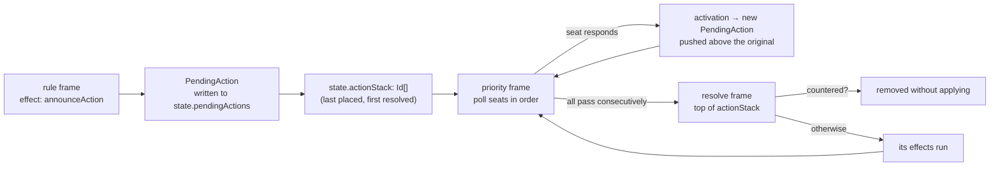

# Technical Design: Cardboard v2

Requirements: [`docs/REQUIREMENTS.md`](./REQUIREMENTS.md) § *v2 — Reference games*
Supersedes: [`docs/TECHNICAL_DESIGN.md`](./TECHNICAL_DESIGN.md) (v1, shipped)

## 1. Overview

v2 replaces Cardboard's execution core. v1's engine is a flat FIFO work queue with exactly one
RuleSet in flight and a single nullable prompt cursor; v2's engine is an **explicit continuation
stack** of frames, all inside `PlayState`, with an addressable **pending-action layer** sitting
beside it. Priority Windows, Effect Replacement, and nested prompts are three views of that one
change — v1's own design doc (§5.1) already states the suspension record must be redesigned the
moment dispatch stops being one-rule-at-a-time, and v2 is exactly that moment.

Three further rewrites ride along: card values become **computed on read** rather than stored,
seats become an **explicit mutable ring** rather than a dense `0..N-1` range, and the play UI
becomes **seat-partitioned** rather than omniscient.

Everything else in v2 is additive on top of those four.

The v1 architectural commitments that made the engine testable — pure engine module, no React or
DOM below `src/engine/`, all rewindable state in one immer-produced object, counter-based PRNG,
deterministic ids — are unchanged and non-negotiable. The new core is written against the same
constraints.

## 2. Context & constraints

### 2.1 What v2 inherits unchanged

| Area | Files | Status |
|---|---|---|
| Seeded PRNG | `src/engine/rng.ts` | **Unchanged.** Counter-based splitmix32; golden-value tests stay. |
| Zone keying | `src/engine/valueRef.ts:63` `zoneKey` / `:73` `parseZoneKey` | **Unchanged.** |
| Clamping | `src/engine/effects.ts:182` `clampValue` | **Unchanged**, but now also called on computed values (§5.4). |
| Capacity probe | `src/engine/effects.ts:196` `canMove` | **Unchanged.** Still the single source of truth the UI mirrors. |
| Definition CRUD + referential walker | `src/stores/definitionStore.ts:236` `findReferrers`, `:68` `walkRefs` | **Extended**, not replaced — every new reference kind in §4 must be added to the walker or delete-protection silently stops covering it. |
| Persistence | `src/stores/persistence.ts` | **Unchanged.** One IndexedDB store, debounced autosave. |
| Theme, `<Card>`, icons, dnd-kit wiring | `src/theme/*`, `src/components/card/*`, `src/components/dnd/*` | **Unchanged** except `<Card>`'s value reads (§5.4). |
| Engine lint boundary | `eslint.config.js` | **Unchanged and load-bearing.** No `Math.random`, no `Date.now`, no `crypto`, no React/immer imports below `src/engine/`. |

### 2.2 What v2 replaces

| Area | Files | Why |
|---|---|---|
| Dispatch | `src/engine/dispatch.ts` (788 lines) | Flat `queue: WorkItem[]` + one in-flight rule cannot express nested suspension. §3.2. |
| Suspension | `PlayState.pendingPrompt` (`types.ts:405`) | A single nullable record, resumed by re-entering one `{kind:'effect', effectIndex}` item. Not a stack. §3.3. |
| Seat resolution | `src/engine/valueRef.ts:89` `resolveSeat` | Modular wrap over `[0, playerCount)`. §3.5. |
| Card value reads | 6 call sites, enumerated in §5.4 | Stored-property lookups become computed. |
| Play screen visibility | `src/screens/play/PlayScreen.tsx`, `src/components/play/*` | Omniscient today; must partition by seat, including the log. §6. |

### 2.3 Decisions taken before this document

These were settled with the project owner and are load-bearing. Where one contradicts the
requirements document, that is called out in §10.

1. **The v1 core is replaced, not run alongside.** Two cores means every effect, criteria, and
   selector kind implemented twice, with divergence bugs no test suite catches.
2. **One window, one pinned seat, and the tester moves between seats as play progresses.** This is
   the point of seat partitioning, not a reduction of it: a designer plays the game from each
   seat's perspective in turn, seeing exactly what that seat sees, so they can judge how the game
   *reads* from every position at the table. Switching seats is the primary interaction, not a
   fallback. *`REQUIREMENTS.md`'s "one seat per browser window on one machine" wording describes a
   mechanism nobody wanted and should be corrected — see §10.1.*
3. **Play sessions remain unpersisted.** A refresh ends the playtest, as in v1 §7.4.
4. **Value modifiers are derived, not materialized.** §5.4.
5. **Seats are stable integer ids in an explicit order array.** Dense arrays stay full-length and
   never develop holes; elimination removes from the order, not from storage. §3.5.
6. **No v1 → v2 migration.** `SCHEMA_VERSION` becomes `2` and v1 files are rejected on the version
   gate. Pre-release; nobody has definitions worth preserving. *Deviates from the requirements —
   see §10.*
7. **Log verbosity is a UI control**, wired down into the engine as an emission gate. §5.9.
8. **v1's acceptance suite is the parity gate on the new core**, ported to v2 shapes, green before
   any v2 primitive lands. §8 Phase 0.

### 2.4 Out of scope

Everything in the requirements' *v2 non-goals* — MTG's layer system, bespoke combat machinery,
zone-change object identity, the legend rule, copy effects, deck-construction legality, real-time
limits, hard-coded reference-game rules — plus the v1 non-goals that still stand: networking,
server, accounts, bots, mobile layouts, user artwork.

No new runtime dependencies. Everything below is built from what `package.json` already has.

---

## 3. Architecture

### 3.1 Module layout delta

```
src/engine/
  types.ts              REWRITTEN — §4
  schema.ts             REWRITTEN — zod mirrors of §4; SCHEMA_VERSION 2
  frames.ts             NEW  — the continuation stack: push/pop/top, frame kinds
  dispatch.ts           REWRITTEN — step() over frames instead of a queue
  interaction.ts        NEW  — the Interaction union, raise/answer/validate
  pending.ts            NEW  — pending-action layer: announce, counter, resolve
  priority.ts           NEW  — priority window rounds, pass counting, legal-response probe
  modifiers.ts          NEW  — collectModifiers, effectiveIndex, effectiveTags. §5.4
  seats.ts              NEW  — seat ring, relative refs, elimination. §3.5
  replacement.ts        NEW  — effect replacement scan + application. §5.7
  continuous.ts         NEW  — settle-time fixpoint scan. §5.6
  activation.ts         NEW  — cost-gated activation, all-or-nothing cost transaction. §5.8
  valueRef.ts           EXTENDED — new ValueRef and CardRef kinds; resolveSeat moves to seats.ts
  criteria.ts           EXTENDED — candidate binding for predicate targeting
  targets.ts            EXTENDED — new selector kinds; reads effectiveTags not template.tags
  effects.ts            EXTENDED — new effect kinds; writes go through the replacement scan
  visibility.ts         EXTENDED — pending actions, sealed submissions, log-line redaction
  setup.ts              EXTENDED — seat ring init, owner assignment, instance tag seeding
  prose.ts              EXTENDED — English for every new effect, selector, and criteria kind
  stateMachine.ts       EXTENDED — settle scan now also drives continuous.ts
  rng.ts                unchanged
```

### 3.2 The continuation stack

v1 held remaining work in `PlayState.queue: WorkItem[]`, drained FIFO. That is correct and cheap
for a model where resolution is never interrupted. v2 interrupts resolution at arbitrary depth: a
rule's effect announces a pending action, which opens a priority window, in which a seat activates
a response rule, whose effect list contains a prompt.

v2 holds work in **`PlayState.stack: Frame[]`**, a LIFO continuation stack. `step()` inspects the
top frame, performs exactly one unit of work, and returns. Everything that was true of v1's step
machine stays true — the stack is plain JSON inside the produced state, so it is serializable,
patchable, and rewindable, and suspension is still "stop and leave the stack alone".

```
Frame kinds (§4.6 for exact shapes)

  event      an event's matched rule bindings, plus a cursor into them
  rule       one RuleSet's effect list, plus a cursor into it   ← the nestable replacement
                                                                  for v1's flat prompt cursor
  resolve    resolution of one pending action
  priority   one priority window round: policy, start seat, cursor, consecutive passes
  sealed     a simultaneous sealed choice awaiting submissions
  settle     sentinel: run the continuous-condition fixpoint and the auto-transition scan
```

**Breadth-first event dispatch is preserved where it applies.** v1 §5.1 made fired events go to the
queue tail so that effect 4 sees the world effect 3 left behind, not a world mutated by a deep
cascade. That property is kept: an `event` frame does not push child event frames — it appends to
**`PlayState.pending: Frame[]`**, a FIFO drained only when the stack empties. So ordinary v1-shaped
play is breadth-first exactly as before, and the stack depth only grows for things that genuinely
nest: prompts, priority, pending-action resolution.

```
step(state, input):
  if state.interaction: return { done: true, suspended: true }
  if state.stack is empty:
    if state.pending is non-empty: push(shift(state.pending)); return
    if not settled: push({ kind: 'settle' }); return
    return { done: true }
  advance(top(state.stack))
```

`advance` on a `rule` frame runs one effect and increments the cursor; on an `event` frame it
pushes a `rule` frame for the next binding; on `priority` it offers the next seat; and so on. One
unit of work per call, unchanged from v1.

**A transaction still runs to settlement and still commits one log entry** (§5.10). Suspension —
now any `Interaction`, not just a card prompt — still ends the transaction as a `suspended` entry.

### 3.3 Interactions replace the prompt cursor

`PlayState.pendingPrompt: PendingPrompt | null` becomes `PlayState.interaction: Interaction | null`,
a discriminated union covering card choice (v1's behaviour, unchanged), option choice, number
choice, seat choice, priority offers, and sealed choices. One field, one suspension mechanism, one
set of "everything except answer / cancel / rewind is rejected while set" rules.

The resumption bug class v1 avoided by construction is avoided the same way: **an effect that raises
an interaction must raise it before mutating anything**, because it executes twice — once to raise,
once to complete. The frame cursor does not advance until the effect completes.

### 3.4 The pending-action layer



A `PendingAction` is ordinary game state in `PlayState.pendingActions: Record<Id, PendingAction>`,
which means criteria and targeting selectors address it the way they address a card, and effects
(`counterAction`, `modifyActionAmount`, `redirectAction`) mutate it before it resolves. That
addressability is the whole point — v1's work queue was internal bookkeeping no authored rule could
see.

`actionStack` gives MTG's last-in-first-out resolution. VTES's single announced action with a block
window is the same structure with one entry.

### 3.5 The seat ring

```ts
type SeatId = number;   // stable, assigned at setup, NEVER reused or renumbered
```

`PlayState` gains `seatOrder: SeatId[]` — the ring, in seating order — and `eliminated: SeatId[]`.
Seat identity and seat position are now different things, which is the whole fix.

**Storage stays dense and full-length.** `playerPools[poolId]` remains an array indexed by `SeatId`,
and every per-seat zone instance stays in `state.zones`. Elimination removes a seat from
`seatOrder`; it never deletes storage. Sparse arrays serialize badly, patch worse, and buy nothing
here — an eliminated seat's pools are simply unreachable through every seat reference, which is the
observable requirement.

**Relative references resolve through `seatOrder`, not modular arithmetic.** `next` and `previous`
survive as sugar for `relative(active, +1)` / `relative(active, -1)`; the general form takes any
base seat and any offset, which is what makes "my predator" correct for a card owned by a seat whose
turn it is not. Closing the ring on elimination is then automatic: drop the seat from `seatOrder`
and its former neighbours become adjacent with no other code aware anything happened.

`activeSeatCount` is `seatOrder.length`, exposed as a `ValueRef` so table-size thresholds stay
correct after an oust with no per-game configuration.

**Elimination is not session end.** `finished` stays false while `seatOrder.length > 0`. Ending the
session remains the `End` state's job, exactly as in v1.

### 3.6 Data flow

Unchanged from v1 §3.4 in shape. The two additions:

- `uiStore` gains `logVerbosity`, and that value is passed **into** the engine on every action, so
  low verbosity avoids emitting lines rather than rendering-then-hiding them (§5.9).
- `visibility.ts` is consulted by the log panel as well as by `ZoneView`, so a log line naming a
  card in a zone the pinned seat cannot see is redacted rather than filtered client-side.

`PlaySession`, `HistoryFrame`, `log[]`, and `history[]` stay in `src/stores/sessionStore.ts`,
outside the produced state, for the reasons v1 §3.5 gives. Unchanged.

---

## 4. Data models & interfaces

`src/engine/types.ts`. Marked **NEW**, **CHANGED**, or omitted where v1's shape is unchanged.
Zod mirrors in `schema.ts`, with the existing `SCHEMA_MATCHES_TYPES` type-level assertion
(`schema.ts:533`) keeping them from drifting.

### 4.1 Seats

```ts
/** NEW. Stable identity. Assigned 0..playerCount-1 at setup and never reused. */
export type SeatId = number;

/** CHANGED — `relative`, `owner`, `controller` are new; `next`/`previous` are retained sugar. */
export type SeatRef =
  | { kind: 'active' }
  | { kind: 'next' }                                        // === relative(active, +1)
  | { kind: 'previous' }                                    // === relative(active, -1)
  | { kind: 'triggeringSeat' }
  | { kind: 'seat'; index: SeatId }
  | { kind: 'relative'; from: SeatRef; offset: number }     // NEW — predator/prey/cross-table
  | { kind: 'owner'; card: CardRef }                        // NEW
  | { kind: 'controller'; card: CardRef }                   // NEW
  | { kind: 'all'; quantifier?: 'every' | 'some' | 'sum' }; // CHANGED — `sum` added
```

`relative` resolves by finding `from` in `seatOrder` and stepping `offset` positions with
wrap-around **over the live order**, so eliminated seats are skipped without special-casing. If
`from` is itself eliminated (a card owned by an ousted seat), resolution fails with
`INVALID_SEAT` rather than guessing — same refusal-to-clamp discipline as v1 §5.7.

`sum` is legal only where a `ValueRef` is consumed as a number (effect amounts, comparison
operands). A zod refinement rejects it in boolean positions; the runtime re-checks and evaluates
`TYPE_MISMATCH` because imported JSON bypasses the editor.

**Every `all` quantifier — `every`, `some`, and `sum` alike — iterates `seatOrder`, never
`playerPools`' array indices.** Storage stays dense and full-length by design (§3.5), so an
eliminated seat's stale pool value is still sitting in the array; an implementation that iterates
the array silently counts ousted players in every vote tally and every "all players" check.

### 4.2 References

```ts
/** CHANGED — `host`, `candidate`, `replacedTarget` are new. */
export type CardRef =
  | { kind: 'triggering' }
  | { kind: 'zoneTop'; zone: ZoneRef }
  | { kind: 'promptAnswer'; promptId: string; ordinal: number }
  | { kind: 'instance'; id: Id }
  | { kind: 'host' }              // NEW — the host of the card this rule is attached to
  | { kind: 'candidate' }         // NEW — the card under test in a predicate selector (§4.4)
  | { kind: 'replacedTarget' };   // NEW — bound inside a replacement rule (§5.7)

/** NEW. Addresses a pending action the way CardRef addresses a card. */
export type ActionRef =
  | { kind: 'triggeringAction' }  // the action whose window/resolution we are inside
  | { kind: 'topOfStack' }
  | { kind: 'action'; id: Id };

/** CHANGED — four new kinds. */
export type ValueRef =
  | { kind: 'literal'; value: number | boolean }
  | { kind: 'pool'; poolId: Id; seat: SeatRef | null }
  | { kind: 'cardIndex'; card: CardRef; indexId: Id }        // now resolves EFFECTIVE value (§5.4)
  | { kind: 'zoneCount'; zone: ZoneRef }
  | { kind: 'cardTag'; card: CardRef; tag: string }          // NEW — boolean; runtime tags
  | { kind: 'activeSeatCount' }                              // NEW — seatOrder.length
  | { kind: 'replacedAmount' }                               // NEW — §5.7
  | { kind: 'actionField'; action: ActionRef; field: 'controller' | 'targetCount' };  // NEW
```

### 4.3 Cards

```ts
/** CHANGED — four new fields. */
export interface CardInstance {
  id: Id;
  templateId: Id;
  /** BASE values. Reads go through effectiveIndex() — §5.4. */
  indexValues: Record<Id, number | boolean>;
  faceDown: boolean;
  rotated: boolean;
  /** NEW. Seeded from template.tags at creation; mutable per instance. */
  tags: string[];
  /** NEW. Set once at creation, never changes. */
  owner: SeatId | null;
  /** NEW. null => derive from the holding zone's seat. */
  controller: SeatId | null;
  /** NEW. Host instance id. Attachment is a reference, not a zone. */
  attachedTo: Id | null;
}
```

`CardTemplate` is unchanged. `template.tags` becomes the **seed** for `instance.tags`; every
runtime read goes through `effectiveTags()`.

`controllerOf(state, cardId)` = `card.controller ?? seatOfZoneHolding(card)`. `ownerOf` is just
`card.owner`. The three-way split is what makes "return it to its owner's hand after its controller
changed" resolve correctly.

### 4.4 Targeting

```ts
/** CHANGED — `matching`, `attachedTo`, `hostOf`, `pendingActions` are new. */
export type TargetSelector =
  | { kind: 'triggeringCard' }
  | { kind: 'topOfZone'; zone: ZoneRef; count: ValueRef }
  | { kind: 'bottomOfZone'; zone: ZoneRef; count: ValueRef }
  | { kind: 'allInZone'; zone: ZoneRef }
  | { kind: 'taggedInZone'; zone: ZoneRef; tag: string }
  | { kind: 'prompt'; from: TargetSelector; count: ValueRef; promptText: string }
  /** NEW — predicate targeting. `where` is evaluated once per candidate with
   *  CardRef{kind:'candidate'} bound to the card under test. */
  | { kind: 'matching'; from: TargetSelector; where: CriteriaNode }
  | { kind: 'attachedTo'; host: CardRef }   // NEW — everything attached to a host
  | { kind: 'hostOf'; card: CardRef };      // NEW — the host of a card

/** NEW — pending actions are selected separately; they are not cards. */
export type ActionSelector =
  | { kind: 'action'; ref: ActionRef }
  | { kind: 'allOnStack'; where: CriteriaNode | null };
```

`matching` wraps like `prompt` does, and the two compose in either order:
`prompt(from: matching(from: allInZone(Battlefield), where: power > 2))` is "choose a creature with
power 3 or more", and the wrapped selector still defines the highlighted legal set — no second
targeting language, exactly as in v1 §4.7.

### 4.5 Effects and rules

```ts
/** CHANGED — v1's eleven kinds are unchanged; ten are added. */
export type Effect =
  // ---- v1, unchanged ----
  | { kind: 'moveCards'; target: TargetSelector; to: ZoneRef; position: InsertPosition }
  | { kind: 'drawCards'; from: ZoneRef; to: ZoneRef; count: ValueRef }
  | { kind: 'shuffleZone'; zone: ZoneRef }
  | { kind: 'changePool'; poolId: Id; seat: SeatRef | null; op: NumericOp; amount: ValueRef }
  | { kind: 'setCardIndex'; target: TargetSelector; indexId: Id; op: NumericOp; amount: ValueRef }
  | { kind: 'flipCard'; target: TargetSelector; to: 'faceUp' | 'faceDown' | 'toggle' }
  | { kind: 'rotateCard'; target: TargetSelector; to: 'rotated' | 'upright' | 'toggle' }
  | { kind: 'createCard'; templateId: Id; zone: ZoneRef; position: InsertPosition; count: ValueRef }
  | { kind: 'destroyCards'; target: TargetSelector }
  | { kind: 'fireEvent'; name: string }
  | { kind: 'forceTransition'; toStateId: Id }
  // ---- NEW ----
  | { kind: 'setTag';        target: TargetSelector; tag: string; on: boolean }
  | { kind: 'attach';        target: TargetSelector; host: CardRef }
  | { kind: 'detach';        target: TargetSelector }
  | { kind: 'setController'; target: TargetSelector; seat: SeatRef | null }
  | { kind: 'announceAction'; ruleId: Id; window: Id | null }
  | { kind: 'counterAction'; action: ActionSelector }
  | { kind: 'openPriority';  window: Id }
  | { kind: 'sealedChoice';  choiceId: string; seats: SeatRef; options: ChoiceOption[] }
  | { kind: 'chooseMode';    promptText: string; seat: SeatRef; modes: ChoiceMode[] }
  | { kind: 'chooseNumber';  promptText: string; seat: SeatRef; min: ValueRef; max: ValueRef;
                             /** the answer is readable as ValueRef{kind:'promptNumber'} */
                             key: string }
  | { kind: 'eliminateSeat'; seat: SeatRef };

export interface ChoiceOption { id: string; label: string }
export interface ChoiceMode   { label: string; effects: Effect[] }
```

```ts
/** CHANGED — four new optional fields, all defaulting to null/false so v1-shaped rules are
 *  unaffected. Each is mutually exclusive with the others; a zod refinement enforces that,
 *  because a rule that is simultaneously a trigger, a modifier, and a replacement has no
 *  defensible evaluation order. */
export interface RuleSet {
  id: Id;
  name: string;
  trigger: EventName;
  stateFilter: Id | null;
  condition: CriteriaNode | null;
  effects: Effect[];
  priority: number;
  onRejection: 'continue' | 'abort';

  /** NEW. true => `trigger` is ignored; `condition` is scanned at settle. §5.6 */
  continuous: boolean;

  /** NEW. A continuously-applying value modifier. §5.4 */
  modifier: {
    scope: TargetSelector;     // re-evaluated per read
    indexId: Id;
    op: 'set' | 'adjust';
    amount: ValueRef;
    /** The modifier applies only while its source card is in one of these zones.
     *  Empty => applies wherever the source is. */
    activeZones: Id[];
  } | null;

  /** NEW. Registers against an effect about to apply. §5.7 */
  replaces: {
    effectKind: Effect['kind'];
    match: CriteriaNode | null;   // may use replacedAmount / replacedTarget
  } | null;

  /** NEW. Cost-gated activation. §5.8 */
  activation: {
    costCheck: CriteriaNode | null;
    cost: Effect[];
    /** Priority window this may be used in. null => only outside a window. */
    window: Id | null;
    /** true => rendered as a button on each card instance the rule is attached to. */
    perInstance: boolean;
    label: string;
  } | null;
}
```

### 4.6 Priority windows

```ts
/** NEW — a top-level authored entity, edited in its own screen (§6). */
export interface PriorityWindow {
  id: Id;
  name: string;
  /** Where polling starts. */
  start: 'active' | 'triggeringSeat' | 'controllerOfAction';
  /** Ring direction. */
  direction: 'forward' | 'backward';
  /** false => the starting seat is skipped (VTES: you do not block your own action). */
  includeStart: boolean;
  /** Closes after this many consecutive passes. null => activeSeatCount (poll the whole table). */
  passesToClose: number | null;
  /** A seat with no legal response auto-passes and produces NO log entry. Always true;
   *  present as a field only so the editor can show it as an explained, disabled checkbox. */
  collapseEmptyOffers: true;
}
```

### 4.7 Frames

```ts
/** NEW — replaces WorkItem. Same deterministic-id discipline: `id` from PlayState.nextWorkId. */
export interface FrameBase { id: number; parentId: number | null; depth: number }

export type Frame =
  | (FrameBase & { kind: 'event'; name: EventName; ctx: TriggerContext; stateId?: Id;
                   bindings: RuleBinding[]; cursor: number })
  | (FrameBase & { kind: 'rule'; ruleId: Id; sourceCardId: Id | null; ctx: TriggerContext;
                   cursor: number; aborted: boolean })
  | (FrameBase & { kind: 'resolve'; actionId: Id })
  | (FrameBase & { kind: 'priority'; windowId: Id; actionId: Id | null;
                   order: SeatId[]; cursor: number; consecutivePasses: number })
  | (FrameBase & { kind: 'sealed'; choiceId: string })
  | (FrameBase & { kind: 'settle'; iteration: number });

export interface RuleBinding { ruleId: Id; sourceCardId: Id | null; ctx: TriggerContext }
```

### 4.8 Pending actions

```ts
/** NEW. Game state, addressable by criteria and selectors. */
export interface PendingAction {
  id: Id;                       // `a${state.nextSeq++}`
  ruleId: Id;
  sourceCardId: Id | null;
  controller: SeatId;
  ctx: TriggerContext;
  /** Targets chosen at announce time and frozen, so a response that moves a card
   *  cannot silently re-aim the original. */
  targets: Record<string, Id[]>;
  /** Mutable per-action characteristics, so "this action is a spell" is authorable. */
  tags: string[];
  countered: boolean;
}
```

### 4.9 Interactions

```ts
/** NEW — replaces PendingPrompt. One suspension mechanism for every kind of pause. */
export type Interaction =
  | { kind: 'chooseCards'; promptId: string; promptText: string; seat: SeatId;
      candidates: Id[]; min: number; max: number }                      // v1 behaviour, unchanged
  | { kind: 'chooseOption'; promptId: string; promptText: string; seat: SeatId;
      options: ChoiceOption[] }
  | { kind: 'chooseNumber'; promptId: string; promptText: string; seat: SeatId;
      min: number; max: number }
  | { kind: 'chooseSeat'; promptId: string; promptText: string; seat: SeatId;
      candidates: SeatId[] }
  | { kind: 'priority'; promptId: string; windowId: Id; seat: SeatId;
      /** Non-empty by construction — an empty set auto-passes without raising. §5.5 */
      legal: { ruleId: Id; cardId: Id | null; label: string }[] }
  | { kind: 'sealed'; promptId: string; choiceId: string; seats: SeatId[];
      options: ChoiceOption[];
      /** Hidden from every seat and from the log until `seats` are all present. §5.11 */
      submitted: Record<SeatId, string> };
```

### 4.10 Play state

```ts
/** CHANGED. Everything rewindable, and nothing else — unchanged principle. */
export interface PlayState {
  definitionId: Id;
  seed: string;
  rngCursor: number;
  nextSeq: number;
  nextWorkId: number;
  logSeq: number;

  /** CHANGED — the ring. playerCount survives only as the initial seat count. */
  playerCount: number;
  seatOrder: SeatId[];        // NEW
  eliminated: SeatId[];       // NEW

  pools: Record<Id, number | boolean>;
  /** Indexed by SeatId. Stays full-length forever; elimination never creates holes. */
  playerPools: Record<Id, (number | boolean)[]>;

  cards: Record<Id, CardInstance>;
  zones: Record<ZoneKey, ZoneInstance>;

  pendingActions: Record<Id, PendingAction>;   // NEW
  actionStack: Id[];                           // NEW — last placed resolves first

  currentStateId: Id;
  finished: boolean;

  stack: Frame[];             // CHANGED — was queue: WorkItem[]
  pending: Frame[];           // NEW — FIFO for breadth-first event dispatch (§3.2)
  interaction: Interaction | null;   // CHANGED — was pendingPrompt

  /** NEW. Continuous rules fire on false→true transitions, not while-true. §5.6 */
  continuousFired: Record<string, true>;

  budget: { causalDepth: number; effectsUsed: number;
            settleIterations: number; priorityRounds: number };  // CHANGED — two counters added
}
```

**The log gains an audience.** `LogLine` and `LogEntry.cause` each take one new field, stamped by
the engine at emission because that is the only place that still knows which zone the line is about:

```ts
export interface LogLine {
  // …v1 fields unchanged
  /** Seats this line may be shown to. null => public. */
  visibility: SeatId[] | null;   // NEW
}

export interface LogEntry {
  seq: number;
  cause: { kind: 'userAction' | 'engine'; description: string; seat: SeatId | null;
           visibility: SeatId[] | null };   // NEW
  lines: LogLine[];
  flags: { override?: true; haltedByLoopGuard?: true; suspended?: true };
}
```

An explicit audience rather than a zone reference the panel resolves itself: `visibility.ts` computes
it once, engine-side, and the panel never needs a second copy of `resolveVisibility`'s rule.
**Redaction withholds `message` and `change` only — never the line or the entry**, because
`entry.seq === index in log[] === index in history[]` and a log that dropped slots per seat would
give different seats different rewind indices for the same moment. §6.2.

### 4.11 Definition root

```ts
export const SCHEMA_VERSION = 2 as const;

export const DEFAULT_MAX_DEPTH = 256;             // was 64
export const DEFAULT_MAX_EFFECTS = 50_000;        // was 10_000
export const DEFAULT_MAX_SETTLE_ITERATIONS = 64;  // NEW
export const DEFAULT_MAX_PRIORITY_ROUNDS = 256;   // NEW

export interface GameDefinition {
  schemaVersion: typeof SCHEMA_VERSION;
  id: Id;
  name: string;
  playerCount: number;
  pools: PointPool[];
  zones: PlayZone[];
  templates: CardTemplate[];
  decks: Deck[];
  customEvents: string[];
  ruleSets: RuleSet[];
  globalRuleSetIds: Id[];
  priorityWindows: PriorityWindow[];   // NEW
  machine: StateMachine;
  limits: { maxDepth: number; maxEffects: number;
            maxSettleIterations: number; maxPriorityRounds: number };   // CHANGED
  updatedAt: string;
}
```

The v1 ceilings are raised because a legitimate five-seat VTES response chain, or an MTG board with
thirty permanents each carrying a continuous condition, trips 64/10 000 during ordinary play — the
requirements name this explicitly.

### 4.12 Actions and rejection reasons

```ts
/** CHANGED — five new actions. */
export type PlayAction =
  | { kind: 'start' }
  | { kind: 'moveCard'; cardId: Id; to: ZoneRef; position: InsertPosition }
  | { kind: 'flipCard'; cardId: Id; to: 'faceUp' | 'faceDown' | 'toggle' }
  | { kind: 'rotateCard'; cardId: Id; to: 'rotated' | 'upright' | 'toggle' }
  | { kind: 'transition'; toStateId: Id }
  | { kind: 'fireEvent'; name: string; seat: SeatId | null }
  | { kind: 'answerPrompt'; chosen: Id[] }
  | { kind: 'cancelPrompt' }
  | { kind: 'activate'; ruleId: Id; cardId: Id | null; seat: SeatId }       // NEW
  | { kind: 'passPriority' }                                                // NEW
  | { kind: 'answerOption'; optionId: string }                              // NEW
  | { kind: 'answerNumber'; value: number }                                 // NEW
  | { kind: 'answerSeat'; seat: SeatId }                                    // NEW
  | { kind: 'submitSealed'; seat: SeatId; optionId: string };               // NEW

/** CHANGED — six added. Still a closed union so §9's override × reason table stays exhaustive. */
export type RejectReason =
  | 'ZONE_FULL' | 'TARGET_GONE' | 'NO_TARGETS' | 'ILLEGAL_TRANSITION' | 'ONE_SIDED_EDGE'
  | 'MISSING_REFERENT' | 'TYPE_MISMATCH' | 'INVALID_SEAT' | 'UNBOUND_REF' | 'RULE_LOOP'
  | 'AWAITING_PROMPT' | 'INVALID_ANSWER' | 'PROMPT_CANCELED' | 'SESSION_FINISHED'
  | 'SEAT_ELIMINATED'      // NEW — target or destination belongs to an ousted seat
  | 'COST_UNPAYABLE'       // NEW — §5.8
  | 'NOT_ACTIVATABLE'      // NEW — wrong window, or condition false
  | 'ACTION_COUNTERED'     // NEW
  | 'SETTLE_DIVERGED'      // NEW — continuous fixpoint hit its iteration cap
  | 'PRIORITY_EXHAUSTED';  // NEW — priority round cap
```

---

## 5. Engine semantics

The v1 semantics in `TECHNICAL_DESIGN.md` §5 remain in force except where restated here.

### 5.1 Rule ordering

v1 §5.2's total order is unchanged: `priority` descending → game-level before card-attached → zone
declaration order, positional index, seat index → RuleSet id as final tiebreak. Two amendments:

- **Seat index means position in `seatOrder`**, not `SeatId`. Board order is what a tester can see;
  after an oust the visible order is the ring, not the id sequence.
- **Pending actions sort after cards**, by `actionStack` position ascending, then action id.

### 5.2 Effect execution

Unchanged from v1 §5.3: best-effort at RuleSet level, atomic at effect level, `onRejection: 'abort'`
stops later effects without rolling back earlier ones, shortfall is partial and constraint violation
is full rejection.

The one addition is §5.8's cost transaction, which *is* all-or-nothing — and is a deliberate
exception, not a change of policy.

### 5.3 The settle point

v1 evaluated auto-transitions only at quiescence (§5.6), for good reasons that still hold: mid-rule
the world is transiently inconsistent. v2 puts three things at that same point, in this order:

```
settle(iteration):
  1. continuous-condition fixpoint scan (§5.6)   — if any rule fired, re-enter settle
  2. auto-transition scan (v1 §5.6, unchanged)   — if a transition fired, re-enter settle
  3. otherwise: settled. transaction commits.
```

Continuous conditions run **before** transitions because "a creature with lethal damage dies" and
"a player at zero pool is ousted" must land before the state machine decides whether the phase is
over. Re-entry is bounded by `budget.settleIterations` against `limits.maxSettleIterations`;
tripping it logs `SETTLE_DIVERGED` and halts the chain exactly as the loop guard does.

### 5.4 Computed values

```ts
// src/engine/modifiers.ts
export function effectiveIndex(
  state: PlayState, def: GameDefinition, cardId: Id, indexId: Id,
): number | boolean;

export function effectiveTags(
  state: PlayState, def: GameDefinition, cardId: Id,
): string[];
```

**Derivation, not materialization.** A modifier is not written into state when its source enters
play; it is discovered by scanning `def.ruleSets` for rules with `modifier !== null` whose source
card is currently in an `activeZones` zone and whose `condition` passes. A materialized design needs
a teardown path for every route a source can leave play by — destroyed, moved, detached, controller
changed, seat eliminated — and every route someone forgets leaves a permanent phantom buff that no
test naturally catches. Derivation is consistent with the board by construction.

**Application order** — fixed, total, and deliberately short of MTG's layer system:

1. base value from `card.indexValues[indexId]`
2. every `set` modifier, in creation order
3. every `adjust` modifier, in creation order
4. `clampValue` against the `CardIndex`'s `GameValue` bounds — the same `effects.ts:182` helper

"Creation order" is the source card instance's numeric id suffix ascending, then RuleSet id — both
deterministic and stable across export/import, so same-seed replays cannot diverge.

**Memoization lives outside the patch stream.** A `WeakMap<PlayState, Map<string, Value>>` in
`modifiers.ts`. immer returns a fresh state object per produce, so the cache invalidates itself with
no versioning and never enters `PlayState` — putting a cache inside the produced state would make it
rewindable, patch-visible, and a source of spurious log churn.

**The seven read sites that change**, all of which must change together or the engine reports
inconsistent values:

| Site | Today | Becomes |
|---|---|---|
| `src/components/card/Card.tsx:116` | `instance?.indexValues[index.id] ?? index.value.defaultValue` | `effectiveIndex(...)`, with the modified-from-base delta shown on the pip |
| `src/components/card/Card.tsx:96` | `template.tags.join(' · ')` (the tagline) | `effectiveTags(...)`, with runtime-granted tags visually distinguished from printed ones |
| `src/engine/valueRef.ts:253` | `cardRes.card.indexValues[ref.indexId]` | `effectiveIndex(...)` |
| `src/engine/effects.ts:576` | `card.indexValues[effect.indexId]` (read for `setCardIndex`) | `effectiveIndex(...)` for `add`/`subtract`; the **write** at `:593` still writes the base |
| `src/engine/targets.ts:204` | `template.tags.includes(sel.tag)` | `effectiveTags(...).includes(...)` |
| `src/engine/prose.ts` | template values in previews | unchanged — authoring-time prose describes the template, not an instance |
| `src/engine/criteria.ts` | via `resolveValueRef` | inherits the change |

Neither `Card.tsx` site calls `effectiveIndex` directly — `<Card>` has no `PlayState` and must not
acquire one, or the catalog gains play-state coupling and v1 §6.3's "catalog and play render
identically" guarantee stops being structural. Both are resolved one level up in `ZoneView`, exactly
as `faceDown` already is, and passed down as computed answers. §6.8.

`setCardIndex` reading effective and writing base is the correct and slightly surprising choice:
"this creature gets -1/-1 permanently" should subtract from what it currently is, and store the
result as its new base. The alternative — read base, write base — makes damage on a buffed creature
behave differently from damage on an unbuffed one.

### 5.5 Priority windows

```
priority frame:
  order    = seats from `start`, walking `direction` around seatOrder, honouring includeStart
  cursor   = index into order
  passes   = consecutive passes so far

advance:
  seat = order[cursor]
  legal = activatableRules(state, def, seat, windowId)     // cost + condition + window match
  if legal is empty:
    passes += 1; cursor = (cursor + 1) % order.length      // NO log entry, NO interaction
  else:
    raise Interaction{kind:'priority', seat, legal}        // transaction commits, suspended
  if passes >= (window.passesToClose ?? seatOrder.length):
    pop the frame; resolution continues
```

**`order` is fixed at frame-push time; the close threshold is read live.** Two consequences that
must both be implemented, because each is wrong on its own:

- A seat eliminated while the window is open is **skipped** when `cursor` reaches it — silently, with
  no interaction and no log entry, the same shape as an auto-pass but for a different reason.
- `passesToClose ?? seatOrder.length` re-reads `seatOrder` on **every** check. Capturing it once at
  push time means a window opened at five seats waits forever for a fifth consecutive pass after an
  elimination drops the table to four.

The two acceptance criteria about log entries fall out of this without special-casing:

- A round in which **no seat holds a legal response** raises no interaction, so no transaction
  boundary occurs and the whole round collapses into the enclosing entry.
- A seat that **does hold one and passes anyway** was necessarily offered an interaction, which
  committed the enclosing transaction as `suspended`; its `passPriority` is then a fresh user action
  and gets its own entry and rewind point.

**A response resets `passes` to 0**, so the window re-polls the table — MTG's rule, and VTES's
"continue from the resulting combat rather than re-offering to seats that already declined" is
expressed by the block rule's effects popping the priority frame explicitly (`counterAction` on the
announced action, then resolution proceeds from the combat the block rule announces).

`budget.priorityRounds` caps total rounds per transaction against `limits.maxPriorityRounds`.

### 5.6 Continuous conditions

A rule with `continuous: true` fires **when its condition becomes true**, not while it is true.
`PlayState.continuousFired: Record<string, true>` keyed by `` `${ruleId}:${bindingKey}` `` records
that it has fired; the key is cleared when the condition next evaluates false. Without this, a rule
whose condition stays true re-fires every settle iteration and the fixpoint never terminates.

The fixpoint loop:

```
scan:
  fired = false
  for each continuous rule, in §5.1 order, for each binding:
    key = ruleId:bindingKey
    if condition true and not continuousFired[key]:
      continuousFired[key] = true; push a rule frame; fired = true
    if condition false:
      delete continuousFired[key]
  return fired
```

Because every newly-eligible rule is picked up on the next iteration, the requirement that "the
first rule's effect makes the second's condition newly true → both fire within the same
transaction" is satisfied, and both land in one log entry and one rewind frame.

### 5.7 Effect replacement

Before `applyEffect` mutates anything, `replacement.ts` scans rules with
`replaces.effectKind === effect.kind`, in §5.1 order, evaluating `replaces.match` with
`ValueRef{kind:'replacedAmount'}` and `CardRef{kind:'replacedTarget'}` bound to the pending
effect's parameters.

- The **first** match wins. Its own `effects` run **in place of** the original.
- Each replacement rule applies **at most once per effect instance** — the substituted effects carry
  the replacing rule's id in a `replacedBy` set on the frame, and rules in that set are skipped when
  the substitutes are themselves scanned. This is what stops "if you would draw, draw two instead"
  from drawing infinitely.
- The log records the original effect and the substitution as two distinguishable lines, which is
  the acceptance criterion verbatim.

Only the effect kinds a replacement can meaningfully intercept are offered in the editor:
`drawCards`, `changePool`, `moveCards`, `destroyCards`, `setCardIndex`.

### 5.8 Cost-gated activation

```
activate(ruleId, cardId, seat):
  if rule.activation is null                        -> NOT_ACTIVATABLE
  if inside a window and rule.activation.window !== windowId  -> NOT_ACTIVATABLE
  if rule.activation.costCheck evaluates false      -> COST_UNPAYABLE, nothing runs, cost named
  apply rule.activation.cost in a nested produce
    if any cost effect rejects                      -> DISCARD the draft, COST_UNPAYABLE
  push a rule frame for rule.effects
```

The cost draft is discarded rather than inverse-patched, which is why this is the one place effects
are all-or-nothing: at cost time nothing external has observed the mutation — no event has fired, no
prompt has been answered — so unwinding is safe here and is not safe in the general case v1 §5.3
argues about.

**A cost effect may not raise an `Interaction`.** That premise — "nothing external has observed the
mutation" — is exactly what a suspension breaks: suspending commits the transaction, which publishes
the half-applied cost to the log and to a rewind point, and the draft can then never be discarded.
The discard model and the suspend-and-commit model are in direct conflict, so one of them has to
lose, and it is cheaper to forbid the case than to build a second cost model for it.

Enforced in two places: a zod refinement rejects any `activation.cost` array containing
`chooseMode`, `chooseNumber`, `sealedChoice`, `openPriority`, or a `TargetSelector` of kind
`prompt`; and `activation.ts` re-checks at runtime, rejecting `COST_UNPAYABLE` with a detail naming
the offending effect, because imported JSON bypasses the editor. The authoring UI simply does not
offer those kinds in a cost list.

"Sacrifice a card of your choice as a cost" is therefore authored as a prompt in the rule's
**effects**, ahead of a `costCheck` that verifies the sacrifice happened — one more effect, no new
engine concept.

The whole activation lands in **one transaction and one log entry**, so rewinding to before it
restores the spent pool exactly, per the acceptance criterion.

`perInstance: true` surfaces the rule as a button on each attached card instance in the play UI
(§6), which is the second half of that requirement — activation must be reachable per instance, not
only as a global event button.

### 5.9 Log verbosity

Three levels, controlled from `uiStore.logVerbosity` and passed **into** the engine on every action
via `EngineInput`:

| Level | Emits |
|---|---|
| 1 — actions | user actions, transitions, rejections, overrides, errors |
| 2 — rules *(default)* | + events fired, rules matched/skipped, effects applied, change lines |
| 3 — criteria | + every evaluated criterion leaf with its resolved values, and per-candidate include/exclude for predicate selectors |

**Criteria evaluation itself never short-circuits at any level** — v1 §5.7's guarantee is a
semantic property and stays. Only line *emission* is gated. That distinction is what keeps
verbosity from changing what the engine computes, which would make a bug reproduce at level 3 and
vanish at level 1.

Log lines are outside `PlayState`, so verbosity affects neither determinism nor rewind.

### 5.10 Transactions, log, and rewind

v1 §5.8 is unchanged in mechanism: one entry per transaction, inverse patches applied newest-frame
first and reverse-array-order within a frame, entries after the rewind point discarded, everything
in `PlayState` inside the rewound domain.

The definition of "requires input" widens from *a card prompt* to *any `Interaction`*. Since
`interaction`, `stack`, `pending`, `pendingActions`, `actionStack`, `continuousFired`, and
`budget` are all fields of `PlayState`, rewinding across a priority window, a half-resolved stack,
or a partially-submitted sealed choice needs **no special case** — exactly as rewinding across a
prompt needed none in v1.

### 5.11 Simultaneous sealed choice

Submissions accumulate in `Interaction{kind:'sealed'}.submitted`.

**What "sealed" means here follows from decision 2.** There is one tester moving between seats, so
this is not about stopping seat B from cheating — it is about seat B's *turn at the keyboard* being
an honest reproduction of seat B's information state. If A's strike were visible while pinned to B,
the tester would be evaluating a decision no real player ever faces, which defeats the reason to
play the seat at all. Three rules deliver that:

1. **No log line is emitted on submission.** The first line the log ever sees is the reveal.
2. **The UI renders `submitted` as a count, never a value**, and `visibility.ts` refuses to resolve
   another seat's submission for the pinned seat. Reveal-all short-circuits it, as everywhere else.
3. **Resolution order is `seats` order, never submission order** — so two sessions where the same
   two seats submit in opposite orders produce byte-identical state.

The whole reveal plus its consequences is one transaction and one log entry, per the acceptance
criterion.

### 5.12 Seat elimination

`eliminateSeat` removes the seat from `seatOrder`, appends it to `eliminated`, and logs one change
line. It does **not** delete pools, zone instances, or cards. Thereafter:

- Any `SeatRef` resolving to an eliminated seat fails `SEAT_ELIMINATED` (except
  `{kind:'seat', index}`, which resolves for forensics but is rejected as a move or target
  destination).
- `activeSeatCount` reads `seatOrder.length`.
- Ring neighbours close automatically because `relative` walks `seatOrder`.
- `finished` is untouched. Elimination is not session end.

Cards owned by an eliminated seat stay where they are; cascading them anywhere is authored, in
keeping with v1's refusal to cascade destruction implicitly.

---

## 6. UI architecture

v1 §6 stands except where restated here. The theme (§6.9), `<Card>`'s no-size/no-variant rule
(§6.3), the dnd-kit mapping (§6.5), and the rule editor's sentences-with-chips premise (§6.8) are
all unchanged and are the constraints the additions below are built inside. **No new dependencies
and no new theme tokens** — every surface here is built from `components.css`, `table.css`, and the
existing `--cb-z-*` scale.

Four things change shape: the play view becomes seat-partitioned rather than omniscient, the log
becomes redactable, the prompt bar becomes an interaction bar, and the authoring editors grow to
cover §4's new unions. One new screen and one new route.

### 6.1 The pinned seat

`uiStore.viewingSeat` **is** the pinned seat and keeps its name. It is already a `SeatId` by
another word, and renaming it would touch eight call sites to change nothing. `uiStore.ts` gains one
field:

```ts
interface UiStore {
  viewingSeat: SeatId;      // the pinned seat. Nothing but setViewingSeat writes it.
  revealAll: boolean;
  overrideEnabled: boolean;
  plainMode: boolean;
  logVerbosity: 1 | 2 | 3;  // NEW — §5.9. Default 2.
  setLogVerbosity(level: 1 | 2 | 3): void;
  // …existing setters
}
```

`logVerbosity` belongs here and not in `sessionStore` for the reason `uiStore.ts:2-5` already
gives: rewinding must not flip the tester's switches underneath them. `sessionStore.dispatch` reads
it with `useUiStore.getState().logVerbosity` at the top of each transaction and puts it in
`EngineInput` — `getState()` rather than a subscription, because the store is not a component and
nothing needs to re-render when it changes.

**The consequence worth stating up front: raising verbosity is not retroactive.** §5.9 gates
*emission*, so detail that was never emitted cannot be recovered by turning the dial up; the tester
rewinds and redoes the action at the higher level. That is the price of not rendering-then-hiding,
and it is the same trade §6.3 already makes for face-down cards.

**"Switching the pinned seat requires an explicit action" means three concrete things**, and the
acceptance criterion is met by all three together, not by the switcher alone:

1. **Nothing in the engine or the session can write `viewingSeat`.** It lives outside the rewound
   domain, so a rewind, a transition, an elimination, or an interaction raised for another seat
   never moves the view. This is already true in v1 and is now load-bearing rather than a
   convenience.
2. **The view never follows the active seat.** `state.pools[ACTIVE_PLAYER_POOL_ID]` drives the
   `← active` marker on a seat band (`table.css:105`) and nothing else.
3. **An interaction raised for an unpinned seat does not answer in place.** The interaction bar
   renders the seat and a `[View as P3]` button — that button is the explicit action, and pressing
   it is what a hot-seat table does when it passes the keyboard. The interaction's own contents are
   redacted until the switch happens, because *what P3 may legally do* is itself information.

**Reveal-all is the god view, and it is a first-class mode rather than a cheat.**
`resolveVisibility`'s first line (`visibility.ts:16`) is `if (revealAll) return false`, and every
new redaction site below takes the same short-circuit in the same position. The two modes answer
different questions and a designer switches between them constantly: *seat view* asks "how does
this game read from seat 2" — the thing decision 2 exists for — and *reveal-all* asks "what is
actually going on", which is what you want the instant a rule misfires. One switch, one meaning,
and no tone of transgression about it.

**Every hidden-information decision the pinned seat drives:**

| Site | File | Decision |
|---|---|---|
| Card face | `ZoneView.tsx:132` → `visibility.ts` | unchanged from v1 |
| Card effective values | `ZoneView.tsx` (§6.8) | not computed at all for a hidden card |
| Card runtime tags | `ZoneView.tsx` (§6.8) | not passed for a hidden card |
| Drag overlay | `PlayScreen.tsx:371` | already takes `viewingSeat`; unchanged |
| Log lines and entry causes | `EventLogPanel.tsx` (§6.2) | NEW |
| Pending-action targets | `ActionStackRail.tsx` (§6.4) | NEW |
| Interaction contents | `InteractionBar.tsx` (§6.5–6.6) | NEW |
| Sealed submissions | `InteractionBar.tsx` (§6.6) | NEW — count only |
| Per-instance activation buttons | `ZoneView.tsx` (§6.7) | only on cards the pinned seat controls |
| Pools | `PoolReadout.tsx` | **public, deliberately.** `PointPool` has no visibility field and §4 does not add one. Hidden pools are not a requirement; treating them as one would be inventing a primitive. |

**One window, and moving between seats is the feature.** Decision 2 (§2.3). The tester walks the
table as play progresses, seeing each seat's game as that seat sees it. So the switch must be
*explicit* — never automatic, per the acceptance criterion — but it must not be laborious, because
it is the most-used control on the screen. That is why the primary switch is the contextual
`[View as P4]` button the interaction bar already offers at the moment a seat is asked to act
(§6.5), and the toolbar's seat strip is the secondary path for switching when nothing is pending.
An explicit action is one deliberate click, not a confirmation dialog.

### 6.2 Log redaction

`LogLine` and `LogEntry.cause` each gain one field:

```ts
export interface LogLine {
  // …v1 fields unchanged
  /** Seats this line may be shown to. null => public. Stamped by the engine at emission. */
  visibility: SeatId[] | null;
}

export interface LogEntry {
  seq: number;
  cause: { kind: 'userAction' | 'engine'; description: string; seat: SeatId | null;
           visibility: SeatId[] | null };   // NEW
  lines: LogLine[];
  flags: { override?: true; haltedByLoopGuard?: true; suspended?: true };
}
```

An explicit audience rather than a zone reference, because the engine already knows which zone it is
writing about at emission time and the panel would otherwise need the definition, the zone table,
and a second copy of `resolveVisibility`'s rule. §3.6's "`visibility.ts` is consulted by the log
panel as well as by `ZoneView`" is satisfied by `visibility.ts` computing the audience once, engine
side, rather than by the panel calling it per line.

**Redaction removes content, never structure.** `entry.seq === index in log[] === index in
history[]` (`types.ts:425`). A log that dropped lines or entries for the pinned seat would give
different seats different rewind indices for the same moment, and rewind would land in the wrong
place the first time someone switched seats mid-game. So a redacted line still occupies its slot,
still carries its `level` and `kind`, and still renders its glyph — only `message` and `change` are
withheld.

**What a redacted line renders as.** The panel's line loop (`EventLogPanel.tsx:70-83`) branches:

```tsx
const visible = (v: SeatId[] | null) => v === null || revealAll || v.includes(viewingSeat);

{entry.lines.map((line, i) =>
  visible(line.visibility) ? (
    <p key={i} className="cb-log__line" data-level={line.level} data-kind={line.kind}>
      <span aria-hidden="true">{glyph(line)}</span>
      <span>{line.message}</span>
      {line.change && <span> {String(line.change.before)} → {String(line.change.after)}</span>}
    </p>
  ) : (
    // No message, no change, no title, no data-* carrying any part of either.
    <p key={i} className="cb-log__line" data-level={line.level} data-kind={line.kind} data-redacted="true">
      <span aria-hidden="true">{glyph(line)}</span>
      <span>hidden from you</span>
    </p>
  )
)}
```

```css
.cb-log__line[data-redacted="true"] {
  color: var(--cb-ink-500);
  font-style: italic;
  /* Marker crosshatch, the same vocabulary as .cb-card__back — "there is something here you
     are not being shown" reads identically on a card and on a log line. */
  background: repeating-linear-gradient(45deg, transparent 0 3px, var(--cb-kraft-300) 3px 4px);
}
```

A redacted `cause` renders its header as `▸ P3 acted` — the seat is not secret, the description is.

**The DOM-leak discipline of §6.3 applies verbatim.** The hidden message must be *absent from the
element*, not present and styled away: no `title`, no `aria-label` echoing it, no `data-message`,
no rendered-then-`display:none` sibling. Ctrl-F and the element inspector are the threat model, and
they are exactly the tools a curious player at a hot-seat table already has open. The message string
itself stays in `sessionStore`'s `log[]` — it has to, or reveal-all and switching seats could not
un-redact it — which is the same "not enforceable against the operator" boundary §6.1 states.

**Verbosity and the per-candidate criterion.** The shared-primitives acceptance criterion "the log
names the criteria that included or excluded each candidate" is a **level 3** line by §5.9's table,
and the default is level 2. Read the criterion as "at the verbosity that emits it" — the alternative
is defaulting to level 3, which is the log volume the requirements asked for a budget against in the
first place. To keep it discoverable rather than merely true, a `matching` selector emits **one**
level-2 summary line — `⤷ "Wrath" targets: 3 of 7 candidates matched (raise log detail to Criteria
for each)` — which fits under level 2's existing "rules matched/skipped" bucket and points at the
control. The verbosity control itself is a three-option select in `PlayToolbar`, beside Reveal all.

### 6.3 Seat bands at five seats, and eliminated seats

**v1's rule survives.** The pinned seat is the bottom band; every other seat is in the top band as
equal columns (`table.css:68-72`); shared zones sit between. It survives five seats and it survives
elimination, with three amendments.

```
┌─ PlayToolbar ───────────────────────────────────────────────────────────────────────┐
│ Viewing as: [P1][P2][P3][P4][P5]  ☐ Reveal all  ☐ Override   Log: (Rules ▾)  active:P2│
└─────────────────────────────────────────────────────────────────────────────────────┘
┌── PlayTable ─────────────────────────────────────────┬── right rail ────────────────┐
│ ┌ opponents band — ring order from pinned+1 ───────┐ │ ┌ ActionStackRail ─────────┐ │
│ │ ┌ P3 ────┐ ┌ P4 ────┐ ┌ P5 ────┐ ┌ P1 ⌁ousted┐   │ │ │ resolves next            │ │
│ │ │(prey)  │ │        │ │(pred.) │ │ (greyed)  │   │ │ │ ▸ P4 · "Counterspell"    │ │
│ │ │Hand ▨5 │ │Hand ▨7 │ │Hand ▨3 │ │ Hand ▨0   │   │ │ │   ↑ targets ①            │ │
│ │ │HP 19   │ │HP 20   │ │HP 11   │ │ HP 0      │   │ │ │ ① P2 · "Bolt" → 1 target │ │
│ │ └────────┘ └────────┘ └────────┘ └───────────┘   │ │ └──────────────────────────┘ │
│ ├ shared band ─────────────────────────────────────┤ │ ┌ EventLogPanel ───────────┐ │
│ │ Deck ▣32   Discard ▣4   Play Zone ▤▤▤            │ │ │ 14 ▸ onCardPlayed        │ │
│ ├ own seat band (P2 — pinned) ─────────────────────┤ │ │ 15 · ▨ hidden from you   │ │
│ │ Board ▤▤▤  Hand ⟨── fan ──⟩ 4/7   HP 20  ⚡3     │ │ │ 16 ⏸ priority: P4        │ │
│ └──────────────────────────────────────────────────┘ │ └──────────────────────────┘ │
├─ InteractionBar (any Interaction) ───────────────────────────────────────────────────┐
│ ⚑ Priority — P4 may respond      [Counterspell] [Fizzle (Ruby Ring)]      [Pass]     │
└─────────────────────────────────────────────────────────────────────────────────────┘
```

**Amendment 1 — the top band is in ring order, not array order.** `seatOrder` walked forward from
the position after the pinned seat, so the strip reads left-to-right as your prey through your
predator. `relative`, `next`, and `previous` (§4.1) are positional, and a table whose strip order
disagreed with the ring would make every relative seat reference unreadable at exactly the table
size where they matter.

```ts
const i = state.seatOrder.indexOf(viewingSeat);
const opponents = i < 0 ? [] : [...state.seatOrder.slice(i + 1), ...state.seatOrder.slice(0, i)];
```

**Amendment 2 — the columns get a floor.** At five seats the top band is four columns and each holds
a seat whose own zones are themselves `grid-auto-flow: column` (`table.css:98-103`). One line:

```css
.cb-band--opponents { grid-auto-columns: minmax(220px, 1fr); }   /* was: 1fr */
```

220px is the width at which a seat title plus two 92px zones stays readable. `.cb-table` is already
`overflow: auto` (`table.css:59`), so past four opponents the band scrolls horizontally instead of
crushing every seat into illegibility. Scrolling a wide table is a normal thing; a six-seat board
where no card is identifiable is not. No collapse mode, no per-count special-casing, no summary
view — one min track and the scroll that was already there.

**Amendment 3 — eliminated seats render from `state.eliminated`, appended after the live ring.**

An eliminated seat is **not deleted from the view**. §5.12 keeps its pools, zones, and cards in
state for forensics, and a tester rewinding across an oust needs to see what was there. It renders
with `data-eliminated="true"`:

```css
.cb-seat[data-eliminated="true"] { opacity: .55; }
.cb-seat[data-eliminated="true"] .cb-seat__title::after { content: " — ousted"; color: var(--cb-ink-red); }
/* The marker slash: the same "this is closed" vocabulary a full zone already uses. */
.cb-seat[data-eliminated="true"]::after {
  content: ""; position: absolute; inset: 0; pointer-events: none;
  background: linear-gradient(to bottom right, transparent 49%, var(--cb-ink-red) 49% 51%, transparent 51%);
}
```

Its zones still render their cards under the pinned seat's normal visibility rules, and every
droppable over them is disabled — moving to an eliminated seat's zone is `SEAT_ELIMINATED` (§5.12),
so the existing `moveDestinations` probe (`destinations.ts`, mirroring `canMove`) refuses it in the
UI exactly the way it refuses a full zone today. One source of truth, unchanged.

**Placement is after the live seats, never inline.** An eliminated seat has no position in
`seatOrder` and therefore no ring position. Leaving it between its former neighbours would draw the
exact thing §3.5 says is no longer true — "its former predator and prey become neighbours" is a VTES
acceptance criterion, and a strip that still shows the ousted seat between them contradicts it on
screen while the engine gets it right.

**A pinned seat that is eliminated stays pinned.** The view does not jump. Auto-switching would be
the engine moving the camera, which §6.1's whole point is that it never does; the operator switches
when they are ready, and until then they are looking at a greyed board, which is the truth.

### 6.4 The pending-action rail

`src/components/play/ActionStackRail.tsx`, above `EventLogPanel` in the existing right rail. Not a
second rail: horizontal space at a five-seat table is the scarce resource, the stack and the log are
read together, and a rail that is empty in every v1-shaped game must cost nothing when unused.

**It renders nothing at all when `state.actionStack.length === 0`** — so every game that does not
use the pending-action layer sees precisely the v1 right rail.

**Rendered top-down in resolution order, which is `actionStack` reversed.** `actionStack` is "last
placed, first resolved" (§4.10), and the one thing a tester needs from this panel is *what happens
next*. The top row is labelled `resolves next`; rows below are numbered ① ② ③ downward so the
ordinal is stable enough to refer to.

Per row, from `PlayState.pendingActions[id]` (§4.8):

| Shown | Source |
|---|---|
| Controller | `action.controller` → `P{n+1}` |
| Name | `def.ruleSets.find(r => r.id === action.ruleId)?.name` |
| Source card | `action.sourceCardId` → its template marquee, or nothing when null |
| Targets | `action.targets` flattened; card names when the pinned seat may see them, else `a card` |
| Tags | `action.tags` as chips — this is where "this action is a spell" becomes visible |
| Countered | `action.countered` → strikethrough, `✖`, and the words *countered — removed without applying* |

**Target redaction reuses `resolveVisibility` rather than inventing a rule.** A target sitting in a
zone hidden from the pinned seat renders as `a card`, from the same call the table makes. The whole
point of §3.4 making pending actions ordinary game state is that they are addressable like cards;
they are therefore *hideable* like cards too, and any second rule here would drift from the first.

**"What targets what" is hover, not lines.** An entry whose target id matches another entry's id —
which happens exactly when one action targets another, as `counterAction` does — draws an `↑ targets
①` note, and hovering the row sets one piece of component state that puts `data-targeted="true"` on
the referenced row. One `useState<Id | null>`. Drawing connectors would mean an SVG overlay over a
scrolling list for a relationship that is almost always "the thing directly below me".

Countered stays visible until the `resolve` frame removes it (§3.4) — the acceptance criterion is
that the log names both, and seeing the strikethrough appear before the row disappears is what makes
that legible at the table.

### 6.5 The interaction bar

`PromptBar` is not extended. `src/components/play/InteractionBar.tsx` switches on
`state.interaction.kind` and renders **`PromptBar` unchanged for `chooseCards`** — v1's behaviour is
identical by §4.9, it has its own tests (`PromptBar.test.tsx`), and rewriting a working component to
add five siblings is how a working component acquires a regression.

`PlayScreen` keeps `data-cb-prompt="1"` on the table root for **every** interaction kind, and keeps
handing `DndContext` `NO_SENSORS` for all of them (`PlayScreen.tsx:47, 223`). One rule: while the
engine is suspended, the board is not draggable and non-targetable cards are greyed. For a
`chooseOption` that greys the whole board, which is correct — nothing on the table is an answer, and
the grey says so.

**The pinned-seat gate is in `InteractionBar`, above the per-kind branches:**

```tsx
if (interaction.seat !== viewingSeat && !revealAll) {
  return (
    <div className="cb-prompt-bar" role="status">
      <span aria-hidden="true">⏸</span>
      <strong>P{interaction.seat + 1} must answer.</strong>
      <button type="button" className="cb-btn" onClick={() => setViewingSeat(interaction.seat)}>
        View as P{interaction.seat + 1}
      </button>
    </div>
  );
}
```

Nothing about the question reaches the DOM — not the prompt text, not the option labels, not the
legal-response list. This is the §6.1 switch requirement and the §6.2 DOM discipline meeting in one
component.

#### The priority bar

`Interaction{kind:'priority'}` (§4.9) carries `legal: { ruleId, cardId, label }[]`. It renders as
one button per entry, labelled from `activation.label`, plus `[Pass]`:

```
⚑ Priority — you may respond      [Counterspell]  [Fizzle (Ruby Ring)]        [Pass]
```

A button dispatches `{ kind: 'activate', ruleId, cardId, seat }`; `[Pass]` dispatches
`{ kind: 'passPriority' }` (§4.12).

**Contrast with `PromptBar`.** `PromptBar` narrates and confirms while *the table is the picker* —
the cards carry `data-legal-target` and the bar only counts them (`PromptBar.tsx:36-39`). The
priority bar **is** the picker, because the choices are rules and a rule is not a thing on the
table. The one overlap: entries with a non-null `cardId` also light their card up, by building the
existing `legalTargets` set from them —

```ts
const legalTargets = new Set(interaction.legal.map((l) => l.cardId).filter((id) => id !== null));
```

— which needs no new plumbing, because `PlayTable` and `ZoneView` already take that prop. A
per-instance response is then reachable from the bar *or* from its card, and both dispatch the same
`activate`.

**A seat with no legal response never sees this bar, and the UI does no filtering to achieve it.**
§5.5's frame auto-passes without raising an interaction, so `state.interaction` is simply never set
and the bar never mounts. §4.9 states `legal` is non-empty by construction. If the bar is on screen
there is something to press — an empty priority bar is unreachable rather than merely unlikely.

**No Cancel, and `Esc` is inert.** Passing *is* the cancel, and §5.5 requires the pass to produce
its own log entry and rewind point — an Esc that aborted silently would be a pass with no record.
This is a deliberate break from the affordance v1 trained the tester on (`PromptBar.tsx:22-28`), so
the bar says `[Pass]` in full rather than relying on the habit.

### 6.6 The other interaction kinds

| Kind | Renders as | Answer |
|---|---|---|
| `chooseCards` | `PromptBar`, unchanged | `answerPrompt` |
| `chooseOption` | one button per `options[]`, showing `option.label` | `answerOption` |
| `chooseNumber` | `<input type="number" min max>` + `[Confirm]` | `answerNumber` |
| `chooseSeat` | one button per `candidates[]`, `P{n+1}` | `answerSeat` |
| `sealed` | the pinned seat's options, plus a submitted **count** | `submitSealed` |

**`chooseOption` shows labels, not cards.** The modal-spell case ("choose one —"). Buttons in the
bar, no modal dialog and no card highlighting, because there is nothing on the table to point at.
`ChoiceOption.id` is the payload and never appears on screen; `label` is the whole visible content.

**`chooseNumber` is a native number input.** `min` and `max` come resolved on the interaction
(§4.9), go straight onto the element so the browser's own validity handling does the constraining,
and gate `[Confirm]`. No stepper component, no slider — a slider for an X cost of 0–20 is worse than
typing 7.

**`chooseSeat` highlights the seat band, not cards.** `.cb-seat[data-legal-target="true"]` takes the
same dashed accent outline `.cb-card--targetable` uses (v1 §6.7), so "pick a thing" reads
identically whether the thing is a card or a seat.

**`sealed` renders submissions as a count and nothing else.** `Object.keys(interaction.submitted).length`
of `interaction.seats.length` — `2 of 5 submitted`. §5.11 rule 2 verbatim: never a value.

```tsx
// The other seats' submitted values are never read, never passed as a prop, never in the DOM.
const submittedCount = Object.keys(interaction.submitted).length;
const iHaveSubmitted = viewingSeat in interaction.submitted;
```

A per-seat "✓ submitted" tick list would be *permitted* — who has answered is not secret, only what
they answered — but the count is enough and it is one fewer place for a value to leak through a
`title` on a hover. The pinned seat sees its options until it submits, then
`you have submitted — waiting for 3 others`. There is no cancel: one seat withdrawing would strand
the rest of the table on a frame nobody can complete.

**Stated plainly:** `submitted` is a field of `PlayState`, and `PlayState` lives in full in the one
window. Sealedness here is the UI declining to render, not the data being absent — and per decision
2 that is sufficient, because the tester *is* both seats and the goal is a faithful reproduction of
each seat's information state, not enforcement against an adversary. The engine-side guarantees
(§5.11's no-log-on-submit and seats-order resolution) matter for a different reason: they keep the
submission out of the log, which is the one place it would otherwise persist and be visible from
every seat afterwards.

### 6.7 Per-instance activation

`RuleSet.activation.perInstance: true` (§4.5) renders as a button on each card instance the rule is
attached to.

**The button is not inside `<Card>`.** `<Card>` is the one renderer shared by catalog, editor
preview, table, and zoom, with no size/variant/mode prop, and that is what *structurally*
guarantees "catalog and play render identically" (§6.3). An activation button needs `PlayState`,
the seat, and a dispatch; putting it inside `<Card>` gives the catalog play-state coupling and
breaks the guarantee. It goes in `ZoneView`'s existing `.cb-card-slot` wrapper, as a sibling of
`<Card>`, positioned over the card's bottom edge:

```css
.cb-card-activate {
  position: absolute; inset-block-end: -6px; inset-inline: var(--cb-s1);
  z-index: var(--cb-z-card-raised);
  display: flex; gap: var(--cb-s1); justify-content: center;
}
```

**Which cards get one.** Only cards whose `controllerOf(state, cardId)` is the pinned seat — you do
not activate an opponent's abilities. That also disposes of the small-size problem for free: the
opponent bands are 92px (`table.css:71`) and never render a button, and the own band is 132px, where
one fits.

**Enabled state mirrors an engine probe, never a reimplementation.** §5.5 already needs
`activatableRules(state, def, seat, windowId | null)` in `priority.ts`; `ZoneView` calls the same
function. A rule that fails `costCheck` renders disabled with the cost in the `title`, exactly the
way a capacity-blocked drop renders `data-drop="reject"` with the capacity in its tooltip (§6.4).
One source of truth; the UI never decides whether a cost is payable.

**Interaction with drag.** The slot is the dnd-kit draggable node (`ZoneView.tsx:119-127`), so a
pointerdown on the button bubbles to the sensor's listener. The `PointerSensor`'s 5px activation
distance (`PlayScreen.tsx:106`) already means a click without movement never starts a drag, but a
press-and-drag *from* the button would. One line settles it:

```tsx
<button className="cb-btn" data-variant="ghost"
        onPointerDown={(e) => e.stopPropagation()}   // the sensor listens on the slot above us
        onClick={() => dispatch({ kind: 'activate', ruleId, cardId, seat: viewingSeat })}>
```

Drag is disabled outright while any interaction is open (§6.5), so during a priority window the
buttons are the only live control on the card, which is what they should be.

Three or more `perInstance` rules on one card collapse to a single `[Actions ▾]` opening the same
list in a `ChipPopover`. Two fit side by side on a 132px card; three do not.

### 6.8 Modified values on the card

§5.4's table names `src/components/card/Card.tsx:116` as a read site. It is, and the change is not
"call `effectiveIndex` there" — `<Card>` has no `PlayState` and must not acquire one, for the same
reason §6.7 keeps the activation button out of it.

**Resolved above, in `ZoneView`, exactly as `faceDown` already is.** `<Card>` gains two optional
props that carry *computed answers*, not state:

```ts
export interface CardProps {
  template: CardTemplate;
  instance?: CardInstance;
  faceDown?: boolean;
  definition: GameDefinition;
  /** NEW. Effective values per index id, from effectiveIndex(). Absent in the catalog — a
   *  template has no instance and therefore no modifiers to apply. */
  effective?: Record<Id, number | boolean>;
  /** NEW. From effectiveTags(). Defaults to template.tags. */
  tags?: string[];
  onClick?: (e: MouseEvent | KeyboardEvent) => void;
}
```

`ZoneView` computes both, and **skips computing them entirely for a card it is rendering
face-down** — the value is not in the DOM either way (a hidden card renders `.cb-card__back`
instead of its body, `Card.tsx:82-86`), but not computing it keeps the §6.2 discipline honest and
incidentally avoids §10.2's per-read modifier scan on every card in every opponent's hand.

`Pip` (`Card.tsx:115`) becomes:

```tsx
function Pip({ index, instance, effective }: { index: CardIndex; instance?: CardInstance;
                                               effective?: Record<Id, number | boolean> }) {
  const base = instance?.indexValues[index.id] ?? index.value.defaultValue;
  const current = effective?.[index.id] ?? base;
  const delta = typeof current === 'number' && typeof base === 'number' ? current - base : 0;
  // …boolean branch as today, except a false base with a true effective renders (see below)
  return (
    <span className="cb-pip" data-pos={index.position}
          data-modified={delta === 0 ? undefined : delta > 0 ? 'up' : 'down'}
          title={delta === 0 ? undefined : `base ${base}`}>
      <Icon id={index.icon} label={index.value.name} />
      <b>{String(current)}</b>
      {delta !== 0 && <sup className="cb-pip__delta">{delta > 0 ? `+${delta}` : delta}</sup>}
    </span>
  );
}
```

**The `+1` text is the carrier; colour is redundant reinforcement** — §6.9's rule that colour is
never the sole carrier of meaning. `data-modified="up"` tints the pip `--cb-ink-green` and `"down"`
`--cb-ink-red`, and the `<sup>` says it in words for anyone who cannot use the tint.

A **boolean** index whose base is `false` and whose effective value is `true` — a keyword granted by
a modifier — must render, where today a false flag renders nothing at all (`Card.tsx:120-127`). It
renders with a dashed pip outline, so a granted keyword is distinguishable from a printed one at a
glance. The reverse (base true, modifier sets false) renders as a struck-through pip rather than
vanishing, because a removed keyword disappearing is indistinguishable from a card that never had
it.

The existing container query hides `.cb-pip b` below 64px (`card.css:17`); `.cb-pip__delta` joins
that rule.

**Two things to be plain about:**

- **The tagline is the seventh read site** (`Card.tsx:96`, `template.tags.join(' · ')`), and it is in
  §5.4's table for the same reason the pip is: per-instance tags are real (§4.3) and every read site
  changes together or the engine reports inconsistent values. It renders `effectiveTags` in play,
  with runtime-added tags carrying a dashed underline so granted is distinguishable from printed —
  the same distinction the boolean pip makes.
- **The pip cannot name which rule modified it.** §5.4 specifies `effectiveIndex` returning a value,
  with no provenance, and modifiers are derived at read time so they emit no log line to look it up
  in. The `title` therefore says `base 3` and stops. Naming the source would need an `explainIndex()`
  that §5.4 does not define; until it exists the answer lives in the Rules library, filtered to rules
  with a modifier. Flagged rather than papered over.

### 6.9 The priority window editor

New screen, `src/screens/authoring/PriorityWindowsScreen.tsx`, at `/game/:gameId/priority`.

**A form list, not a canvas. Justified, because the requirements point at the state machine.** The
state machine earned a canvas because its data *is* a graph: `MachineState` carries `exitableTo`
and `enterableFrom`, `StateGraph.tsx` draws one line per edge, and the thing a designer cannot hold
in their head is the topology. `PriorityWindow` (§4.6) has six scalar fields and **no reference to
any other window** — there are no edges to draw. A canvas here would be six form fields floating in
a box, with drag-to-position state to persist and nothing for the position to mean.

The requirements' actual demand is that this is "not a chip in the existing rule editor" but "global
structure a designer reasons about across the whole game". A top-level rail surface is that. The
state-machine comparison is about prominence, not about canvases.

So: `<EntityList>` master plus a detail panel — the pattern five authoring screens already share
(§6.2), with inline rename and delete-with-referrer-check for free.

```
┌ Priority ────────────────────────────────────────────────────────────────────────┐
│ ┌ windows ──────────┐ ┌ "Block window" ──────────────────────────────────────┐   │
│ │ ▸ Block window    │ │  Poll starts at   ( the acting seat ▾ )              │   │
│ │   MTG priority    │ │  Direction        ( forward ▾ )                      │   │
│ │   Referendum      │ │  ☐ include the starting seat                         │   │
│ │ [+ window]        │ │  Closes after     ( 4 ) consecutive passes           │   │
│ └───────────────────┘ │                   ☐ poll the whole table instead     │   │
│                       │  ☑ Skip seats with no legal response  (always on)    │   │
│                       │                                                      │   │
│                       │  POLLS AS   4 seats, nobody eliminated               │   │
│                       │     P1         P2         P3         P4              │   │
│                       │   (start)  →   ①    →     ②    →     ③              │   │
│                       │   skipped                                            │   │
│                       │                                                      │   │
│                       │  Used by 3 rules ›            [Delete this window]    │   │
│                       └──────────────────────────────────────────────────────┘   │
└──────────────────────────────────────────────────────────────────────────────────┘
```

**`<PollOrderPreview>` is the one piece worth building, and it is the analogue of the rule editor's
READS AS prose (§6.8)** — the designer's proof they built what they meant. `start` ×
`direction` × `includeStart` is three interacting toggles whose combined answer to "who actually
gets asked, in what order" is genuinely hard to hold in your head, and it is the only thing on this
screen that is. It is a row of divs with ordinals and arrows: no SVG, no drag, no canvas.

Its hint states the limit plainly: **the preview is a nominal table of `definition.playerCount`
seats with nobody eliminated.** The live order comes from `seatOrder` at run time (§5.5), and after
an oust the real poll is shorter. Showing a nominal order and quietly implying it is the live one
would be worse than showing nothing.

`collapseEmptyOffers` is a checked, disabled checkbox carrying its explanation — §4.6 says it exists
as a field only so the editor can show it, and a disabled control with a reason is how the rest of
this app already says "yes, and you cannot change it" (`effectKinds.ts:29`).

`passesToClose: null` is a checkbox — *poll the whole table* — that swaps the number field out,
rather than a number field with a magic empty state.

**Delete protection.** A window is referenced by `Effect{kind:'openPriority'}.window`,
`Effect{kind:'announceAction'}.window`, and `RuleSet.activation.window`. §2.1 is explicit that every
new reference kind must be added to `walkRefs` (`definitionStore.ts:68`) or delete-protection
silently stops covering it; `Referrer`'s kind union gains `'priorityWindow'` and the screen's
`referrersOf` is `findReferrers(definition, 'priorityWindow', id)`. Without this the screen deletes
a window three rules still point at and nothing complains until play.

**There is no second new screen.** The requirements name "priority windows and pending-action
manipulation" together, but only the former is an entity with storage (`GameDefinition.priorityWindows`).
Pending-action manipulation is `announceAction` / `counterAction` / `openPriority` — effects, which
live in the rule editor by construction. Giving them a screen would mean inventing a container for
them to live in.

### 6.10 Authoring §4's new unions

The failure mode to design against is still §6.8's: a wall of nested selects. Most of §4's additions
are one more radio row in a list that already exists. Four are not, and they are the whole cost.

**Two new chip components. That is the complete list of new widgets:**

| New file | Why it cannot be a radio row |
|---|---|
| `src/components/authoring/CardRefChip.tsx` | `CardRef` is not editable anywhere today — `ValueRefPicker.tsx:48` hard-codes `{kind:'triggering'}`. §4.2 adds `host` / `candidate` / `replacedTarget`, and `attach`, `hostOf`, `attachedTo`, `cardTag` all take one as a parameter. |
| `src/components/authoring/ActionSelectorChip.tsx` | `ActionSelector` (§4.4) is a new type with a kind that carries a `CriteriaNode`. |

**One existing control is replaced, and the replacement deletes code.** `SeatRef` gains `relative`
(which nests a `SeatRef`) and `owner` / `controller` (which each carry a `CardRef`). Neither fits a
flat `{value,label}[]` fed to a native select, which is the whole reason `seatRef.ts`'s
`seatToOption` / `optionToSeat` string encoding exists. So `SeatRef` becomes a `ChipPopover` —
`SeatRefChip` — and `SeatSelect.tsx`, `EffectRow.tsx:419`'s `SeatInline` helper, and `seatRef.ts`'s
encoding all go away. A chip popover *is* the compact mid-sentence control; that is what
`ValueRefPicker` is. Net: one file added, two deleted.

`relative` nests a `SeatRef` for `from`, with the `relative` row **disabled at depth 1** — relative
to a relative is arithmetic the author can do in the offset field, and the nesting is unreadable.
An editor restriction, not a schema one.

**`ValueRef` — `KINDS` at `ValueRefPicker.tsx:17` gains four rows:**

| Kind | Cost |
|---|---|
| `activeSeatCount` | **one radio row, zero parameters.** |
| `replacedAmount` | one radio row, zero parameters, offered only inside a replacement rule's `match`. |
| `cardTag` | one radio row + `CardRefChip` + a text input. |
| `actionField` | one radio row + two native selects (`ActionRef`, then `field`). |

`ActionRef` offers only `triggeringAction` and `topOfStack`; `{kind:'action', id}` names a runtime
id no author can know, omitted for exactly the reason `ValueRefPicker.tsx:26-30` already gives for
omitting `promptAnswer` and `instance`.

**`SeatRef`'s `all` row becomes three** — *every player* / *any player* / *all players, summed* —
which also makes `every` and `some` authorable for the first time; today `seatOptions` offers a bare
`all`. `sum` is legal only in numeric positions (§4.1), so the chip takes a `numeric` flag and hides
the row elsewhere, with the zod refinement and the runtime `TYPE_MISMATCH` as the backstops behind
it.

**`TargetSelector` — `TARGET_KINDS` at `targetSelector.ts:4` gains three rows:** `attachedTo` and
`hostOf` are a row plus a `CardRefChip` each. `matching` is §6.11.

**`Effect` — `EFFECT_KINDS` at `effectKinds.ts:6` gains the new kinds from §4.5** (the comment
there says ten; the union lists eleven — `eliminateSeat` is the extra):

| Effect | Editor cost |
|---|---|
| `setTag` | target chip + text input + on/off select. Nothing new. |
| `detach` | target chip. Nothing new. |
| `attach` | target chip + `CardRefChip`. |
| `setController` | target chip + `SeatRefChip` (nullable → *no explicit controller*). |
| `eliminateSeat` | `SeatRefChip`. |
| `openPriority` | one window select. |
| `announceAction` | a rule select + a window select — but see below. |
| `chooseNumber` | text input + `SeatRefChip` + two `ValueRefPicker`s + a key input. |
| `counterAction` | `ActionSelectorChip` (new). |
| `sealedChoice` | `SeatRefChip` + `<ChoiceOptionList>` — a repeatable id/label list reusing the `▲▼✕` trio from `EffectRow.tsx:82-110`. |
| `chooseMode` | §6.11 — the one that restructures the editor. |

`announceAction.ruleId` is the **first reference from a rule to another rule**. It is a plain
`InlineSelect` over `definition.ruleSets`, but it adds a reference kind `walkRefs` must learn (§2.1)
and it makes a rule able to announce itself. The loop guard catches that at run time; the editor
should say so at authoring time, as a warning in the same spirit as `machineWarnings.ts`.

**`RuleSet`'s four new optional fields are `RuleSetEditorScreen`'s business, not `EffectRow`'s.**
§4.5 makes `continuous` / `modifier` / `replaces` / `activation` mutually exclusive and enforces it
with a zod refinement. Render them as **one radio group — *This rule is a:* trigger / continuous
condition / value modifier / replacement / activation** — which makes the illegal combination
unrepresentable in the editor rather than reported by validation afterwards. That is precisely the
argument `StateMachineScreen.tsx:16-20` already makes for editing transitions as two mirrored
checkbox lists, and it is the same amount of work.

The WHEN row then swaps with the mode: trigger keeps today's event select; continuous hides it
entirely (§4.5: `trigger` is ignored) and reads *whenever this becomes true*, with the IF tree doing
the work; modifier shows scope / index / set-or-adjust / amount / active zones; replacement shows an
effect-kind select **restricted to §5.7's five interceptable kinds** and a match tree; activation
shows costCheck, a cost effect list, a window select, `perInstance`, and the label.

### 6.11 The three recursions

Three of §4's additions nest an editor inside an editor. They need calling out together, because the
containment story is what stops them from becoming unbounded.

**They cannot cycle, and here is why.** A `TargetSelector` can contain a `CriteriaNode`
(`matching.where`, `ActionSelector.allOnStack.where`); a `CriteriaNode` contains `ValueRef`s; and
**no `ValueRef` kind in §4.2 contains a `TargetSelector`.** Target → criteria → value is a one-way
descent. The only genuinely self-similar recursions are `TargetSelectorFields` into itself (which
`prompt` already does today, `TargetSelectorChip.tsx:118-126`), `CriteriaGroupEditor` into itself
(`CriteriaGroupEditor.tsx:107-115`), and the new effect-list-in-an-effect below. All three are
depth-capped in the editor.

**Recursion 1 — `matching` nests a `CriteriaGroupEditor` inside a target chip.** A criteria tree
with three groups will not fit in a `ChipPopover`, and shrinking the tree to fit is how it becomes
unreadable. So the tree is **not rendered inside the popover**: the chip shows the criteria summary
and acts as the disclosure, and the tree is edited in an expanded region below the effect row, at
the rule editor's full column width — the same way §6.8's sketch already gives the `⏸` note its own
line beneath the sentence.

```
 ⠿ 2. ( Destroy ▾ )  ( cards matching… ▾ ) in ( Battlefield ▾ )        [▲][▼][×]
      └ where ┌─ ( all of ▾ ) ────────────────────────────────────────────────┐
              │   ( power of the card under test ▾ ) ( is above ▾ ) ( 2 ▾ )   │
              │   [+ condition]  [+ group]                                    │
              └───────────────────────────────────────────────────────────────┘
```

`CriteriaGroupEditor`'s existing depth handling carries over untouched — indent stops growing past
depth 3 and a depth number appears instead (`CriteriaGroupEditor.tsx:21`), which is exactly the
behaviour a nested tree needs and exactly why it was built that way.

**`CardRef{kind:'candidate'}` must be offered only inside that subtree.** It binds nowhere else
(§4.4), and this app's established discipline is to disable an option and say why rather than let a
designer author a reference that dangles (`effectKinds.ts:29`, `ValueRefPicker.tsx:79-83`). So an
optional `context?: 'candidate' | 'replacement'` prop threads from `matching` down through
`CriteriaGroupEditor` → `CriteriaRow` → `ValueRefPicker` → `CardRefChip`. Four components, one
optional prop each, defaulting to undefined so every existing call site compiles unchanged. React
context was considered and rejected: `CriteriaGroupEditor` is used by two unrelated screens, and an
implicit provider makes "why is this row offering *the card under test*" invisible at the call site.
The same prop gates `replacedAmount` and `replacedTarget` inside a replacement rule's match tree,
and it has a precedent — `TargetSelectorFields`'s existing `allowPrompt` flag
(`TargetSelectorChip.tsx:47`) is the same mechanism for the same reason.

**Recursion 2 — `ActionSelector.allOnStack.where`** nests a criteria tree inside the new
`ActionSelectorChip`, and reuses the identical expanded-sub-row mechanism. No second design.

**Recursion 3 — `chooseMode` nests an effect list inside an effect.** `ChoiceMode` is
`{ label: string; effects: Effect[] }` (§4.5), and the effect list currently lives inline in
`RuleSetEditorScreen`. Extract it: `src/components/authoring/EffectList.tsx` — the `<ol>`, the
`[+ effect ▾]` picker, the reorder plumbing, one `EffectRow` per item. `RuleSetEditorScreen` uses it,
`EffectRow`'s `chooseMode` branch uses it once per mode, and **`RuleSet.activation.cost: Effect[]`
uses it too** — so the extraction pays for itself in three places rather than being scaffolding for
one.

```
 ⠿ 3. ( Choose a mode ▾ )  asks ( the active player ▾ )  "Choose one —"    [▲][▼][×]
      ┌ mode 1 ─ label ( Deal 3 damage ) ──────────────────────── [×] ─┐
      │  ⠿ 1. ( Subtract ▾ ) ( 3 ) from ( HP ▾ ) of ( a seat… ▾ )      │
      │     [+ effect ▾]                                               │
      └────────────────────────────────────────────────────────────────┘
      ┌ mode 2 ─ label ( Draw two cards ) ─────────────────────── [×] ─┐
      │  ⠿ 1. ( Draw ▾ ) ( 2 ) cards from ( Deck ▾ ) to ( Hand ▾ )     │
      │     [+ effect ▾]                                               │
      └────────────────────────────────────────────────────────────────┘
      [+ mode]
```

`chooseMode` inside `chooseMode` is **disabled at depth 1**: nested modes are authorable as a second
rule and are unreadable inline. Mode boxes take the depth-parity edge colour `CriteriaGroupEditor`
already uses, so bracket structure stays scannable when a rule has both a nested mode list and a
nested criteria tree.

`EffectRow`'s `pauses` marker (`EffectRow.tsx:55`) — the `⏸ execution pauses here` note — must widen
past `prompts(effect.target)` to cover every effect that raises an `Interaction`: `chooseMode`,
`chooseNumber`, `sealedChoice`, and `openPriority`. That note exists to put the one genuinely
surprising behaviour at the point of authoring rather than the point of failure (§6.8), and v2 has
four more ways to be surprised by it.

### 6.12 Routes

One new route. `src/routes.tsx`, as a child of the `AuthoringLayout` layout route, between `rules`
and `states`:

```tsx
{ path: 'rules/:ruleSetId', element: <RuleSetEditorScreen /> },
{ path: 'priority', element: <PriorityWindowsScreen /> },      // NEW
{ path: 'states', element: <StateMachineScreen /> },
```

Between those two because a window is referenced *by* rules and references nothing itself, and the
rail reads in authoring order — you define the windows after the rules that need them and before the
machine that frames them.

| Route | Screen |
|---|---|
| `/game/:gameId/priority` | `PriorityWindowsScreen` — §6.9 |

`SURFACES` (`src/screens/surfaces.ts:13`) gains the matching entry, and this is not optional
bookkeeping:

```ts
{ path: 'priority', label: 'Priority', count: (d) => d.priorityWindows.length,
  errorKeys: ['priorityWindows'] },
```

`bucketErrors` routes an error by its first path segment and sends anything unrecognised to
`GAME_LEVEL` (`surfaces.ts:41`). Without the `errorKeys` entry, every validation error on
`priorityWindows` lands on no badge the designer would think to look at — and the rail badge is the
app's only error surface (§6.1).

`/game/:gameId/play` is unchanged: still a sibling of the authoring layout, still no rail, still
confirms on leave.

### 6.13 Theme

Unchanged, and that is a constraint on everything above rather than an absence of work.

- **No new tokens.** The action rail is inside the existing right rail (`--cb-z-rail`); the
  interaction bar reuses `.cb-prompt-bar` and `--cb-z-prompt`; redaction, elimination, and modified
  pips reuse `--cb-ink-red` / `--cb-ink-green` / `--cb-kraft-300`.
- **The two-box rough rule holds** (§6.9): every new panel is a clean content element plus a
  `pointer-events: none` filtered sibling. `.cb-card-activate` sits over the card's own filtered
  box, never inside it — a filter creates a containing block and clips `outline`, which would take
  the button's focus ring with it.
- **Colour is never the sole carrier.** A countered action has the strikethrough, the `✖`, and the
  word *countered*. A redacted line has the crosshatch and the words *hidden from you*. An
  eliminated seat has the marker slash and *— ousted*. A modified pip has the `+1`.
- **`data-cb-plain="1"` keeps working** on every new surface: it zeroes jitter and disables filters
  globally, and nothing here introduces a decoration that survives it.
- **New interactive elements are real buttons.** The activation button, every interaction-bar
  response, and the seat switcher are `<button>`s that reach `:focus-visible`'s dashed 3px outline
  without any extra work — which is the whole reason none of them is a styled `<div>`.

---

## 7. Persistence

### 7.1 No migration

`SCHEMA_VERSION` becomes `2`. `importJson` (`src/engine/schema.ts:556`) keeps its four gates and its
version gate rejects `1` with:

```
Unsupported schema version 1. This build reads version 2. v1 definitions are not
convertible — the schema changed before release.
```

This is a deliberate deviation from the requirements (§10). It removes an entire subsystem: no
migration chain, no per-version transformer, no round-trip tests across versions.

### 7.2 Round-trip identity

Unchanged from v1 §7.1. `exportJson` writes through `GameDefinitionSchema.parse`, so key order is
the schema's declaration order and unknown keys are stripped. The new fields — `priorityWindows`,
the four `limits` keys, and the four optional `RuleSet` fields — must be **`.nullable()` and
present**, not `.optional()`. An optional-where-nullable-was-meant turns `null` into an absent key
and fails only on the *second* round trip, which v1 §9.3 already has a test for; that test now
covers the new fields too.

### 7.3 IndexedDB

Unchanged. One `games` store, `keyPath: 'id'`, debounced autosave. Sessions remain unpersisted per
decision 3.

---

## 8. Implementation plan

Strict dependency order; no step references a file a later step creates. **[E]** engine, headless ·
**[S]** store, headless · **[U]** UI. Each row is roughly one commit.

The plan is **phased**, and the phases are not a convenience — they are five points at which the
build is demonstrable to a human. Phase 0 retires the only genuinely risky part of v2 (the core
rewrite) against a test suite that already exists and already passes, before a single new primitive
is designed into the hole. Every later phase adds capability to a core that is known-good.

**Regression gates.** The v1 suite is the parity contract (§2.3 decision 8). It is re-run as a
blocking gate at steps **9, 14, 20, 26, 33, 40, 47** — not only at the end. Those steps are marked
**GATE** in the table below and each has its own exit criterion. Between gates the tree may be red;
inside a gate it may not.

**Two structural traps, both cheap to prevent and expensive to discover late.** They are called out
again on the rows that must handle them:

1. **`src/stores/definitionStore.ts` `walkRefs` (:190) / `findReferrers` (:236).** Every new
   reference kind in §4 must be added to the walker or delete-protection silently stops covering it
   — the entity still deletes, and the dangling reference surfaces later as a `[deleted x]` chip or
   a runtime `MISSING_REFERENT`. v1 has no `walkSeatRef` at all, because a v1 `SeatRef` held no ids;
   §4.1 gives it a `CardRef`, which can hold a `ZoneRef`, so one must be written and called from
   every `SeatRef` site. Steps 19, 31, and 21 own this. The permanent fix, landed in step 19, is to
   **remove the `default:` arm from every `walk*` switch** so TypeScript's exhaustiveness check
   breaks the build the next time a kind is added.
2. **`src/engine/prose.ts`.** A new effect kind with no prose arm renders as blank text on the card
   face and in the rule editor preview — the two share `generateRulesProse` verbatim, so both go
   blank together and neither throws. Steps 19, 31, and 46 own this; step 19 also lands the
   exhaustiveness test (`prose.test.ts` iterates every `Effect['kind']` and asserts non-empty,
   non-`[deleted …]` output) so a missing arm reds the build rather than shipping a blank card.

---

### Phase 0 — core rewrite to v1 parity

**Goal:** the continuation stack replaces the work queue and `Interaction` replaces `PendingPrompt`,
with **no v2 primitive whatsoever**. Same eleven effect kinds, same selectors, same seat model, same
observable behaviour.

| # | Step | Files | |
|---|---|---|---|
| 1 | Shape change only, no new semantics. `PlayState.queue: WorkItem[]` → `stack: Frame[]` + `pending: Frame[]`; `pendingPrompt` → `interaction`; add `nextWorkId`; `Frame` (§4.7) and `Interaction` (§4.9, `chooseCards` arm only) unions; delete `WorkItem` and `PendingPrompt`. `SCHEMA_VERSION` → `2` with §7.1's rejection message, `limits` gains `maxSettleIterations`/`maxPriorityRounds`, defaults raised per §4.11. Fixtures follow the constants. *(The version bump lands here, not later: it is one bump, one message, one test, versus re-touching every fixture again mid-plan.)* | `src/engine/types.ts`, `schema.ts`, `schema.test.ts`, `src/test/fixtures/{duel,empty,loop,malformed}.ts` | **[E]** |
| 2 | The stack itself: `push`/`pop`/`top`, `id` from `nextWorkId`, `parentId`/`depth` threading. No dispatch logic — this file only knows about frames. | `src/engine/frames.ts` + test | **[E]** |
| 3 | `Interaction` lifecycle: `raise`, `answer`, `validate`, and the "everything except answer / cancel / rewind is rejected while set" rule, for the `chooseCards` arm only. This is v1's prompt behaviour relocated, so v1's prompt tests port across nearly verbatim. | `src/engine/interaction.ts` + test | **[E]** |
| 4 | `dispatch.ts` rewrite, part 1: `step()` over `event` and `rule` frames; RuleSet matching and §5.1 ordering unchanged from v1; **event frames append to `state.pending`, not to the stack**, preserving v1 §5.1's breadth-first guarantee; depth/effect budgets and `RULE_LOOP` against the raised ceilings. Prompts not yet wired. | `src/engine/dispatch.ts`, `dispatch.test.ts` | **[E]** |
| 5 | `dispatch.ts` part 2: suspension. An effect that raises an interaction raises it **before mutating anything** and the frame cursor does not advance until it completes (§3.3); `answerPrompt`/`cancelPrompt` resume by re-entering the same `rule` frame. The `prompt` selector path in `effects.ts`/`targets.ts` moves onto `interaction.ts`. | `src/engine/dispatch.ts`, `effects.ts`, `targets.ts`, `interaction.ts` + tests | **[E]** |
| 6 | The `settle` frame replaces v1's quiescence hook: auto-transition scan runs as a frame with an `iteration` counter and `budget.settleIterations`. Slot 1 of §5.3 (continuous scan) is a documented no-op until step 26 — the ordering is built now so nothing has to be re-plumbed then. | `src/engine/stateMachine.ts` + test, `src/engine/index.ts` | **[E]** |
| 7 | Transaction loop reads `state.interaction` instead of `state.pendingPrompt`; "requires input" widens to *any* `Interaction`. Rewind is untouched by design — `stack`, `pending`, and `interaction` are all inside `PlayState`, so §5.10 needs no new case. | `src/stores/sessionStore.ts`, `sessionStore.test.ts` | **[S]** |
| 8 | De-break the play UI against the renamed field. `PromptBar` switches on `interaction.kind` with one arm; nothing else changes yet. | `src/components/play/PromptBar.tsx`, `PlayTable.tsx`, `src/screens/play/PlayScreen.tsx`, `src/screens/play/play.test.tsx` | **[U]** |
| 9 | **GATE — parity.** Whole suite, both vitest projects. | `src/engine/regressions.test.ts`, `src/test/traceability.test.ts`, `src/test/fixtures/*` | mixed |

**Phase 0 is done when:** `npm test` is green with zero skipped tests across both projects;
`traceability.test.ts`'s `IN_SCOPE` list is byte-identical to today's and every criterion in it still
has a tagged proof; `src/test/fixtures/script.ts`'s 200-row scripted session and its rewind points
`[0, 1, 12, 99, 198]` produce identical canonical snapshots to the pre-rewrite run; and
`git grep -n 'pendingPrompt\|WorkItem\|state\.queue' src/` returns nothing.

---

### Phase 1 — seats and values

**Goal:** seats become a mutable ring, card values become computed, and cards gain the identity
fields (owner / controller / tags / attachment) every later phase reads.

| # | Step | Files | |
|---|---|---|---|
| 10 | The seat ring. `SeatId`, `seatOrder`, `eliminated`; `resolveSeat` **moves out of `valueRef.ts`** into `seats.ts` and gains `relative(from, offset)` walking the live order; `next`/`previous` become sugar over it. A `from` that is itself eliminated fails `INVALID_SEAT` rather than guessing (§4.1). | `src/engine/seats.ts` + test, `valueRef.ts`, `valueRef.test.ts`, `types.ts`, `schema.ts` | **[E]** |
| 11 | `CardInstance` gains `tags`, `owner`, `controller`, `attachedTo` (§4.3); `createPlayState` seeds `tags` from `template.tags`, sets `owner` at deal time, leaves `controller`/`attachedTo` null, and initialises `seatOrder` to `0..playerCount-1`. Storage stays dense and full-length (§3.5). | `src/engine/setup.ts`, `setup.test.ts`, `types.ts`, `schema.ts` | **[E]** |
| 12 | `eliminateSeat` effect and §5.12 semantics: removed from `seatOrder`, appended to `eliminated`, one change line, no storage deleted, `finished` untouched. `ValueRef{kind:'activeSeatCount'}`; `SeatRef{kind:'all', quantifier:'sum'}` with the zod refinement rejecting it in boolean positions and the runtime `TYPE_MISMATCH` re-check for imported JSON; `SEAT_ELIMINATED` reject reason. **AC:** "seat 3 eliminated → the seat after 2 resolves to 4, count reads 4, finished stays false"; "four-seat and five-seat games, same authored threshold". | `src/engine/{seats,effects,valueRef,criteria}.ts`, `types.ts`, `schema.ts` + tests | **[E]** |
| 13 | `modifiers.ts`: `collectModifiers` scanning `def.ruleSets` for `modifier !== null` with an in-`activeZones` source and a passing condition; `effectiveIndex` applying base → every `set` → every `adjust` → `clampValue` (§5.4); `effectiveTags`; the `WeakMap<PlayState, …>` memo that lives **outside** the produced state. `RuleSet.modifier` added to types and schema as `.nullable()`-and-present (§7.2). **AC:** "one modifier setting and another adjusting → set applies first regardless of authoring order". | `src/engine/modifiers.ts` + test, `types.ts`, `schema.ts` | **[E]** |
| 14 | **GATE — the seven read sites, all in one commit.** §5.4 is explicit that they change together or the engine reports inconsistent values: `Card.tsx:116` (pip) and `Card.tsx:96` (tagline) — both resolved in `ZoneView` and passed down, never computed inside `<Card>` (§6.8) — plus `valueRef.ts:253`, `effects.ts:576` (read effective, **write base** at `:593`), `targets.ts:204` (`effectiveTags`, not `template.tags`), and `criteria.ts` inheriting via `resolveValueRef`; `prose.ts` deliberately does not change. Re-run the full suite: this is the step most likely to move a v1 assertion. **AC:** "a new creature entering under that controller has the bonus immediately, no recalculation action". | `src/components/card/Card.tsx`, `src/engine/{valueRef,effects,targets,criteria}.ts` + tests | mixed |
| 15 | Per-instance tags: `setTag` effect, `ValueRef{kind:'cardTag'}`, `taggedInZone` reading through `effectiveTags`. **AC:** "a tag added by an effect and absent from the template evaluates true, and false once removed". | `src/engine/{effects,valueRef,targets}.ts` + tests | **[E]** |
| 16 | Attachment: `attach`/`detach` effects, `attachedTo`/`hostOf` selectors, `CardRef{kind:'host'}`. Attachment is a reference, not a zone, so a host moving zones changes nothing; destroying a host detaches and logs the detachment as its own change line and does **not** cascade (§4.3, v1's no-implicit-cascade rule). **AC:** "host moves between zones → host reference still resolves"; "host destroyed → attachment not auto-destroyed, detachment logged". | `src/engine/{effects,targets,valueRef}.ts` + tests | **[E]** |
| 17 | Owner / controller / holder: `controllerOf(state, cardId) = card.controller ?? seatOfZoneHolding(card)`, `ownerOf`, `setController` effect, `SeatRef{kind:'owner'}` and `{kind:'controller'}`. **AC:** "returned to its owner's hand after its controller changed → owner's hand"; "unique card contested → controller changes without changing zones". | `src/engine/{seats,effects,valueRef}.ts` + tests | **[E]** |
| 18 | Predicate targeting: `TargetSelector{kind:'matching'}` with `CardRef{kind:'candidate'}` bound once per candidate, composing with `prompt` in either order (§4.4), and per-candidate include/exclude log lines. The wrapped selector still defines the highlighted legal set — no second targeting language. **AC:** "only instances whose power exceeds 2 are targeted, and the log names the criteria that included or excluded each candidate". | `src/engine/criteria.ts`, `targets.ts` + tests | **[E]** |
| 19 | **Walker and prose, phase 1.** Add `walkSeatRef` (new — v1 has none) and call it from `walkValueRef`'s `pool.seat`, `walkEffect`'s `changePool.seat` / `setController.seat` / `eliminateSeat.seat`; extend `walkCardRef` for `host`/`candidate`; extend `walkSelector` for `matching`/`attachedTo`/`hostOf`; extend `walkEffect` for the six new kinds. **Delete every `default:` arm from the `walk*` switches** so the next new kind is a compile error. English for `setTag`, `attach`, `detach`, `setController`, `eliminateSeat`, `matching`, `sum`, `relative`, `owner`, `controller`, `activeSeatCount`, `cardTag`, plus the prose exhaustiveness test. | `src/stores/definitionStore.ts`, `definitionStore.test.ts`, `src/engine/prose.ts`, `prose.test.ts` | **[S][E]** |
| 20 | **GATE — phase 1.** Full suite plus new per-criterion proofs. | all of the above | mixed |

**Phase 1 is done when:** the full suite is green; every phase-1 acceptance criterion quoted above
has an `AC:`-tagged test (`traceability.test.ts` gains their ids and asserts them); a test deletes a
zone referenced *only* through `SeatRef{kind:'owner'}.card.zone` and gets a blocked delete naming
the referrer; and `prose.test.ts` covers every `Effect['kind']` in the union with non-empty output.

---

### Phase 2 — the pending-action layer

**Goal:** the addressable, interruptible, multi-seat layer the requirements call the one missing
capability — plus everything that hangs off it. At the end of this phase every headless acceptance
criterion in the requirements is provable.

| # | Step | Files | |
|---|---|---|---|
| 21 | `PriorityWindow` as a top-level authored entity (§4.6): type, zod mirror, `GameDefinition.priorityWindows`, blank-definition default, store CRUD, and — this is the walker trap again — `RefKind` gains `'priorityWindow'` with delete-protection so a window in use by an `openPriority` effect or a `RuleSet.activation.window` cannot be deleted. *(Must precede 24: the priority frame reads a window by id.)* | `src/engine/types.ts`, `schema.ts`, `src/stores/definitionStore.ts` + tests | **[E][S]** |
| 22 | `pending.ts`: `PendingAction` (§4.8) written into `state.pendingActions`, `announceAction` effect freezing its targets at announce time, `actionStack` push, and the `resolve` frame that pops the top and runs its effects. **AC:** "a stack of two pending actions resolves most-recently-placed first". | `src/engine/pending.ts` + test, `effects.ts`, `dispatch.ts`, `frames.ts` | **[E]** |
| 23 | Addressability: `ActionRef`, `ActionSelector`, `ValueRef{kind:'actionField'}`, and the `counterAction` effect — countered actions leave the stack without applying, `ACTION_COUNTERED`, both named in the log. §5.1's "pending actions sort after cards, by `actionStack` position then id". **AC:** "countered action removed without applying, log names both". | `src/engine/{pending,effects,valueRef,criteria,targets}.ts` + tests | **[E]** |
| 24 | `priority.ts`: the `priority` frame per §5.5 — order built from `start`/`direction`/`includeStart`, `activatableRules` legality probe, empty offer auto-passes with **no interaction and no log entry**, non-empty raises `Interaction{kind:'priority'}`, a response resets `passes` to 0, `passesToClose ?? seatOrder.length` closes the window, `budget.priorityRounds` caps it with `PRIORITY_EXHAUSTED`. `openPriority` effect, `passPriority` action. **AC:** all four MTG priority criteria and VTES's "closes only after every seat has declined consecutively". | `src/engine/priority.ts` + test, `dispatch.ts`, `effects.ts`, `interaction.ts`, `types.ts` | **[E]** |
| 25 | `activation.ts`: `RuleSet.activation`, the `activate` action, `costCheck` → `COST_UNPAYABLE` naming the failing cost with nothing run, then the cost applied in a **nested produce that is discarded on any rejection** (§5.8 — the one deliberate all-or-nothing exception), then a `rule` frame for the effects. Whole activation is one transaction and one log entry. `NOT_ACTIVATABLE` for wrong window. **AC:** "activated with only 1 available → nothing spent, log names the failing cost"; "with 2 available → one transaction, rewind restores the total exactly". | `src/engine/activation.ts` + test, `dispatch.ts`, `priority.ts`, `types.ts`, `schema.ts` | **[E]** |
| 26 | **GATE — `continuous.ts`.** The fixpoint scan drops into slot 1 of the `settle` frame built in step 6, ahead of auto-transitions. `continuousFired` keyed by `` `${ruleId}:${bindingKey}` ``, set on false→true and cleared on false, so a permanently-true condition does not re-fire forever; `maxSettleIterations` → `SETTLE_DIVERGED`. **§10.2's open question — what constitutes a binding for a rule with no source card — is decided and written down in this step, not after the fixtures.** Re-run the full suite: this step changes when *every* v1 auto-transition fires. **AC:** "first rule's effect makes the second's condition newly true → both fire in the same transaction"; "elimination fires at the next settled point and the session continues". | `src/engine/continuous.ts` + test, `stateMachine.ts`, `stateMachine.test.ts`, `types.ts` | **[E]** |
| 27 | `replacement.ts`: scanned before `applyEffect` mutates anything, §5.1 order, first match wins, `replacedAmount`/`replacedTarget` bound into `replaces.match`, the replacing rule's id carried in a `replacedBy` set on the frame so it is skipped when the substitutes are themselves scanned (this is what stops "draw two instead" recursing). Two distinguishable log lines. Editor exposure limited to `drawCards`, `changePool`, `moveCards`, `destroyCards`, `setCardIndex` (§5.7). **AC:** "substitution happens before any card moves, log distinguishes replaced from original". | `src/engine/replacement.ts` + test, `effects.ts`, `types.ts`, `schema.ts` | **[E]** |
| 28 | Non-card choices: `chooseMode`, `chooseNumber` effects and the `chooseOption` / `chooseNumber` / `chooseSeat` `Interaction` arms with their `answerOption` / `answerNumber` / `answerSeat` actions. Raise-before-mutate from step 5 applies unchanged. **AC:** "play pauses showing mode labels rather than cards, no later effect has run, chosen branch runs in order". | `src/engine/{effects,interaction,dispatch}.ts`, `types.ts`, `schema.ts` + tests | **[E]** |
| 29 | Sealed simultaneous choice: `sealedChoice` effect, the `sealed` frame and `Interaction` arm, `submitSealed` action, and §5.11's three rules — no log line on submission, `visibility.ts` refuses to resolve another seat's submission for the pinned seat, and resolution walks `seats` order rather than submission order so opposite submission orders produce byte-identical state. **AC:** "first submission invisible and unlogged; both reveal and resolve in one transaction and one log entry". | `src/engine/{effects,interaction,visibility}.ts`, `frames.ts`, `types.ts` + tests | **[E]** |
| 30 | Log verbosity as an engine emission gate: `EngineInput` carries the level, levels 1/2/3 per §5.9, `uiStore` gains `logVerbosity`. **Criteria evaluation itself still never short-circuits** — only emission is gated, so a bug cannot reproduce at level 3 and vanish at level 1. A test asserts identical `PlayState` across all three levels for the same action sequence. | `src/engine/dispatch.ts`, `criteria.ts`, `index.ts`, `src/stores/{uiStore,sessionStore}.ts` + tests | **[E][S]** |
| 31 | **Walker and prose, phase 2.** `walkEffect` for `announceAction` (a `ruleId` reference **and** a `priorityWindow` reference), `counterAction`, `openPriority`, `sealedChoice`, `chooseMode` (recursing into each mode's `effects`), `chooseNumber`; `walkActionSelector`; `RuleSet.modifier.scope`/`.amount`/`.activeZones`, `.replaces.match`, `.activation.{costCheck,cost,window}` — four whole new sub-trees the v1 walker cannot see. English for all ten new effect kinds plus the four new `RuleSet` panels. The zod refinement enforcing that `continuous` / `modifier` / `replaces` / `activation` are mutually exclusive (§4.5) lands here. | `src/stores/definitionStore.ts`, `definitionStore.test.ts`, `src/engine/prose.ts`, `prose.test.ts`, `schema.ts`, `schema.test.ts` | **[S][E]** |
| 32 | **The two fixtures.** `mtgish.ts` — one instant, one creature with a static +1/+1 rule, one counterspell, one "draw two instead" replacement rule, one lethal-damage continuous rule, one elimination-at-zero continuous rule, two seats. `vtesish.ts` — five seats, one predator-referencing action card, one block rule behind a priority window, two minions with vote values and a referendum, one equipment with a host-discipline requirement, one influence-counter-to-ready rule built from v1 primitives only. **Scoped strictly to the cards the acceptance criteria name — no card exists in either fixture that is not the subject of a criterion.** *(Cannot come earlier: a fixture is a `GameDefinition` object literal typed against `types.ts`, so authoring it before the last schema field lands in step 31 means rewriting it at every intervening step; and its purpose is to be the acceptance harness, which needs the whole engine to run against.)* | `src/test/fixtures/mtgish.ts`, `vtesish.ts`, `index.ts`, `fixtures.test.ts` | **[E]** |
| 33 | **GATE — headless acceptance pass.** Every acceptance criterion in the requirements that does not name the play UI is proved against `mtgish` or `vtesish`, `AC:`-tagged, and listed in `traceability.test.ts`. | `src/test/traceability.test.ts`, `src/engine/regressions.test.ts` | mixed |

**Phase 2 is done when:** every acceptance criterion under *shared primitives*, *Magic*, and *VTES*
except the two that name the pinned play UI has a tagged, passing proof; `traceability.test.ts`
lists them all in `IN_SCOPE` with an empty `PENDING`; the same sealed-choice scenario run with the
two seats submitting in opposite orders produces byte-identical `PlayState`; and `mtgish` and
`vtesish` both survive an export → import → re-export byte-identity check (§7.2).

---

### Phase 3 — play UI

**Goal:** the tester can play both fixtures. Nothing below this line changes engine semantics; if a
step here needs an engine change, that is a phase-2 bug, not a phase-3 step.

| # | Step | Files | |
|---|---|---|---|
| 34 | Seat partitioning. `uiStore.viewingSeat` becomes the pinned seat with an **explicit** switch control (never implicit, never automatic on turn change); `ZoneView` and `PlayTable` resolve every card through `visibility.ts`; reveal-all stays the one global short-circuit. The contextual `[View as Pn]` switch (§6.5) is the primary path and lands in this step, not a later one — seat-to-seat movement is the core play loop (decision 2), not a corner case. **AC:** "no zone hidden from seat 2 discloses its contents, and switching the pinned seat requires an explicit action". | `src/components/play/{ZoneView,PlayTable,PlayToolbar}.tsx`, `src/screens/play/PlayScreen.tsx`, `src/stores/uiStore.ts` + tests | **[U]** |
| 35 | Log redaction and the verbosity control. `EventLogPanel` consults `visibility.ts` for every card named in a line — redaction, not client-side filtering (§3.6) — and gains the 1/2/3 selector wired to `uiStore.logVerbosity` from step 30. **AC:** the log half of the criterion above. | `src/components/play/EventLogPanel.tsx`, `EventLogPanel.test.tsx` | **[U]** |
| 36 | The pending-action rail: `state.actionStack` rendered top-down with each action's source card, controller, frozen targets, and countered flag; plus the priority bar showing whose offer is open, the legal responses, and a pass button bound to `passPriority`. | `src/components/play/PendingActionRail.tsx` (new), `PriorityBar.tsx` (new), `PlayScreen.tsx` + tests | **[U]** |
| 37 | Activation. `activation.perInstance` rules render as buttons on each attached card instance; non-per-instance ones sit on the toolbar; `COST_UNPAYABLE` surfaces the named failing cost inline rather than as a generic rejection. | `src/components/play/{PlayToolbar,ZoneView}.tsx`, `src/components/card/Card.tsx`, `PlayScreen.tsx` + tests | **[U]** |
| 38 | Non-card and sealed choices in `PromptBar`: option list, number spinner bounded by the resolved min/max, seat picker, and the sealed panel rendering `submitted` **as a count, never a value**. | `src/components/play/PromptBar.tsx`, `PromptBar.test.tsx` | **[U]** |
| 39 | Modifier attribution. Step 14 already made the pip read `effectiveIndex`; this adds the source popover — which rules contributed, in the §5.4 order they applied, with the base value shown alongside. | `src/components/card/Card.tsx`, `Card.test.tsx` | **[U]** |
| 40 | **GATE — phase 3.** Full suite; both remaining acceptance criteria proved in component tests. | `src/screens/play/play.test.tsx`, `src/test/traceability.test.ts` | **[U]** |

**Phase 3 is done when:** both fixtures are playable end to end from `PlayScreen` against
`mtgish` and `vtesish`; a component test pins the view to seat 2, renders, and asserts no hidden
card id or name appears in the DOM including inside the log; and the priority-round log criteria
(collapse when nobody can respond, own entry when a seat can and passes) hold in the rendered log,
not only in the engine.

---

### Phase 4 — authoring UI

**Goal:** every v2 primitive is authorable in the app. Deliberately last: the fixtures are written
in TypeScript, so nothing before this phase is blocked on an editor existing.

| # | Step | Files | |
|---|---|---|---|
| 41 | Priority Windows screen: list plus editor for all six `PriorityWindow` fields, `collapseEmptyOffers` shown as an explained disabled checkbox (§4.6), route, rail surface with count and error bucket, and the blocked-delete list wired to step 21's `findReferrers`. | `src/screens/authoring/PriorityWindowsScreen.tsx` (new), `src/routes.tsx`, `src/screens/surfaces.ts`, `src/screens/authoring/authoring.test.tsx` | **[U]** |
| 42 | `EFFECT_KINDS` and the effect rows for all ten new kinds, each with a `defaultEffect` that returns `null` when the definition has nothing to point at — the existing pattern, so a designer still cannot author a dangling reference. `chooseMode` needs a nested effect-list editor. | `src/components/authoring/{effectKinds.ts,EffectPicker.tsx,EffectRow.tsx}` + tests | **[U]** |
| 43 | Selector chip: `matching` (embedding `CriteriaGroupEditor` with a `candidate` card reference available), `attachedTo`, `hostOf`; and the action-selector chip for `counterAction`. | `src/components/authoring/{TargetSelectorChip.tsx,targetSelector.ts}`, `src/components/criteria/isDangling.ts` + tests | **[U]** |
| 44 | `SeatSelect` gains `relative` (base + offset), `owner`, `controller`, and the `sum` quantifier; `ValueRefPicker` gains `cardTag`, `activeSeatCount`, `replacedAmount`, `actionField`. `sum` is offered only in numeric positions, mirroring the zod refinement rather than duplicating its logic. | `src/components/criteria/{SeatSelect.tsx,ValueRefPicker.tsx,seatRef.ts}` + tests | **[U]** |
| 45 | `RuleSetEditor` gains four mutually-exclusive panels — Continuous, Modifier (scope, index, set/adjust, amount, active zones), Replaces (effect kind from §5.7's five, match criteria), Activation (cost check, cost effects, window, per-instance, label) — with the exclusivity enforced in the UI as a single-select, not four independent checkboxes that the schema then rejects. | `src/components/authoring/RuleSetEditor.tsx`, `src/screens/authoring/RuleSetEditorScreen.tsx`, `rules.test.tsx` | **[U]** |
| 46 | Prose completeness in the editor: `RulesProsePreview` and the card face render every new kind (step 19's exhaustiveness test is the gate that this is true), and the card editor surfaces per-instance seeding of `tags`. | `src/components/authoring/RulesProsePreview.tsx`, `src/screens/authoring/CardEditorScreen.tsx`, `cards.test.tsx` | **[U]** |
| 47 | **GATE — acceptance pass.** Re-author a trimmed `mtgish` and `vtesish` **through the UI**, export, and diff against the TypeScript fixtures; walk every criterion by hand; stop the dev server. | `src/screens/authoring/*`, `src/test/traceability.test.ts` | mixed |

**Phase 4 is done when:** a definition authored entirely through the UI exports to JSON that
imports and plays identically to the corresponding TypeScript fixture; no authored construct in
`mtgish.ts` or `vtesish.ts` lacks an editor path; and the full suite is green with `PENDING` empty
in `traceability.test.ts`.

---

**Steps 1–33 are the whole engine plus stores**, and cover every acceptance criterion that does not
name a screen before a single new component exists. That is v1's §8 property preserved deliberately:
if the UI slips, the game logic is still verified.

---

## 9. Testing & verification

Vitest + React Testing Library + `fake-indexeddb`, unchanged from v1 §9. No Playwright, for the same
reason: the engine is pure, carries the overwhelming majority of the risk, and browser-driving buys
little for its maintenance cost against a rewrite of this size.

**The governing rule for v2 is the parity gate (decision 8):** every row in v1's coverage map
(`TECHNICAL_DESIGN.md` §9.1 — A1–A4, P1–P3, S1–S2, R1–R4, M1–M5, H1–H2, L1–L2) must still pass,
ported to v2 shapes, before any v2-only primitive is considered done. §9.2 below defines "ported"
file by file. Nothing in that suite may be weakened, only re-expressed against the new types.

```ts
// vitest.config.ts — unchanged from v1. New engine modules (frames.ts, interaction.ts, pending.ts,
// priority.ts, modifiers.ts, seats.ts, replacement.ts, continuous.ts, activation.ts) all land under
// src/engine/, so they already match the 'engine' project's include glob with no config edit.
projects: [
  { test: { name:'engine', include:['src/{engine,stores,theme}/**/*.test.ts'],
            environment:'node', setupFiles:['src/test/setup.engine.ts'] } },
  { test: { name:'ui', include:['src/{components,screens}/**/*.test.{ts,tsx}'],
            environment:'jsdom', setupFiles:['src/test/setup.dom.ts'] } },
]
coverage: { provider:'v8',
  thresholds: { 'src/engine/**': { branches:90, lines:90 }, global:{ lines:70 } } }
```

Thresholds are unchanged. The engine roughly quadruples in module count, not in kind — `modifiers.ts`,
`replacement.ts`, and `continuous.ts` are combinatorial in the same way `effects.ts` already is, and
v1's 90%-branch bar was already calibrated for exactly that shape of code. Raising it further buys
paranoia, not correctness; lowering it for the new modules would be exempting the riskiest code in the
rewrite from the rule that exists because of code like it.

### 9.1 Coverage map — one row per v2 acceptance criterion

Levels: **E** engine unit · **S** store unit · **C** component (RTL) · **B** build/source assertion ·
**M** manual. Ids: `SP` shared primitives (12), `MTG` (11), `V` VTES (11) — 34 total, matching
`REQUIREMENTS.md`'s three v2 lists one for one.

**Shared primitives**

| # | Criterion | Level | Test file | Assertion |
|---|---|---|---|---|
| SP1 | `matching{where: power>2}` over a zone selects only qualifying candidates; log names include/exclude per candidate | E | `targets.test.ts` | resolved target id set excludes the `power<=2` candidate; at `logVerbosity:3` a line exists per candidate with `criteria` kind and a boolean outcome (§5.9 row 3) |
| SP2 | Runtime tag added by an effect (not on template) reads true in criteria; removing it reads false | E | `criteria.test.ts`, `effects.test.ts` (`setTag`) | `evalCriteria(cardTag)` before `setTag(on:true)` → false; after → true; after `setTag(on:false)` → false. Asserted via `effectiveTags()`, not `template.tags` |
| SP3 | Attached card's host reference survives the host moving zones | E | `effects.test.ts` (`attach`) | after `moveCards` on the host, `resolveCardRef({kind:'hostOf', card:attached})` still resolves to the same host id |
| SP4 | Host destroyed → attachment not cascaded; detachment logged as its own change line | E | `effects.test.ts` (`destroyCards`) | attached card still in `state.cards` after host destroyed; `attachedTo === null`; a log line distinct from the destroy line, `kind:'change'`, names the detachment |
| SP5 | `setController` seat wins over the holding zone's seat for `controllerOf` | E | `effects.test.ts`, `valueRef.test.ts` | `card.controller` set to seat 1 while the card sits in seat 0's zone → `controllerOf(state, cardId) === 1`; `ownerOf` unchanged |
| SP6 | `sum` quantifier over a per-player pool resolves to one total | E | `valueRef.test.ts` | `SeatRef{kind:'all', quantifier:'sum'}` resolves to the arithmetic sum across `playerPools`, not `TYPE_MISMATCH`; a boolean pool with `sum` → schema-level rejection (zod refinement, §4.1), asserted in `schema.test.ts` |
| SP7 | Cost precondition requiring 2, only 1 available → nothing runs, nothing spent, cost named | E | `activation.test.ts` | `{ok:false, reason:'COST_UNPAYABLE'}`; pool unchanged; no `changePool`/`drawCards` log lines at all — the draw effect never ran, not "ran and got reverted" |
| SP8 | Same rule with 2 available → one transaction, rewind restores the spent total exactly | E+S | `activation.test.ts`, `sessionStore.test.ts` | one `LogEntry` covering both the cost and the effects; pool == pre-spend value after rewinding past it |
| SP9 | Two continuous rules, first's effect makes the second's condition newly true → both fire in one transaction | E | `continuous.test.ts` | one `LogEntry`; both `continuousFired[key]` entries present after settle; §9.4(c) |
| SP10 | `chooseMode` pauses showing labels not cards; no later effect run; chosen branch runs in order | E+C | `dispatch.test.ts`, `PromptBar.test.tsx` | `state.interaction.kind === 'chooseOption'` with `options` equal to the mode labels; the effect after `chooseMode` in the rule has not mutated state; RTL renders labelled buttons, no card grid |
| SP11 | 5 seats, seat 3 eliminated → seat-after-seat-2 resolves to seat 4; `activeSeatCount === 4`; `finished === false` | E | `seats.test.ts` | `resolveSeatRef({kind:'relative', from:{kind:'seat',index:2}, offset:1})` → `4`; `activeSeatCount` ValueRef → `4`; `state.finished` unchanged |
| SP12 | Play UI pinned to seat 2 discloses nothing hidden, log included; switching pinned seat is an explicit action | C | `PlayTable.test.tsx`, `EventLogPanel.test.tsx`, `PlayToolbar.test.tsx` | §9.4(f); `PlayToolbar` seat switcher requires a click, pinned seat does not follow `state`'s active seat automatically |

**Magic: The Gathering**

| # | Criterion | Level | Test file | Assertion |
|---|---|---|---|---|
| MTG1 | Pending action placed → every seat offered priority in turn order; a legal responder may respond above the original | E | `priority.test.ts` | `state.interaction.kind === 'priority'` offered to seat in `seatOrder` order starting at `active`; responding pushes a new `PendingAction` with `actionStack` now `[original, response]` |
| MTG2 | Stack of two, no further response → most recently placed resolves first | E | `pending.test.ts` | `actionStack.pop()` order observed via the log's resolution sequence: response's effects land before the original's |
| MTG3 | Counter resolves → countered action removed without applying; log names both | E | `pending.test.ts` (`counterAction`) | `pendingActions[id].countered === true` then removed from `actionStack` on its resolve frame with no effects run; log line names the counter and the countered action by id/label |
| MTG4 | Priority round with no legal response anywhere → collapses, no per-seat log entry | E | `priority.test.ts` | zero `LogEntry`s of `cause.kind:'engine'`/no interaction raised; the round's frame pops within the same transaction as the action that opened it |
| MTG5 | A seat with a legal response passes anyway → own log entry and rewind point | E+S | `priority.test.ts`, `sessionStore.test.ts` | `passPriority` produces a `LogEntry` with `cause.kind:'userAction'`; `rewind` to before it is accepted as a distinct point |
| MTG6 | Static +1/+1 rule; new creature entering the zone reads the bonus immediately, no recalculation action | E | `modifiers.test.ts` | `effectiveIndex(state, def, newCardId, powerIdx)` includes the bonus in the same read that follows `moveCards`, with no intervening action |
| MTG7 | `set` modifier before `adjust` regardless of authoring order | E | `modifiers.test.ts` | rule array ordered `[adjust, set]` in `def.ruleSets` still yields `effectiveIndex === set.amount + adjust.amount`, not `adjust` clobbered by `set` |
| MTG8 | Card returned to owner's hand after controller changed → owner's hand, not controller's | E | `effects.test.ts` (`moveCards` + `owner`-seat targeting) | destination zone instance is keyed by `card.owner`, verified against a `ZoneRef{seat:{kind:'owner', ...}}` or equivalent selector resolution, not `controllerOf` |
| MTG9 | Continuous rule eliminates a seat at zero life; elimination lands at next settle; session continues | E | `continuous.test.ts`, `seats.test.ts` | after the damage effect's transaction settles, `eliminated` contains the seat, `seatOrder` does not, `finished === false`; other seats still act afterward |
| MTG10 | Replacement: a draw becomes two; substitution before any card moves; log distinguishes original from substitute | E | `replacement.test.ts` | exactly 2 cards move, not 1; two distinguishable log lines (`effectKind:'drawCards'` original + substitute, per §5.7); §9.4(d) |
| MTG11 | Attacker/blocker via attachment; damage resolves via the continuous-condition rule, not bespoke combat code | E | `mtgish.ts`-driven scenario in `effects.test.ts`/`continuous.test.ts` | both creatures' `damage` index set via `setCardIndex`; the one meeting `damage >= toughness` is destroyed by the fixture's continuous rule, asserted by checking no engine module outside `continuous.ts`/`effects.ts` participated (i.e., no bespoke combat function exists to call) |

**Vampire: The Eternal Struggle**

| # | Criterion | Level | Test file | Assertion |
|---|---|---|---|---|
| V1 | 5 seats; predator of the triggering card's owner resolves relative to that seat, not the active seat | E | `seats.test.ts` | active seat ≠ triggering owner; `resolveSeatRef({kind:'relative', from:{kind:'owner', card}, offset:-1})` still resolves correctly |
| V2 | Seat ousted → leaves order; former neighbours become adjacent; later refs correct with no restart | E | `seats.test.ts` | pre-oust and post-oust `relative` resolutions for the closing neighbours, in the same session, no `createPlayState` re-call |
| V3 | Announced action → block window offers each other seat in order; closes only after all decline consecutively | E | `priority.test.ts` (`vtesish` block window) | `PriorityWindow{start:'controllerOfAction', includeStart:false}` order excludes the announcing seat; frame pops only at `consecutivePasses === order.length` |
| V4 | One seat blocks → resolution continues from the resulting combat, not re-offered to already-declined seats | E | `priority.test.ts` | after a block, `consecutivePasses` resets to 0 and the block rule's own effects pop/replace the window per §5.5, rather than re-polling seats that already passed in the same round twice |
| V5 | Two hidden strikes: first submission invisible/unlogged; second submission → both reveal, one transaction, one log entry | E+C | `dispatch.test.ts` (`sealedChoice`), `EventLogPanel.test.tsx` | no log line exists between the two `submitSealed` actions; after the second, exactly one `LogEntry` contains both resolved values; §9.4(f) |
| V6 | Vote values 1/2/1 summed → 4; log names both resolved totals, not just the verdict | E | `criteria.test.ts`/`vtesish` scenario in `dispatch.test.ts` | `sum` ValueRef resolves to `4`; log line contains both the for-total and against-total strings, not merely "passed"/"failed" |
| V7 | Votes-for > votes-against → passing branch runs; votes added mid-window are included | E | `dispatch.test.ts` | a vote cast after the window opens but before it closes changes the resolved sum consumed at resolution |
| V8 | Equipment attached to a vampire; discipline-value->=2 check permitted only for that host | E | `criteria.test.ts` (`hostOf`) | the same criterion against a different vampire in play (no attached equipment, or equipment attached elsewhere) evaluates false |
| V9 | Unique card contested; controller resolves to one seat without a zone change | E | `effects.test.ts` (`setController`) | `card.controller` changes; `zones[...].cardIds` membership (i.e. which zone instance holds it) is unchanged |
| V10 | 4-seat and 5-seat sessions both reading `activeSeatCount` get the correct table size, no config | E | `seats.test.ts` | two `createPlayState` calls, `playerCount:4` and `:5`, each report `activeSeatCount` matching, with the same authored threshold criterion |
| V11 | Influence counters reach capacity → authored rule moves the minion to Ready, via existing v1 primitives | E | `vtesish.ts` scenario in `dispatch.test.ts` | driven purely by `setCardIndex`(`influence`, add) + a `condition`+`moveCards` rule — **no** `announceAction`/`priority`/`replaces`/`modifier` field touched, proving the "no new primitive" claim by grepping the fixture's own rule for those fields rather than asserting behaviour alone |

**Not automatable, and the cheap real check instead:**

- **SP12 / V5, the seat-walk itself.** RTL proves the DOM contract for any *one* pinned seat. What
  it cannot prove is the property decision 2 actually cares about: that walking the ring seat by
  seat through a whole turn produces five coherent, individually-believable views of the same game
  — that seat 4's board is legible from seat 4, that a hidden zone leaves an interesting decision
  rather than an unreadable one. That is a judgement call, like v1's L1 theme pass. **Manual:** one
  five-seat walk per release on `vtesish`, switching seats each time the interaction bar asks,
  confirming each seat's view stands on its own. ~2 minutes.
- **MTG11 / VTES combat "feel".** That combat is *authorable* is proven by `mtgish.ts`/`vtesish.ts`
  driving it through existing primitives. That the resulting play *feels like* MTG combat or VTES
  combat is the genuine unknown §10.2 names and is not a testable proposition — carried forward, not
  resolved here.

### 9.2 The v1 parity suite as a gate — what "ported" means, file by file

Every v1 fixture and test file is **upgraded in place**, same exported names and ids, so nothing
downstream that imports them needs to change beyond the type errors the compiler finds. "Ported"
means specifically:

- **`src/test/fixtures/empty.ts`, `duel.ts`, `loop.ts`, `malformed.ts`.** Each `GameDefinition` gains
  `schemaVersion: 2`, `priorityWindows: []`, and `limits: { maxDepth: DEFAULT_MAX_DEPTH,
  maxEffects: DEFAULT_MAX_EFFECTS, maxSettleIterations: DEFAULT_MAX_SETTLE_ITERATIONS,
  maxPriorityRounds: DEFAULT_MAX_PRIORITY_ROUNDS }` (the v2 raised defaults — §4.11). Every `RuleSet`
  gains `continuous: false, modifier: null, replaces: null, activation: null` **explicitly present**,
  not omitted — §7.2 is exact that these are `.nullable()` not `.optional()`, and a fixture that
  relies on `undefined` defaulting would pass the type check while silently exercising the wrong zod
  path. Every `CardInstance` built by `setup.ts`/`board.ts`'s `place()` helper gains `tags:
  [...template.tags]` (the seed, per §4.3), `owner`, `controller: null`, `attachedTo: null`.
- **`src/test/board.ts`.** `place()` must set the four new `CardInstance` fields; `emptyBoard()`
  additionally resets `state.stack = []`, `state.pending = []`, `state.pendingActions = {}`,
  `state.actionStack = []`, `state.continuousFired = {}` where v1's version reset `queue`.
- **`src/engine/dispatch.test.ts`, `regressions.test.ts`.** Every assertion against `state.queue` or
  `WorkItem` shape is rewritten against `state.stack` / `state.pending` and `Frame` shapes — this is
  not a rename, because v1's `{kind:'effect', effectIndex}` WorkItem has **no direct v2 equivalent**:
  a `rule` frame's own `cursor` now plays that role (§4.7). Every assertion against `pendingPrompt` is
  rewritten against `interaction.kind === 'chooseCards'`, which is the same data under a new
  discriminant (§3.3) — a mechanical rename, unlike the queue change.
- **`src/test/fixtures/script.ts`.** **No row changes.** Its ~200 actions are all pre-existing
  `PlayAction` kinds (`moveCard`, `flipCard`, `rotateCard`, `transition`, `fireEvent`, `answerPrompt`,
  `cancelPrompt`), and `PlayAction` only grows in v2 (§4.12) — it does not narrow. The test that
  matters here is new, not ported: **a property check that every v1 `PlayAction` value is still a
  valid `EngineInput` against v2's schema**, so "the union grew" is proven additive rather than
  assumed.
- **PRNG golden values (`rng.test.ts`).** Untouched, byte-for-byte. `rng.ts` is explicitly unchanged
  (§2.1) — this is the one file where "ported" means "not touched at all," and the test proving that
  is simply v1's file re-run with zero diff.
- **Round-trip identity (P2, `persistence.test.ts`, `schema.test.ts`).** The canonical export string
  for every fixture **changes** — new keys are present. That change is asserted deliberately: a golden
  string constant is updated in the same commit that adds the fields, with a comment pointing at this
  section, so a future accidental key addition/removal shows up as an unreviewed diff against a
  reviewed one.
- **Malformed-import table (P3, `malformed.ts`).** The 8 existing rows stay; **one row is added**:
  `schemaVersion: 1` (a *structurally valid v1 file*) must be rejected by name (§7.1's exact message),
  distinct from `schemaVersion: 999` (already covered) — v1 files are a live input v2 will actually
  receive, unlike an arbitrarily future version.
- **Loop guard (R4, `loop.ts`, `dispatch.test.ts`).** Unchanged as-is — `selfLoop`, `mutualLoop`,
  `fanOut` still trip `RULE_LOOP` against `maxDepth`/`maxEffects` exactly as before. **Two new sibling
  fixtures are added, not substituted:** see §9.2's new-fixtures note below and §9.4(c).
- **Everything else** (`setup.test.ts`, `criteria.test.ts`, `targets.test.ts`, `effects.test.ts`,
  `prose.test.ts`, `stateMachine.test.ts`, `visibility.test.ts`, `schema.test.ts`, `valueRef.test.ts`,
  and the store/component tests A1–L2 route to) needs only the type-level fallout of the wider unions
  — new `ValueRef`/`CardRef`/`TargetSelector`/`Effect`/`RejectReason`/`PlayAction` members are additive,
  so no existing `switch`/discriminated-union exhaustiveness check in these files should need its
  existing branches touched, only new branches added. A test asserting that is itself worth having:
  **exhaustiveness compiles** for every switch over `Effect['kind']`, `ValueRef['kind']`, and
  `RejectReason` in the engine — a `never` check at the default branch, which the v2 additions must
  not have silently satisfied by falling through.

**New sibling fixtures added to `loop.ts` for the two new budget counters** (§4.11's
`maxSettleIterations`/`maxPriorityRounds` are new ceilings, and a new ceiling with no fixture proving
it actually halts something is an unverified claim):

- **`settleLoop`** — two continuous rules whose conditions alternate true under each other's effects
  with **no stable fixpoint** (rule A's effect makes B's condition true; B's effect makes A's condition
  true again, and neither uses a binding key that lets `continuousFired` suppress the cycle). Trips
  `SETTLE_DIVERGED` at `maxSettleIterations`, tested the same way R4 tests `RULE_LOOP`: exact iteration
  count, then exactly one `SETTLE_DIVERGED` line, wall clock under 100ms.
- **`priorityLoop`** — an activation with no cost and an effect that keeps making a *new* activation
  legal (e.g. untapping itself), so a priority round's `passesToClose` is never reached because a fresh
  legal response reappears every time the offer returns to the same seat. Trips `PRIORITY_EXHAUSTED` at
  `maxPriorityRounds`, same three assertions.

### 9.3 New fixtures: `mtgish.ts` and `vtesish.ts`

Both frozen, in `src/test/fixtures/`, `structuredClone` before mutating — same discipline as `duel.ts`.
Scoped to exactly what the MTG/V acceptance criteria need, not to any real card pool (§2.4, non-goal).

**`mtgish.ts`** — 2 seats. Serves MTG1–MTG11, and the shared-primitive rows that need modifiers or
replacement (SP6, SP7, SP8, SP9).

- Pools: `life` player int 20/0/20 (MTG9's zero-life elimination target).
- Zones: `Library` player/faceDown/stack/ordered · `Hand` player/ownerOnly/fan/ordered ·
  `Battlefield` shared/faceUp/row/unordered · `Graveyard` player/faceUp/stack/ordered. Small decks —
  enough cards for the scripted scenarios, not 40; S2/PRNG golden coverage is `duel.ts`'s job, not
  this fixture's.
- `PriorityWindow WINDOW_STACK` — `start:'active', direction:'forward', includeStart:true,
  passesToClose:null` (MTG1, MTG4, MTG5).
- Templates:
  - `Bolt` — `onCardPlayed → announceAction(ruleId: RS_BOLT_RESOLVE, window: WINDOW_STACK)`. The
    resolve-only `RS_BOLT_RESOLVE` (never itself an event trigger — only reachable via a `resolve`
    frame) is `changePool life(target seat) -3`. Drives MTG1–MTG3.
  - `CounterMagic` — no trigger; `activation: { costCheck: null, cost: [], window: WINDOW_STACK,
    perInstance: true, label: 'Counter target spell' }`, effects `counterAction({kind:'topOfStack'})`.
    Drives MTG3.
  - `Bear` — creature, tags `['creature']`, indexes `power`(2) and `toughness`(2) and `damage`(0, the
    fixture's damage marker). Base for MTG11.
  - `AnthemLord` — `modifier: { scope: taggedInZone(Battlefield,'creature') controlled by self,
    indexId: power, op:'adjust', amount:+1, activeZones:[Battlefield] }`. Drives MTG6, MTG7 (paired
    with...).
  - `PowerSet` — a second static rule on the same template family, `modifier: {op:'set', amount:0}`,
    authored **before** `AnthemLord`'s `adjust` in `ruleSets` array order, to prove MTG7's "set applies
    before adjust regardless of authoring order."
  - `MindControl` — `setController` effect targeting a prompted creature. Drives MTG8, paired with a
    `ReturnToOwner` rule (`moveCards` to a zone selected by `{kind:'owner'}` seat ref).
  - `DrawTwoInstead` — global `replaces: { effectKind:'drawCards', match: null }`,
    effects `[drawCards count:2]`. Drives MTG10 and §9.4(d).
  - Attacker/blocker: `attach` effect pairs a declared blocker to an attacker `CardRef`; a global
    **continuous** rule `LethalDamage` — `condition: effectiveIndex(candidate,'damage') >=
    effectiveIndex(candidate,'toughness')`, `effects:[destroyCards(candidate)]` — is the sole mechanism
    that kills either creature. Drives MTG11 together with a `DealCombatDamage` rule that
    `setCardIndex(damage, add, hostOf/attachedTo power)` on both sides.
- States: minimal `Start → Main → End`; MTG's fixture is not exercising the state machine breadth
  `duel.ts` already covers.

**`vtesish.ts`** — 5 seats (ring semantics need at least three distinct relative positions to be
meaningfully different from 2; 5 matches the requirements' own V10 wording and V1/V2's ring-closure
asserts). Serves V1–V11, and the shared-primitive rows about seat elimination and sealed choice
(SP11, SP12).

- Pools: `pool` (blood/pool resource) player int 30/0/30 — V2's oust condition, V10's threshold.
- Zones: `Uncontrolled` player/faceUp/row/unordered, `Ready` player/faceUp/row/unordered — V11's two
  ends. `Library`/`Hand` minimal, setup only.
- `PriorityWindow WINDOW_BLOCK` — `start:'controllerOfAction', direction:'forward',
  includeStart:false, passesToClose:null`. Drives V3, V4.
- Templates:
  - `Minion` — indexes `influence`(0) and `capacity`(3, fixed per instance). `RS_TICK` (custom event
    `onUntap` → `setCardIndex(influence, add, 1)`), `RS_READY` (`condition: influence >= capacity`,
    `effects:[moveCards → Ready]`, **not** `continuous` — a plain conditional rule re-checked because
    `RS_TICK` fires it via the ordinary settle scan, exactly the "existing v1 primitives" V11 asks for).
    The fixture's own comment calls out that this is deliberately *not* using `continuous`, `modifier`,
    `replaces`, or `announceAction`, since V11's criterion is precisely that none of those are needed.
  - `Strike` action: `announceAction` opens combat, immediately followed by
    `sealedChoice(choiceId:'strike', seats: the two combatants, options:[Hit, Dodge])`. Drives V5.
  - `VoteCard` — indexes `voteValue` (1, 2, or 1 across three instances per V6's wording exactly).
    `RS_REFERENDUM_PASS` / `RS_REFERENDUM_FAIL`, each triggered on the vote window's close event, with
    conditions comparing `sum` over `voteValue` for tagged `votingFor`/`votingAgainst` minions. Drives
    V6, V7.
  - `Equipment` — `attach`-only template; a criterion elsewhere reads
    `effectiveIndex({kind:'hostOf', card: equipment}, 'discipline') >= 2`. Drives V8.
  - `UniqueVampire` — a `Seize` activation, `setController`, no zone change. Drives V9.
  - Global continuous rule `Oust` — `condition: pool <= 0`, `effects:[eliminateSeat(active)]`. Drives
    V2, and pairs with V1's predator/prey criterion authored against `{kind:'relative', from:
    {kind:'owner', card: triggering}, offset:-1}`.
- States: minimal `Start → Main → End`; the ring and combat/vote mechanics are what this fixture
  exists to exercise, not state-machine breadth.

### 9.4 Deep dives

**(a) Nested suspension — a prompt inside a priority window inside a pending-action resolution, and
rewinding across all three.**

Scenario, on `mtgish.ts`: seat 0 plays `Bolt` (`announceAction` → `state.stack = [priority frame]`,
`pendingActions` has one entry, `actionStack.length === 1`). Seat 1 responds with a card whose
activation effects include a `chooseNumber` (an X-cost style choice). Responding pushes a `rule` frame
above the `priority` frame; that rule frame's cursor stops on the `chooseNumber` effect and
`state.interaction.kind === 'chooseNumber'` — **the transaction commits as `suspended`, and the stack
is left exactly as-is**: `state.stack` has `['priority', 'rule']` in that order, the `rule` frame's
`cursor` pointing at the choosing effect, `aborted: false`.

Assertions:
1. `state.stack.map(f => f.kind)` is `['priority', 'rule']` while suspended — depth 2, not flattened.
2. Answering the number resumes the `rule` frame's remaining effects, which complete, popping it; the
   `priority` frame resumes offering the next seat — assert the offer order continues from where it
   left off, not restarted.
3. **Rewinding to the point before the number was asked** restores `interaction: null` and the stack
   back to `['priority', 'rule']` with the *pre-answer* cursor — not popped, not advanced.
4. **Rewinding to before seat 1 responded at all** restores `stack: ['priority']`,
   `pendingActions`/`actionStack` back to the one-entry state, and the priority frame's own cursor to
   wherever it was before the response — i.e., the whole nested frame is gone, per §5.10's "no special
   case" claim, and this is the test that actually exercises that claim rather than asserting it by
   quoting the doc.
- Test files: `dispatch.test.ts` for 1–2, `sessionStore.test.ts` for 3–4 (rewind mechanics live there,
  per v1's H1 placement).

**(b) Determinism under the new ordering surfaces.**

Four surfaces, each needs a same-input/different-order-of-observation test proving the *result* is
order-independent even though the *offers* are strictly ordered:

- **Priority order.** Run `mtgish.ts`'s stack scenario twice with the same seed; in one run seat 1
  responds on its first offer, in the other it lets the first offer pass and responds on a later one
  reached by the same deterministic `order` array. Assert the two final `canonicalJson(state)`s differ
  only in the log's turn-count, not in any card/pool value — i.e. the *order* seats are offered in is
  fixed by `seatOrder`+`start`+`direction`, never by response timing.
- **Seat elimination.** Two 5-seat sessions, same seed, seat 3 eliminated at a different point in each
  (once mid-priority-window, once between transactions) but by the same eventual game state — assert
  `seatOrder` and every `relative` resolution converge to the same values regardless of when within a
  transaction the elimination landed.
- **Modifier order.** `mtgish.ts`'s `PowerSet`/`AnthemLord` pair, authored in both possible array
  orders across two fixture variants — assert `effectiveIndex` is identical either way (MTG7, and the
  general "creation order" claim in §5.4, which is source-instance-id-then-RuleSet-id, not
  array-position).
- **Sealed-choice submission order.** `vtesish.ts`'s strike: submit seat A then seat B, and separately
  seat B then seat A, same choices. Assert `canonicalJson(state)` is byte-identical after both — §5.11
  rule 3's "resolution order is `seats` order, never submission order" is exactly the property this
  proves, not merely that both eventually resolve.
- Test files: `priority.test.ts`, `seats.test.ts`, `modifiers.test.ts`, `dispatch.test.ts`
  (`sealedChoice`).

**(c) The continuous-condition fixpoint, including the non-termination trap.**

Positive case (SP9): `mtgish.ts`'s `AnthemLord`-style pairing extended with a second continuous rule
whose condition is "a creature with the anthem bonus applied has power ≥ 3" — playing the anthem
source and a 2-power creature in the same transaction must fire **both** rules (the anthem's own
continuous re-evaluation isn't needed here since modifiers are derived, but the *second* rule's
condition only becomes true once the derived value is read after the anthem lands) within one settle
pass. Assert one `LogEntry`, and `continuousFired` contains both rules' keys.

The trap, concretely: MTG9's own fixture (`Oust`-equivalent, "zero life eliminates") is the natural
non-termination case, not a contrived one. `pool <= 0` (or `life <= 0`) **stays true forever** once a
seat is eliminated — nothing un-sets it. Without `continuousFired`, every subsequent settle in the
*entire rest of the session* would re-run `eliminateSeat` on an already-eliminated seat. Assert: the
rule fires **exactly once** for that seat across a session that drives at least three more transactions
after the elimination, and `continuousFired[key]` remains `true` (never cleared, because the condition
never goes false) for the rest of the session.

`settleLoop` (§9.2) is the negative-space companion: it proves the fixpoint *does* halt via the budget
when a genuine cycle exists, wall clock under 100ms, same discipline as R4.

- Test file: `continuous.test.ts`.

**(d) Effect replacement not looping.**

`mtgish.ts`'s `DrawTwoInstead`: a `drawCards(count:1)` becomes `drawCards(count:2)`, not
`drawCards(count:4)` — the substituted effects carry `DrawTwoInstead`'s id in `replacedBy` on the
frame, so when the two substitute `drawCards` are themselves scanned for replacement, that rule is
excluded. Assert exactly 2 cards move. Add a **second**, distinct replacement rule (`DrawThreeInstead`,
lower §5.1 priority) also matching `drawCards` — assert only the first-in-order rule's substitution
applies (still 2 cards, never 3, never 2-then-3), and the log contains exactly two distinguishable
lines: the original `drawCards(count:1)` (marked as replaced, not applied) and the substitute
`drawCards(count:2)` (marked as applied) — proving "the log records the original effect and the
substitution as two distinguishable lines" (§5.7) is a literal, checkable string difference, not a
paraphrase.

- Test file: `replacement.test.ts`.

**(e) The cost transaction being all-or-nothing and rewindable.**

Three cases against one activation whose `cost` is `[changePool -2, moveCards(a specific card) →
Battlefield]`, where the `moveCards` step targets a zone at capacity:
1. **`costCheck` false** — nothing in `cost` runs at all; pool and zone both untouched;
   `COST_UNPAYABLE` names the failing check, not a specific effect.
2. **`costCheck` true but the nested cost draft itself hits `ZONE_FULL` on the second cost effect** —
   the *first* cost effect (the pool spend) is discarded along with the second, because the whole
   `cost` array runs in one nested `produce` that is thrown away wholesale (§5.8) — assert the pool is
   at its **pre-cost** value, not "spent minus refunded." This is the case that actually tests
   "discarded rather than inverse-patched": an inverse-patch design would show the pool correct too,
   so the discriminating assertion is that **no log line for the pool spend exists at all**, not just
   that the value is right.
3. **Full success** — one `LogEntry` covers cost and effects; rewinding to before the activation
   restores the pool to its pre-spend value in one step, no partial-restore intermediate state
   reachable by any rewind point.

- Test file: `activation.test.ts` for 1–2, `sessionStore.test.ts` for 3.

**(f) Hidden information, including the DOM-leak assertion style extended to the event log.**

Carrying v1's rule forward exactly: assert `container.innerHTML` does **not** contain the hidden card's
name, never merely that it isn't visible (a `display:none` node still leaks through `innerHTML` and
through `Ctrl-F`). v2 widens the surface to two more places:

1. **The event log**, per §3.6's "a log line naming a card in a zone the pinned seat cannot see is
   redacted rather than filtered client-side" — this is an **engine-side** guarantee, testable without
   React: call the seat-scoped log projection (`visibility.ts`) directly and assert the returned
   `LogLine.message` for a move into/out of a hidden zone contains a placeholder (e.g. "a card") and
   not the real template name, while the *same* line viewed with `revealAll:true` contains it. Then the
   RTL layer (`EventLogPanel.test.tsx`) asserts `container.innerHTML` doesn't contain the name either,
   as a belt-and-braces check that nothing upstream leaked it before redaction.
2. **The sealed-choice submission**, per §5.11 rules 1–2: after seat A submits and before seat B does,
   assert (i) no `LogLine` of any kind exists yet for this choice, and (ii) `PromptBar`/whatever renders
   `Interaction{kind:'sealed'}.submitted` for seat B's pinned view shows a count (`1 of 2 submitted`) and
   `container.innerHTML` does **not** contain seat A's chosen `optionId` or its label anywhere in the
   DOM — a value a naive "just don't render it" implementation could still leave in a `data-*` attribute
   or a hidden node.
- Test files: `visibility.test.ts` (engine-side), `EventLogPanel.test.tsx`, `PromptBar.test.tsx`
  (component-side, DOM-leak style).

### 9.5 Edge cases the requirements don't name

Ranked by likelihood of biting. Each gets a test though no criterion demands one.

1. **Seat eliminated while it holds priority in an open window.** The `priority` frame's `order` array
   is fixed at frame-push time; the eliminated seat's turn in that array must be skipped without
   raising an interaction and without corrupting `consecutivePasses`. Test: eliminate the seat whose
   `cursor` position is next, assert `advance` steps past it silently — same "no log entry" shape as an
   auto-pass, for a different reason.
2. **`passesToClose: null` (defaults to `activeSeatCount`) when a seat is eliminated mid-round.** If
   the close threshold is captured once at frame-push time rather than read live, a window opened at 5
   seats never closes after an elimination drops the table to 4, because it keeps waiting for a 5th
   consecutive pass that can't happen. Test: exactly this sequence; assert the frame pops at 4
   consecutive passes, not 5, proving the check re-reads `seatOrder.length` rather than a captured copy.
3. **An eliminated seat still holding a pending action it announced.** Elimination doesn't touch
   `pendingActions` (§5.12 only touches `seatOrder`/`eliminated`); the action must still resolve
   normally, but any of its effects that resolve a `SeatRef` back to its own (now-eliminated)
   `controller` must fail `SEAT_ELIMINATED` rather than throwing or silently no-oping. Test both halves:
   the action resolves, and a `controller`-targeting sub-effect inside it is rejected.
4. **`sum` over a per-player pool double-counting an eliminated seat.** Storage stays dense and
   full-length by design (§3.5) — `playerPools` still holds the eliminated seat's stale value. A naive
   `sum` implementation that iterates the array instead of `seatOrder` silently includes it. Test: sum
   before and after an elimination with the eliminated seat's pool left non-zero; the post-elimination
   sum must exclude it.
5. **Modifier source destroyed mid-resolution of the very rule that reads its effect.** A rule's effect
   list first destroys a creature, a later effect in the *same* rule reads `effectiveIndex` on
   something that creature was buffing. Since modifiers are derived not materialized, this must just
   work — the read after removal already reflects the loss — but it's exactly the class of bug a
   materialized-cache design would get wrong (stale cached value), so it earns its own test rather than
   trusting the derivation argument in prose.
6. **Attachment to a destroyed host.** An `attach` effect whose `host: CardRef` no longer resolves
   (the host was destroyed earlier in the same cascade) must reject (`TARGET_GONE`-shaped), not create
   a dangling `attachedTo` pointing at an id absent from `state.cards`.
7. **Replacement of an already-replaced effect, by a *different* rule than the one that produced it.**
   `replacedBy` prevents a rule from re-matching its own substitutes (§5.7, §9.4(d)), but does not name
   whether a *second, distinct* replacement rule targeting the same effect kind is allowed to intercept
   the first substitute. Test both readings against the fixture and assert whichever is implemented is
   deliberate: if allowed, it must still terminate (bounded by how many distinct replacement rules
   exist, not by a cycle); if disallowed, the exclusion set must include every rule that has fired in
   this effect's chain, not just the immediate replacer.
8. **A sealed-choice submitter is eliminated between submitting and the reveal.** §5.11 says nothing
   about this. Test the conservative reading — a submission already recorded resolves as submitted
   regardless of later elimination — and flag in the test's own comment that this is a designed choice
   being pinned down by the test, not a behavior derived from the spec, so a reviewer changing it later
   knows to update this comment, not just the code.
9. **Override interacting with the four new rejection reasons.** v1's edge case 8 (override × every
   `RejectReason`) must be re-run over the six new reasons: it must bypass `NOT_ACTIVATABLE` and
   `SEAT_ELIMINATED` (as move/target-destination checks, matching capacity/`enterableFrom`'s existing
   bypass), and must **not** bypass `RULE_LOOP`'s new siblings `SETTLE_DIVERGED`/`PRIORITY_EXHAUSTED`,
   `ACTION_COUNTERED`, or `COST_UNPAYABLE` (a cost is a precondition, not a rejected move — bypassing it
   would let a designer activate abilities for free, which is a different kind of cheat than "let this
   move through anyway").
10. **`continuousFired` binding key for a rule with no source card.** §10.2 names this an open
    question. Test: two independent game-level continuous rules with no card binding must not share one
    `continuousFired` key — construct both, make only one's condition true, assert only that one's key
    is set. This doesn't resolve the open question; it is the guardrail that fails loudly if the chosen
    key scheme accidentally collides two unrelated rules.
11. **`{kind:'actionField'}` or `{kind:'topOfStack'}` read against an empty `actionStack`.** After the
    last pending action resolves or is countered, a rule elsewhere still referencing
    `{kind:'topOfStack'}` must fail `MISSING_REFERENT`, not resolve to `undefined` and propagate a
    silent `NaN`/`false` through a criterion.
12. **A cost effect that tries to raise an `Interaction`.** §5.8 forbids it — suspending commits the
    transaction, which publishes the half-applied cost and makes the draft undiscardable, so the
    nested-produce-discard model and the suspend-and-commit model cannot both hold. Both enforcement
    layers need a test, because the schema one is bypassable: (i) `schema.test.ts` asserts an
    `activation.cost` containing `chooseMode` / `chooseNumber` / `sealedChoice` / `openPriority` or a
    `prompt` selector fails zod validation naming the offending effect; (ii) `activation.test.ts`
    hand-builds that same definition *past* the schema (as imported JSON would) and asserts the
    runtime re-check rejects `COST_UNPAYABLE` with the offending effect named, rather than suspending
    mid-cost. Then the positive case: "sacrifice a card of your choice as a cost" authored the
    supported way — a prompt in the rule's `effects` ahead of a `costCheck` verifying the sacrifice
    landed — works end to end.
13. **Rewinding into the middle of an open sealed choice.** Rewind to a point where seat A has
    submitted and seat B has not; assert `interaction.submitted` shows exactly seat A's entry; then have
    seat B submit — the outcome must be identical to a session that never rewound (replay equivalence,
    extended from v1's H1 to cover `interaction`, not just `PlayState`'s more "static" fields).
14. **`replacedAmount`/`replacedTarget` referenced outside a replacement rule's own evaluation.** An
    authoring mistake — a normal rule's `condition` uses `{kind:'replacedAmount'}` — must fail
    `UNBOUND_REF` at validation or at evaluation time, never silently resolve to a stale binding left
    over from the last time some *other* rule's replacement scan ran.
15. **A card destroyed mid-rule that a later effect in the same rule, or a pending action's frozen
    `targets`, still references.** Carried forward from v1 edge case 14, now doubled: the pending-action
    layer freezes `targets: Record<string, Id[]>` at announce time specifically so a response can't
    re-aim it (§4.8) — but that means a target can go stale (card destroyed) between announce and
    resolve. Test that resolution skips the gone target and logs it, rather than resolving against an id
    that no longer exists in `state.cards`.
16. **`maxSettleIterations`/`maxPriorityRounds` set to their new, much higher defaults (64, 256) still
    trip in reasonable wall-clock time.** v1's loop guard test asserts sub-100ms at a ceiling of 64;
    confirm `settleLoop`/`priorityLoop` (§9.2) stay well under a similar budget at the new ceilings —
    the raised limits exist precisely because legitimate play needs headroom (§4.11), so the guard
    itself must not become the thing that hangs the browser.

---

---

## 10. Open questions & risks

### 10.1 Deviations from the requirements, taken deliberately

- **`REQUIREMENTS.md` misstates the hidden-information mechanism, and should be corrected rather
  than implemented.** It specifies "one seat per browser window on one machine, synchronised
  locally", and frames the single-operator case as a *limitation* ("a designer testing all five
  seats alone can always look... not cheat-proof"). The actual goal is the opposite: **one tester,
  one window, moving from seat to seat as play progresses so they experience the game from each
  player's perspective.** That the same person eventually sees every seat is not a leak — it is the
  entire exercise.

  The consequence is that *secrecy is not the design target and never was.* Partitioning exists so
  that while you are seat 2, you see the game as seat 2 sees it — which is what lets a designer
  judge whether a card reads as strong, whether a hidden zone makes a decision interesting, whether
  a five-seat board is legible from the middle of the ring. Multi-window synchronisation would
  serve enforcement against a co-located opponent, which is not a use case this tool has.

  Two paragraphs of `REQUIREMENTS.md` should change to match: the *Revised scope* bullet on hidden
  information, and the indented "Known limitation, stated plainly" block. Nothing in this design
  changes.
- **No v1 → v2 migration (decision 6).** The requirements call schema migration a real capability
  v2 must gain. Pre-release, this was traded away. If any v1 definition turns out to be worth
  keeping, the cheapest recovery is a one-shot converter script rather than a migration framework.

### 10.2 Genuine unknowns

- **Is the reduced modifier model's failure mode acceptable across a whole board?** Carried forward
  from the requirements unresolved. The design is defensible per card; nobody has yet authored a
  static-effect-heavy board to find out how it feels in aggregate. Revisit after the MTG fixture in
  Phase 2 has real static effects on it.
- **How much of VTES combat is authorable content versus a required primitive?** Simultaneous
  sealed choice is clearly a primitive and is specified in §5.11. Ranges, maneuvers, presses, and
  torpor are *believed* authorable on top of it using attachment, tags, and continuous conditions —
  not demonstrated end to end. The VTES fixture is where this gets settled, and if it fails, the
  missing thing is a primitive, not a special case.
- **Derived modifier cost at scale.** `effectiveIndex` scans candidate modifier rules per read,
  memoized per state object. On a thirty-permanent board with ten static effects, a full re-render
  is 300 scope evaluations. Expected fine; unmeasured. The escape hatch, if it is not, is to cache
  the *modifier set* per settle point rather than the value per read — same derivation, coarser key.
- **Continuous-condition binding keys.** `continuousFired` is keyed by rule plus binding, and what
  constitutes a binding for a rule with no source card is not yet pinned down. Getting it wrong
  makes a rule either fire once globally when it should fire per card, or never re-arm. Settle this
  in Phase 2 before the fixtures are written, not after.
